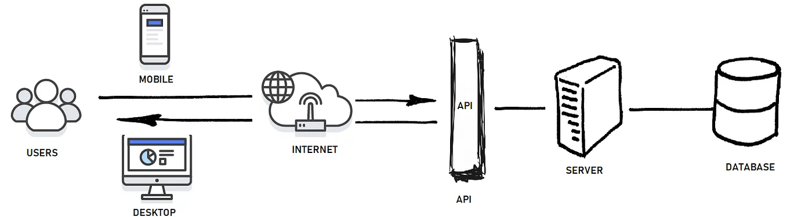
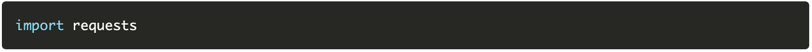
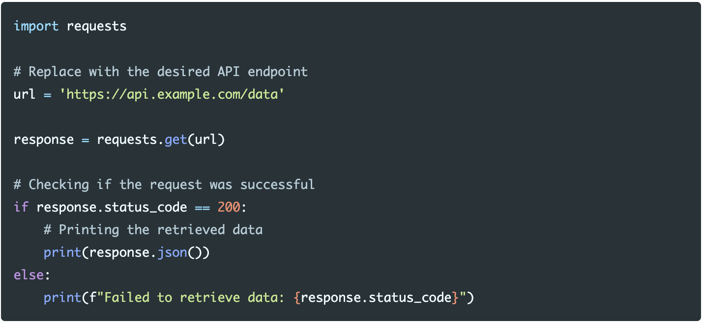
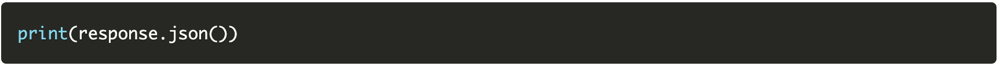
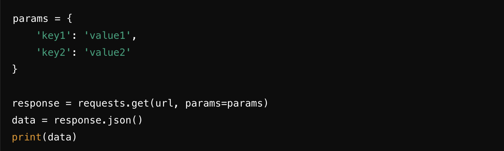
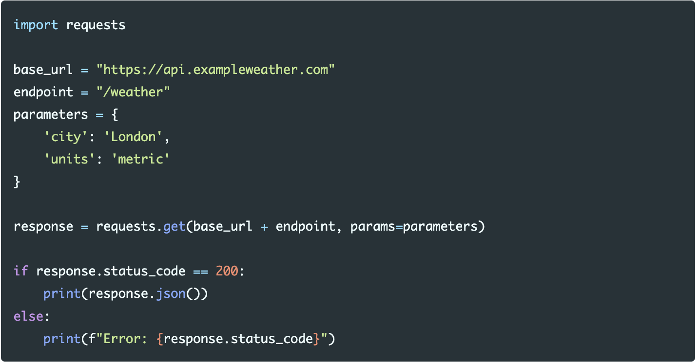
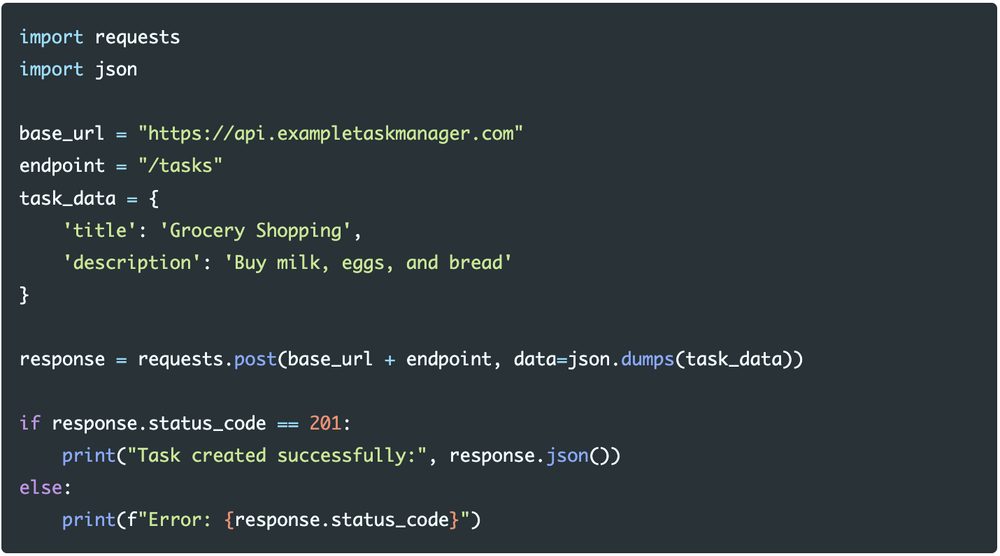

# APIs Main Quest

There are several key benefits of using an API for your project. APIs can help you to retrieve up-to-date data and enable external developers to (in a way) rely on a third-party organization in order to add functionality to existing solutions. APIs allow for access to many online services for your project. The possibilities are endless because they can return data or perform actions and can be used by nearly any programming language, allowing you to use the data in any way you see fit. APIs also improve security by controlling what data and actions an application is allowed to access on a server.

### Level One: 
→ Instructions shown below.
### Level Two: 
→ A hands-on API ques­t to practice fetching data, parsing responses, and displaying information from an external service. You can accept the assignment <a href="https://classroom.github.com/a/6zvc_FYg" target="_blank" rel="noopener noreferrer"><u>here</u></a>. 
### Level Three: 
→ Creating your own project. The instructions can be found <a href="https://github.com/BU-Spark-Learning-Ambassadors/API-level-3" target="_blank" rel="noopener noreferrer"><u>here</u></a>.

---

# APIs Level One
## VOCABULARY
### I. API Basics
*(what an API is and why we use it)*

**REST API**  
A web-based interface that allows programs to communicate over the internet using HTTP methods and standard URLs (endpoints).

**API Common Uses**  
APIs are used to retrieve data (weather, maps, music, databases), send data (forms, uploads), or connect services together (logins, payments, integrations).

**Types of APIs**  
Different categories of APIs such as public (open to anyone), private (internal use), and third-party (provided by external services like Spotify or Google).

**Accessing API Endpoints**  
Connecting to a specific URL provided by an API that represents a resource (for example: users, songs, or weather data).

### II. Requests (Client → Server)
*(what you send to the API)*

**Request**  
A message sent from a client (your app) to a server asking it to perform an action or return data.

**HTTP Methods**  
Also called HTTP verbs. They define the action being requested:
- GET – retrieve data
- POST – send new data
- PUT/PATCH – update data
- DELETE – remove data

**Headers**  
Key-value information sent with a request that tells the server details like content type, authentication tokens, or formatting.

**Body**  
The main data included in a request, typically used when sending information (such as a form submission).

**Query Parameters**  
Extra values added to the end of a URL to filter or customize the response (e.g., search terms, limits, or sorting).

**Implementing Requests**  
Writing code that sends a request to an API endpoint and handles the response.

### III. Authentication & Security
*(proving your app is allowed to use the API)*

**Authentication**  
The process of verifying the identity of a user or application before granting access to an API.

**API Key**  
A unique code provided by an API service that identifies and authorizes your application when making requests.

### IV. Responses (Server → Client)
*(what the API sends back)*

**Status Code**  
A numeric code included in the server’s response indicating whether a request succeeded or failed (e.g., 200 = success, 404 = not found, 500 = server error).

**Reading and Understanding Status Codes**  
Interpreting the meaning of response codes to determine if a request worked, failed, or needs to be retried.

**JSON (JavaScript Object Notation)**  
A lightweight data format commonly used by APIs to send structured data that programs can easily read and process.

## WHAT ARE APIS?

API stands for **Application Programming Interface.** It is a way for
two software components to communicate with each other and is an
accessible method to allow data transmission between multiple
applications. Think about it like this: when you order at a restaurant,
you tell the waiter what you want, and the waiter then relays this to
the kitchen which prepares your food, and finally the waiter brings your
food to you. In this case, your order is a request, the kitchen is the
back end service while the waiter is the API that acts as a
communication between yourself and the kitchen without exposing the
complexities of how the food is made. In the real world when you use an
application, the app connects to the internet and sends data to a
server. After the server retrieves the data, interprets it, and performs
any necessary actions, it is then presented in a readable format to the
client. APIs exist all around us: when you use the weather app, the
weather bureau’s software system contains the information about today’s
weather, but the app on your phone connects to this data via APIs in
order to show you information about the weather.

{:style="width:720px; display:inline-block;"}

### What is the purpose of APIs?
There are several key benefits of using an API for your project. APIs
can help you to retrieve up to date data and enable external developers
to (in a way) rely on a third party organization in order to add
functionality to existing solutions. APIs allow for access to many
online services for your project. The possibilities are endless because they can return data or perform actions and can be used by nearly any programming language, allowing you to use the data in any way you see fit. APIs also play a strong role in terms of security governance,limiting access to any software that an application might not be allowed to use.

### What are the different types of APIs?
There are 3 types of APIs: **private, partner** and **public**.

Private APIs are designed to be used within an organization and thus are
limited to only developers within that organization. These types of APIs
have stronger security measures because it is for internal use and
enables the organization to have complete control over its design and
usage. It may be used to improve solutions or create a new system using
existing resources.

Partner APIs are used to be shared with specific external partners or
organizations. These APIs are given access to select business partners
to allow them to integrate their systems, exchange data, and collaborate
together. A few examples include:

- **Facebook Login API:** Third-party applications use this to enable user authentication with Facebook credentials.
- **eBay APIs:** eBay offers a number of APIs to users who join the eBay Developers Program, including Sell APIs, Buy APIs, Commerce APIs, and more.

Public APIs are made available to the general public. They are
accessible to any developer or user and have a broad usage from
individuals to entire organizations. They can be either free or
commercial. A few examples include:

- **Google Maps API:** Integrates Google Maps into their apps to provide access to mapping and location-based services.
- **OpenAI API:** Allows users to connect the GPT-4o API and the Whisper API with other apps.

### What is an API endpoint?

An endpoint is a component of an API where the API receives requests.
These include server URLs, services, and other digital locations from
where information is sent and received between two systems. Endpoints
are essential to APIs because they are the point where the client and
the server communicate. Let's see an example!

<a href="https://developer.spotify.com/documentation/web-api" target="_blank" rel="noopener noreferrer"><u>Spotify</u></a>
has an API that gives information about albums, playlists, songs, and
more. If you, for example, wanted to access a specific album, you can
gain access through Spotify’s catalog with the endpoint
https://api.spotify.com/v1/albums/{id}, where {id} is the album’s unique
identifier.

## LET’S GET STARTED!

Before anything, you will need to pick an API to use. There are
thousands of public APIs you can choose from, but a helpful place to
start might be to consult pages like <a href="https://developers.google.com/apis-explorer/" target="_blank" rel="noopener noreferrer"><u>Google’s API Explorer</u></a> or <a href="https://github.com/public-apis/public-apis" target="_blank" rel="noopener noreferrer"><u>this repository of public APIs</u></a> to find which one best fits your needs. Some popular AI APIs include:

- **OpenAI API:** Offers access to powerful language models like GPT-4 for natural language tasks such as text generation, completion, and summarization.
- **Google Cloud AI APIs:** A suite of APIs for integrating vision, language, and conversation capabilities into applications.
- **IBM Watson API:** Provides a range of AI services, including NLP, sentiment analysis, and computer vision.

Next, locate the API documentation and understand how to interact with
that API. Usually, there will be a reference section that provides the
various objects, parameters, and endpoints you can access. Every API
should have a document that contains information such as how to use it,
what you can do with it, and some dependencies or requirements. Check
the authentication requirements and see if you need to obtain certain
credentials. From here, you can begin to dive into the API!

## API REQUESTS IN PYTHON

Before you start coding, you need to first figure out what type of API
request you will need to be making. These request types, also known as
methods, have unique functions associated with each other. A few common
types include GET (to retrieve information), POST (to send new data),
and PUT (to update existing data). For the purpose of this guide, we
will focus on how to implement a GET request. In addition, you will also
need to obtain an API key. This is done by creating a verified account
with the API provider.

When making API requests, there are several libraries in Python that can
be used throughout the process. The most widely used library for making
requests in Python is the requests library. Since it is not a standard
library, you will first have to install it. Open up a coding platform of
your choice and install and import the library using pip:

{:style="width:720px; height:47px; display:inline-block;"}
{:style="width:720px; height:48px; display:inline-block;"}

## YOU’VE INSTALLED THE LIBRARY! WHAT’S NEXT?

After importing our library, we can proceed with making the GET request
and analyzing the results. We will use the requests.get() function,
passing in the URL we want to request. The following code outlines how
to request and how to understand the API’s response:

{:style="width:720px; height:331px; display:inline-block;"}

After making the request, it is important to check the status code to
ensure that the request was successful. Ideally, 200 should be printed
to show that it was successful but if you see a code like 404, that
indicates that the server cannot find the requested file.

## WHAT HAPPENS IF I GET A DIFFERENT STATUS CODE?

Every status code indicates a different output that happened with the
request. Look at the following for a guide to see what your status code
means:

<a href="https://developer.mozilla.org/en-US/docs/Web/HTTP/Status" target="_blank" rel="noopener noreferrer"><u>https://developer.mozilla.org/en-US/docs/Web/HTTP/Status</u></a>

Run through these status codes and try to solve whatever issue is
popping up.

## I SUCCESSFULLY MADE THE REQUEST! WHAT NOW?

Most APIs return data in JSON format. You can use the response.json()
method to view the data that you just received.

{:style="width:720px; height:48px; display:inline-block;"}

Sometimes you will need to send query parameters with your GET requests.
Query parameters are appended to the URL of an API request. These
parameters are used to modify and change the behavior of the request in
order to customize the response. To do this, you will need to use query
parameter syntax, which requires a question mark followed by the query
parameters you want to add. Multiple parameters are separated by an
ampersand.

## Should I implement query parameters?

There are many scenarios in which implementing a query parameter might
be useful. Some common uses include filtering data, sorting data,
limiting the number of results returned in a single request, querying a
dataset for a specific term, or customizing the format. Think of this
like ordering a burger: if we are given a standard burger with lettuce,
tomatoes, onions, and cheese, we might only want to choose the lettuce
and cheese. These specifications are much like optional query
parameters, allowing us to specify or filter the data from an API as we
need.

## How should I implement a query parameter?

You can send query parameters using the ‘params’ argument as a
dictionary to filter out the data you receive. Let’s see a basic setup
of how to do this below:

{:style="width:720px; height:217px; display:inline-block;"}

In the real world, this is what the code might look like if you wanted
to get weather data for the city of London:

{:style="width:490px; height:140px; display:inline-block;"}

Query parameters allow for more dynamic requests by enabling clients to
specify optional filters or settings without changing the endpoint
structure. In contrast, <u>path parameters</u> are another option which
would request weather information in this general format:

GET/weather/London. Path parameters are best used for identifying
specific collections in an API URL whereas query parameters allow for
multiple filterings.

## NOW WHAT?

In most cases, if you need to send data to an API you should now
implement a POST request. A POST request is one of the most common
methods used in APIs, and is primarily used to send complex data (such
as JSON, form data, or files) to a server to create or update a
resource. To do this, you will need to use requests.post(). Let’s see
how to do this below:

{:style="width:629px; height:350px; display:inline-block;"}

Here, we used json.dumps to convert the task\_data dictionary into a
JSON-formatted string then send the request with requests.post().
Similar to our GET request above, we also need to test if this request
was done successfully through looking at its status code. In this
example, a status code of 201 indicates that we are successful.

As you become more familiar with the APIs, refine your requests and add
more complexities to better meet your needs. This might involve using
additional parameters, handling pagination, or optimizing performance.
Follow an iterate and improve method to keep track of your code and
leverage more of your APIs capabilities.

---

## HOW TO CONTINUE THIS MAIN QUEST?  

Take the quiz <a href="https://docs.google.com/forms/d/e/1FAIpQLSdrirR6caWeNXtfILYCv-RtfpRrp0GmiUAOyNb5Kp-yeGmjiw/viewform?usp=sf_link" target="_blank" rel="noopener noreferrer"><u>here</u></a> to finalize Level One, then apply your knowledge with Level Two. After completing that, you can create your own project with some guidelines for Level Three!

---

### For any information or quality issues, please contact:  

Kaylin Von Bergen (Spark! Code Quest Lead) via <a href="https://github.com/BU-Spark/bu-spark/issues/new?title=Issue%20with%20Code%20Quest%20%E2%80%94%20%5BINSERT%20SPECIFIC%20CODE%20QUEST%5D&body=%40kaylinvonbergen%20%40langdon%0A%0APlease%20describe%20the%20issue%20below%3A%0A" target="_blank" rel="noopener noreferrer"><u>GitHub issue</u></a>

---

### Author of this Code Quest:  
Catherine Liu
