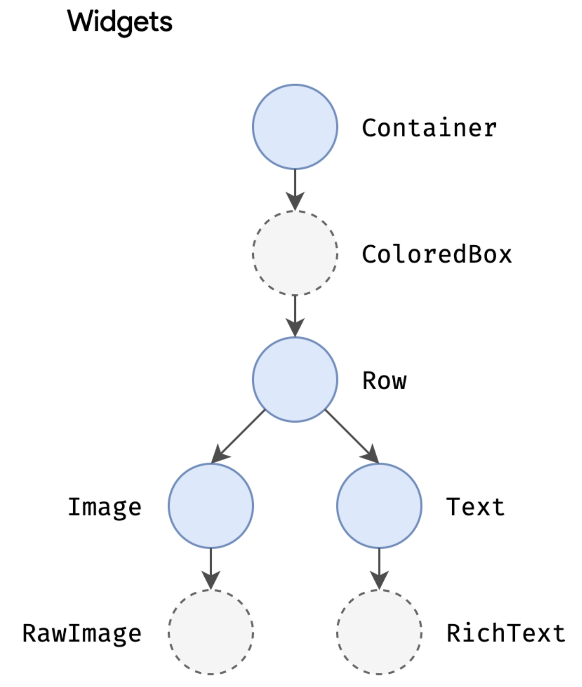
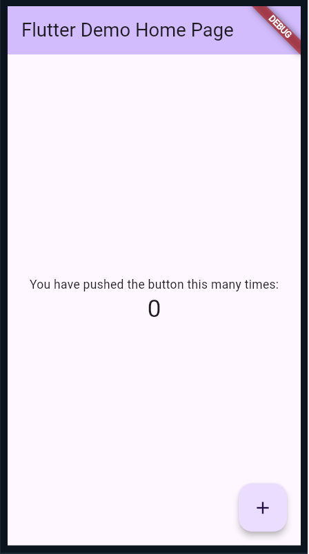
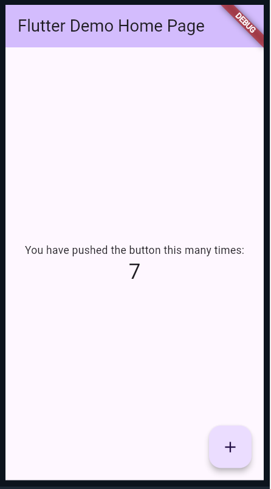
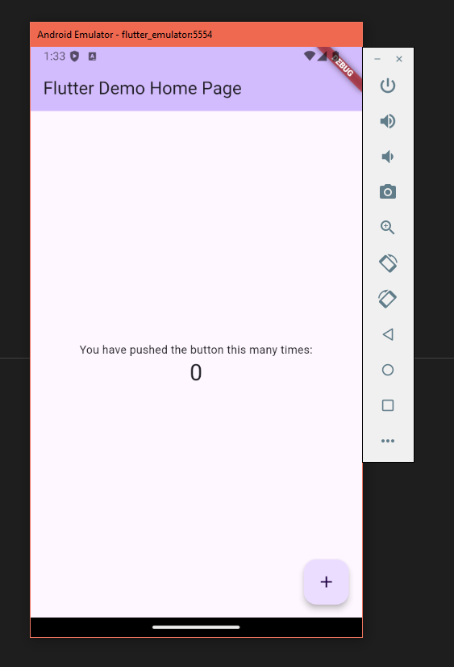

# Flutter Main Quest

Flutter is an open source UI software development kit (SDK) developed by Google which is used for building applications for mobile, web, and desktop that compile natively. It uses Dart, an open-source programming language released by Google in 2011.  

### Level One: 
→ Instructions shown below.
### Level Two: 
→ A short Flutter exercise where you implement a color picker UI and manage a dynamic list of user-selected colors. You can accept the assignment [<u>here</u>](https://classroom.github.com/a/RtnzKd4X). 
### Level Three: 
→ Creating your own project. The instructions can be found [<u>here</u>](https://github.com/BU-Spark-Learning-Ambassadors/flutter-level-3).

---

# Flutter Level One
## Overview – what you should learn  


### Vocabulary  
- **Widget**  
- **State**  
- **Stateless**  
- **Stateful**  
- **Properties**  
- **BuildContext**  
- **Dart**  

---

### Specific Commands/Code Snippets  

- `setState()`
- `flutter create [projectname]`
- `flutter run`
- `r`
- `Widget build(BuildContext context)`
- `createState()`
- `flutter doctor`
- `@override`


---

### Concepts  
- **Widgets**  
- **Hot reload**  
- **Emulators**  
- **Material Design vs. Cupertino Widgets**  
- **Routing**  
- **Gesture Detection**  

---

**Dart** — Dart is an open-source general-purpose programming language developed by Google. It supports application development in both client and server-side. But it is widely used for the development of android apps, iOS apps, IoT (Internet of Things), and web applications using the Flutter Framework.  
**Widget** — Widgets are the basic building blocks of the UI—everything a user sees in an app created with Flutter is a widget, from simple elements like text boxes and buttons to layouts, carousels and the entire screen.  
**State** — State refers to any data that can change over time and affects how a widget looks or behaves. State can change on a timer or on an input.  
**Stateful** — If a widget is stateful, its state can be changed and the developer must use methods such as `setState()` and `createState()` to control it.  
**Properties** — Each widget has properties, and they are values or settings that you can pass to widgets to customize their behavior and appearance.  
**BuildContext** — An immutable object that provides context about the location of a widget in the widget tree.  
**Hot reload** — a feature that allows developers to quickly see the results of changes made to the code without needing to restart the entire application.  
Type `r` in the terminal running your application to hot reload.  
**Gesture Detection** — Handling user interactions like taps, swipes, and long presses using `GestureDetector`.  
**Material Design vs. Cupertino Widgets** — two distinct sets of UI components in Flutter, each catering to different design languages and platforms—Android and iOS, respectively. Flutter allows you to combine Material and Cupertino widgets in the same app. For instance, you might use a `CupertinoButton` on an iOS platform while using a `RaisedButton` on Android.  
**flutter doctor** — a command in Flutter that checks your development environment to ensure all the necessary tools and dependencies are properly installed and configured.  

---

### What is Flutter?  
Flutter is an open source UI software development kit (SDK) developed by Google which is used for building applications for mobile, web, and desktop that compile natively. It uses Dart, an open-source programming language released by Google in 2011.  

---

### Why use Flutter over other resources?  
Since it complies natively, it allows developers to create high-quality apps that work across multiple platforms without needing to rewrite code for each platform. Dart is relatively easy to learn for those familiar with languages like JS, Java, or C#. Flutter compiles to native ARM code on mobile, so apps have the performance, look and feel of native apps. For ease in development, it uses hot reload, a tool that allows developers to see the changes in their app in real-time each time they change the code. It has a large user-base (it’s the most popular cross-platform mobile framework worldwide as of 2022, after all), and therefore has an extensive library and good community support.  

---

### Why do I need to know anything about Flutter?  
App development is a great skill for people in tech to have under their belt. Flutter makes app development easy and efficient. Most companies start with a cross-platform mobile dev framework but, as they get bigger, transition to developing separate, native apps for each platform (i.e., Swift for iOS and Java/Kotlin for Android), so it’s not uncommon for Flutter to be used in industry!  

---

### Okay, what are the essentials?  
The installation process for Flutter is a little bit more time-consuming than most installations, but this document will include walkthroughs on how to do this. Then, you should start learning the architecture of Flutter, for example, how to use widgets, states, how rendering works, etc. You should be comfortable with Dart syntax (or have enough baseline knowledge of general programming to be able to use documentation or an LLM to help you code in Dart).  

## FLUTTER ARCHITECTURE!  

Before we start doing any coding, let’s learn a little bit about the Flutter Architecture. When apps are released, they are compiled directly into machine code. This is why it’s so much easier to create cross-platform apps. Instead of rewriting your app in multiple languages, you write it in Dart and it gets compiled into Intel x64/ARM instructions (for mobile), or JavaScript (for web).

Flutter has three architectural layers: the **Framework**, **Engine**, and **Embedder**.  

- The **Framework layer** is the topmost layer and what you will be looking at the most as a developer. Using Dart code, you’ll be able to build a UI using widgets (we’ll get into these later), control the positioning and layout of these widgets, handle user input such as swiping, tapping, sliding and scaling, and even access APIs for animations and transitions.  
- The **Engine layer** is written mostly in C++, and supports the primitives necessary to support all Flutter applications. It’s responsible for rasterizing composited scenes whenever a new frame needs to be painted. It provides the low-level implementation of Flutter's core API, including graphics (through Impeller on iOS and coming to Android and macOS, and Skia on other platforms), executes Dart code, manages text rendering, and facilitates interaction with platform specific APIs.  
- Finally, the **Embedder layer** interacts with the underlying OS using platform specific code. It sets up the rendering surface (a window on desktop, a view on mobile), allows for communication between the Flutter app and the underlying platform, and manages platform-specific AIs (think cameras, sensors, file systems, etc.)

{:style="width:225px; display: block; margin-left: auto; margin-right: auto;"}
{:style="width:225px; display: block; margin-left: auto; margin-right: auto;"}

---

## STATE!  

State is extremely important to understand when working with Flutter. A developer provides a mapping from application state to interface state, and the framework updates the interface at runtime when the application state changes. State refers to any data that can change over time and affects how a widget looks or behaves. State can change on a timer or on an input.  

Consider a clock app—state changes automatically when the time changes. State can change on input in the case of a checkbox being checked, a button being pressed, etc.  

In Flutter, widgets can be stateless or stateful.  
- A **StatelessWidget** is immutable — you should use them when the widget’s appearance and behavior are determined entirely by its constructor parameters and don’t change over time.  
- A **StatefulWidget** is mutable and can change its appearance or behavior in response to user interactions or other factors, so use it when it needs to update dynamically.  

State is managed by Flutter. When the state of a widget changes (for example, when the user presses a button), the framework calls `setState()`, which tells Flutter to rebuild the widget. During this rebuild, Flutter updates the widget tree, but only the parts of the UI that depend on the changed state are rebuilt. This makes the process efficient.  

---

## WIDGETS!  

Widgets are the basic building blocks of the UI—everything a user sees in an app created with Flutter is a widget, from simple elements like text boxes and buttons to layouts, carousels and the entire screen. Widgets are composable to create more complex UI elements.  

Widgets are organized in a tree structure known as the **widget tree**. It has a hierarchical structure and represents the entire UI of your app; each widget is embedded into another widget up until the upper-most widget, starting from the container for the entire screen to things like rows, columns and stacks, to leaf elements like text boxes and buttons.  

Remember Stateless and Stateful—one declares it to stay the same, and the other allows it to save state. There exist widgets for alignment and padding too, such as the **Center** widget. They don’t have visual representation on their own but they are there solely to control some aspect of another widget.  

State gets managed and passed around the system. Since many widgets may contain state within the tree, it can get cumbersome to pass data down as we get deeper down the tree. In this case, we can utilize an **InheritedWidget**, which can grab data from a shared ancestor.  


{:style="width:225px; display: block; margin-left: auto; margin-right: auto;"}


---

### Important Widgets to Know  

- **Container** — One of the most versatile and commonly used widgets. It controls the layout and style of its child widget. You can add padding, margin, alignment, change the background color, add borders, and round its corners. You can also add size constraints. It can contain a single child widget.  
- **Columns and Rows** — allow for a vertical or horizontal layout of a list of child widgets.  
- **Icons** — A collection of pre-designed symbols used to represent common actions, objects and concepts within an app. For example, `Icons.home`, `Icons.favorite`, `Icons.search`, `Icons.settings`. You can change the size and color as well as add accessibility text for screen readers.  
- **AppBar** — serves as the topmost element of an app’s screen, providing a title, navigation actions (such as a back button), and other key interface buttons. The `actions` property allows a developer to add a list of widgets (usually `IconButtons`) to the right side of the AppBar.  
- **ElevatedButton** — material design button that features a shadow to give it a 3D effect. It has a property called `onPressed` which allows the developer to define what happens when the user interacts with it. You can change the style and content (such as text or an icon).  
- **Image** — exactly what you think. Has properties that allow you to change the fit, size, alignment, and blend. Sources include assets, files, memory, and network image URLs.  
- **Scaffold** — provides a basic material design visual layout structure. This is where you place the AppBar, Body, Drawer, BottomNavigationBar, Snackbar, etcetera.  

---

## LET'S GET STARTED!  

The first thing we have to do is install it from [https://docs.flutter.dev/get-started/install](https://docs.flutter.dev/get-started/install).  

Installing Flutter and optimizing settings can be more complicated than you’re used to, so here’s a walkthrough for Windows, and here is a walkthrough for Mac.  

We’re going to get you started with Android Studio development, but it only takes a couple extra steps to develop on Apple too that you can take later. There may be slight differences in versions and such, but they should be easy to figure out.  

We’re also going to be using VS Code to do any coding, so make sure you have that installed as well. In VS Code, install the Flutter extension.  

Open a new terminal in VS Code and navigate to a file or directory to hold your Flutter projects (using `cd [address]`). Then, you can type:  
```
flutter create [projectname]
```
replacing `[projectname]` with something else, such as `spark_walkthrough` (note, the name should be all lowercase with underscores to separate words, aka snake_case).  

As long as everything is named and installed properly, the project will be created and it will give you the directory that your code is in. Click **File → Open Folder**, and then find the main folder of your project. As the terminal told you, your application code will be under `/lib/main.dart`.  

**NOTE:** when you try to run the emulator, your system may ask you to download something else called “Android Emulator hypervisor driver.” Please follow the directions on Android Studio.  

---

## EMULATOR  

Next, you’re going to want to have an emulator available. An emulator is a software program that simulates another device.  

In our case, we’re going to emulate an Android phone so that we can see our app on it as we code it. You should have already set this up with the video tutorial.  

In VS Code, in the status bar on the bottom, you’ll be able to click where it says *Windows* and change it to the device you’re going to emulate.  

---

## CODING IN FLUTTER  

Let’s look at an example program first; usually, when you create a Flutter project, it opens up with a sample `main.dart` file. In case it’s empty, here is the code:  

```dart
import 'package:flutter/material.dart';

void main() {
  runApp(const MyApp());
}

class MyApp extends StatelessWidget {
  const MyApp({super.key});

  @override
  Widget build(BuildContext context) {
    return MaterialApp(
      title: 'Flutter Demo',
      theme: ThemeData(
        colorScheme: ColorScheme.fromSeed(seedColor: Colors.deepPurple),
        useMaterial3: true,
      ),
      home: const MyHomePage(title: 'Flutter Demo Home Page'),
    );
  }
}

class MyHomePage extends StatefulWidget {
  const MyHomePage({super.key, required this.title});

  final String title;

  @override
  State<MyHomePage> createState() => _MyHomePageState();
}

class _MyHomePageState extends State<MyHomePage> {
  int _counter = 0;

  void _incrementCounter() {
    setState(() {
      _counter++;
    });
  }

  @override
  Widget build(BuildContext context) {
    return Scaffold(
      appBar: AppBar(
        backgroundColor: Theme.of(context).colorScheme.inversePrimary,
        title: Text(widget.title),
      ),
      body: Center(
        child: Column(
          mainAxisAlignment: MainAxisAlignment.center,
          children: <Widget>[
            const Text(
              'You have pushed the button this many times:',
            ),
            Text(
              '$_counter',
              style: Theme.of(context).textTheme.headlineMedium,
            ),
          ],
        ),
      ),
      floatingActionButton: FloatingActionButton(
        onPressed: _incrementCounter,
        tooltip: 'Increment',
        child: const Icon(Icons.add),
      ),
    );
  }
}
```

We’re going to look at this code step by step to try and understand what’s happening and why it does what it does.  

For guidance, here is what the app is supposed to look like on run, and after the button on the bottom right has been pressed seven times.

{:style="width:225px; display: block; margin-left: auto; margin-right: auto;"}
{:style="width:225px; display: block; margin-left: auto; margin-right: auto;"}


---

```dart
import 'package:flutter/material.dart';
```

This line imports the `material.dart` package, which contains the Material Design widgets and utilities provided by Flutter. It allows you to use pre-built widgets like `MaterialApp`, `Scaffold`, `Text`, and more.  

The **main function** is the entry point of any Dart program; this is where it starts. It uses the function `runApp()`, which makes the parameter given (the widget `MyApp()`), and makes that the root of the widget tree.  


```dart
void main() {
  runApp(const MyApp());
}
```

Right below the main function is our custom **MyApp widget**:
```dart
class MyApp extends StatelessWidget {
  const MyApp({super.key});

  @override
  Widget build(BuildContext context) {
    return MaterialApp(
      title: 'Flutter Demo',
      theme: ThemeData(
        colorScheme: ColorScheme.fromSeed(seedColor: Colors.deepPurple),
        useMaterial3: true,
      ),
      home: const MyHomePage(title: 'Flutter Demo Home Page'),
    );
  }
}
```

created using class definitions. Notice the syntax for creating a Stateless vs. Stateful widget; you extend the `StatelessWidget` or `StatefulWidget` class.  

`const MyApp({super.key});` is a constructor for the MyApp class. Marking it as `const` makes it so that if the inputs are constant, the instance of MyApp can be treated as a compile-time constant. This can improve performance by allowing Dart to reuse the instance instead of creating a new one each time.  

`super.key` passes the key argument to the parent class (`StatelessWidget`). Keys are special identifiers that help the framework understand how to manage the widgets in the widget tree, especially during complex operations like moving, adding, or removing widgets. They ensure that the state of a widget is maintained and performance is optimized.  

We use `@override` because the `build` method is overriding the one in the superclass (`StatelessWidget`).  

We are inputting `context`, which is a **BuildContext** object. It provides information about the location of this widget in the widget tree. It’s used to access resources like themes and to interact with the widget’s position in the tree. Context is created automatically by Flutter, and you can use this variable later.  

It will be returning a **MaterialApp widget**, which is going to be the root widget of the application. The `title:`, `theme:`, and `home:` fields are all properties.  

Each widget has properties (check documentation for full list), which are values or settings that you can pass to widgets to customize their behavior and appearance. Title is straightforward, but the theme and home properties are a little more complicated.  

`ThemeData` is also a widget, and has its own properties; in this case, we are looking at `colorScheme` and `useMaterial3`.  

Since there are so many widgets, you’ll have to be able to look up how to use certain widgets and what to put in each property.  

In the `home` property, we pass in a homepage that you can see the code for right after.  

```dart
class _MyHomePageState extends State<MyHomePage> {
  int _counter = 0;

  void _incrementCounter() {
    setState(() {
      _counter++;
    });
  }

  @override
  Widget build(BuildContext context) {
    return Scaffold(
      appBar: AppBar(
        backgroundColor: Theme.of(context).colorScheme.inversePrimary,
        title: Text(widget.title),
      ),
      body: Center(
        child: Column(
          mainAxisAlignment: MainAxisAlignment.center,
          children: <Widget>[
            const Text(
              'You have pushed the button this many times:',
            ),
            Text(
              '$_counter',
              style: Theme.of(context).textTheme.headlineMedium,
            ),
          ],
        ),
      ),
      floatingActionButton: FloatingActionButton(
        onPressed: _incrementCounter,
        tooltip: 'Increment',
        child: const Icon(Icons.add),
      ),
    );
  }
}
```

Once again, we’re creating a custom widget by using a class definition. This one is Stateful, so we have to give it State!  
`@override State<MyHomePage> createState() => _MyHomePageState();`  
creates and returns an instance of the `_MyHomePageState` class, which is where the mutable state for MyHomePage is managed.  

`_MyHomePageState` extends `State<MyHomePage>`. It has a variable, `_counter`, and includes a method which changes the state and increments counter. The `setState` method notifies Flutter that the state has changed. When `setState` is called, Flutter schedules a rebuild of the widget tree. During this rebuild, the updated state is reflected, and the UI is updated accordingly.  

The state is going to be updated within the **Scaffold** widget we’re creating. Scaffold has multiple properties: `appBar`, `body`, and `floatingActionButton`.  

You should know about the `appBar` already from the list given a few pages up. The `body` property uses an alignment widget, **Center**, and then the `child` property uses a **Column**, which also has children.  

It takes a lot of playing around to get used to these kinds of widgets, but playing around is good progress. This is why **hot reload** is a great feature of Flutter!  

`floatingActionButton` is a button, and includes the `onPressed` property, which calls the `incrementCounter` method, icons, and tooltip.  

Here is our app in the emulator! 
{:style="width:225px; display: block; margin-left: auto; margin-right: auto;"}
It includes the **AppBar** at the top, which has the title and uses the color theme (as does the button), the **Scaffold**, whose body is shown by the text and counter number, and then the button at the bottom right.  

Each time the button is pressed, it increments the counter using the `_incrementCounter` method and the state is changed, meaning the Home page widget gets rebuilt to change the counter number.  

---

## CONCLUSION  

These are the basics of Flutter. Since there are so many different widgets, we can’t go over each and every one in this document, but this gets you started on understanding the architecture of Flutter and its code.  

Documentation can be found at [https://flutter.dev/](https://flutter.dev/), and whenever you want to learn something new, do so through there.  

Additionally, forums and LLMs (such as ChatGPT) can be a great resource.  

If you want to get involved in the Flutter community, the **FlutterDev subreddit** is a good place to look. Additionally, there is a community forum on the Flutter Dev website itself.  

Good luck with Flutter!  

---

## HOW TO CONTINUE THIS MAIN QUEST?  

Take the quiz [<u>here</u>](https://docs.google.com/forms/d/e/1FAIpQLSetYuZqkLiXADH_NOjx3JCdx_V4Y_Z3Ncn52ZNHdh23fiez-Q/viewform) to finalize level one, then apply your knowledge by doing a Flutter Side Quest!  

After completing that, you can create your own project with some guidelines for level three!

---

### For any information or quality issues, please contact:  

Kaylin - kaylinvb@bu.edu  
Seun - oademilo@bu.edu  

---

### Author of this Code Quest:  
Kaylin - kaylinvb@bu.edu  
