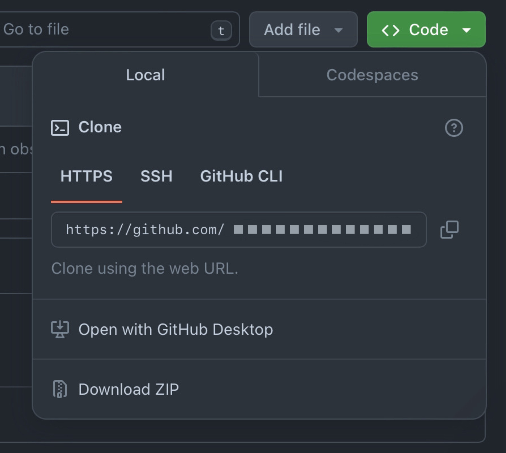

# Git/Hub Main Quest

**Git** is a free tool that developers install locally on their
computers. It tracks changes made to files and allows developers to
maintain previous versions and create new versions of their projects.
This concept is known as *version control* — the practice of managing
changes to computer files and maintaining different versions of those
files.  
**GitHub** is an online service built to run Git in the cloud. Think of
it as a combination of social media and a convenience tool for Git; it
allows you to store your code online, collaborate with others, and
access and revise other people's code.

### Level One: 
→ Instructions shown below.
### Level Two: 
→ A hands-on Git Side Ques­t for fine-tuning your version control skills: commit history, branching strategies and merge conflict resolution. You can accept the assignment [<u>here</u>](https://classroom.github.com/a/S2rfJDU0). 
### Level Three: 
→ Creating your own project. The instructions can be found [<u>here</u>](https://github.com/BU-Spark-Learning-Ambassadors/git-level-3).

---

# Git/Hub Level One
## Vocabulary
- **Repository —** A repository is the most basic element of GitHub. They're easiest to imagine as a project's folder. A repository contains all of the project files (including documentation), and stores each file's revision history. Repositories can have multiple collaborators and can be either public or private.

- **Branch —** A branch is a parallel version of a repository. It is contained within the repository, but does not affect the primary or main branch allowing you to work freely without disrupting the "live" version. When you've made the changes you want to make, you can merge your branch back into the main branch to publish your changes (*note: the main branch used to be called master; read more [here](?tab=t.uh2g7kc4nmfw)*).

- **Directory —** A folder containing one or more files or folders. You can create directories to organize the contents of a repository.

- **Commit —** A commit, or "revision", is an individual change to a file (or set of files). When you make a commit to save your work, Git creates a unique ID (a.k.a. the "SHA" or "hash") that allows you to keep record of the specific changes committed along with who made them and when. Commits usually contain a commit message which is a brief description of what changes were made.

- **Pull/pull requests —** Pull refers to when you are fetching changes and merging them. For instance, if someone has edited the remote file you're both working on, you'll want to pull in those changes to your local copy so that it's up to date. Pull requests are proposed changes to a repository submitted by a user and accepted or rejected by a repository's collaborators. *Like issues, pull requests each have their own discussion forum.*

- **Push —** To push means to send your committed changes to a remote repository on GitHub.com. For instance, if you change something locally, you can push those changes so that others may access them.

- **Conflicts —** Errors that occur when Git cannot automatically combine changes because the same lines of a file were edited differently in two places.

- **Fetch —** When you use git fetch, you're adding changes from the remote repository to your local working branch without committing them. Unlike git pull, fetching allows you to review changes before committing them to your local branch.

- **Fork —** A fork is a personal copy of another user's repository that lives on your account. Forks allow you to freely make changes to a project without affecting the original upstream repository. You can also open a pull request in the upstream repository and keep your fork synced with the latest changes since both repositories are still connected.

- **Clone —** A clone is a copy of a repository that lives on your computer instead of on a website's server somewhere, or the act of making that copy. When you make a clone, you can edit the files in your preferred editor and use Git to keep track of your changes without having to be online. The repository you cloned is still connected to the remote version so that you can push your local changes to the remote to keep them synced when you're online.

- **Access Token —** A token that is used in place of a password when performing Git operations over HTTPS with Git on the command line or the API. Also called a personal access token.

- **Remote —** This is the version of a repository or branch that is hosted on a server, most likely GitHub.com. Remote versions can be connected to local clones so that changes can be synced.

- **Local —** The version that lives on your computer.

- **Large file storage (Git LFS) —** An extension to Git that stores large files (like images, videos, or datasets) outside the normal repository to keep the repo fast and manageable.

- **Version control —** A system that records changes to files over time so you can view history, revert mistakes, and collaborate safely.

- **Presentation and documentation (README, etc.) —** Files that explain what the project is, how it works, and how to install or use it. The README is the main project description shown on GitHub.

## Specific Commands

- ``git clone &lt;https://name-of-the-repository-link&gt;``

- ``git branch &lt;branch-name&gt;``

- ``git push -u &lt;remote&gt; &lt;branch-name&gt;``

- ``git branch -d &lt;branch-name&gt;``

- ``git checkout &lt;name-of-your-branch&gt;``

- ``git status``

- ``git add &lt;file&gt; / git add -A``
``
- ``git commit -m "commit message"``

- ``git push &lt;remote&gt; &lt;branch-name&gt;``

- ``git pull &lt;remote&gt;``

- ``git revert 3321844``

- ``git merge``

- ``git clone -b &lt;branchname&gt; --single-branch &lt;repo-https&gt;``

## WHAT IS GIT? WHAT IS GITHUB?
**Git** is a free tool that developers install locally on their
computers. It tracks changes made to files and allows developers to
maintain previous versions and create new versions of their projects.
This concept is known as *version control* — the practice of managing
changes to computer files and maintaining different versions of those
files.  
**GitHub** is an online service built to run Git in the cloud. Think of
it as a combination of social media and a convenience tool for Git; it
allows you to store your code online, collaborate with others, and
access and revise other people's code.

### Why do I need to know anything about Git and Github?
Version control is an essential tool in software development. When
Instagram, for example, updates their app, do you think they completely
overwrite their previous code every time they want to test something? Do
they simply discard the code for previous versions? What if multiple
developers want to fix the same bug but have different ideas? The
preservation of previous versions of projects, apps, websites, etc., is
extremely important for debugging and maintaining software quality. It
also allows developers to create new solutions without overwriting the
current version. Plus, it makes collaboration a million times easier.

### Okay, what are the essentials?
First, you need to understand the most basic terminology and commands.
Then, you’ll need to know how to transition your projects from just
living in IDEs and files on your computer to GitHub, as well as creating
new projects through GitHub. You’ll need to be able to push and commit
changes, including adding comprehensive commit messages.

Next, you’ll have to be able to interact with other developers' work,
such as pulling, making forks, and submitting pull requests. The end
goal is for you to become proficient with local and remote version
control, moving your projects to the cloud, grabbing projects from the
cloud, and collaborating efficiently with other developers while
maintaining version control.

## LET'S GET STARTED!
To start, make sure you have Git installed on your computer by following
the steps outlined
[<u>here</u>](https://git-scm.com/book/en/v2/Getting-Started-Installing-Git).
After that, we’ll begin by creating our own project using a
*repository*. A repository is the “capsule” of your project on GitHub.
Think of it as a folder that holds all the directories and files of your
project. When you’re starting a new project, you’re going to want to
have some version control. Additionally, you might want a way to access it from multiple devices, as well having a hub for collaboration and
sharing.

To create a new repository, You’ll sign into GitHub (creating an account
if necessary, and either navigate to the tab on the left, or to the
window that appears when clicking your profile picture and clicking
*your repositories.* Then, there will be a green box that reads *new.*

{:style="width:225px; display: block; margin-left: auto; margin-right: auto;"}

At this point, you’ll be able to name your repository, fiddle with
privacy settings, add a description, and initialize a *README* file. A
*README* file is a file that most repositories contain, which is written
in Markdown, and provides context or necessary information for the
project. Once you’re happy with the settings, you can click *create
repository*, and you’ll have a new repository!

## YOU’VE CREATED YOUR REPOSITORY ON GITHUB! WHAT NEXT?
It’s important to remember that you’ve only created the *remote
repository*. This means that it’s hosted on GitHub, and you don’t have
access to it locally on your machine. Luckily, there are plenty of
commands to help us get this project on your computer!

We’re going to have to *clone* the repository. To do this, we need our
SSH key or HTTPS link. The difference isn’t so important right now, but
essentially, SSH allows us to have a more secure connection that
requires authentication (a key pair) to communicate with GitHub servers,
while HTTPS provides secure communication over the internet. In this
case, we’ll start with the HTTPS link.

{:style="width:500px; display: block; margin-left: auto; margin-right: auto;"}

You’re going to want to press the green *Code* button. Here, you’ll be
able to navigate over to HTTPS, and copy the link. To use this, we need
to open some kind of terminal (either through your machines terminal or
an IDE terminal, such as VSCode, Eclipse, or even the built-in
*codespace*). From there, you’ll type ``git clone &lt;HTTPS link&gt;``. It
will ask you where to place the files, and you’ll choose where you want
to have your project stored. Now you have a *remote repository,* which
is the repository on GitHub, and the *local* version, which is what you
have stored in files in your computer.

## COOL! HOW DO I START MAKING CHANGES TO MY PROJECT?
You’re asking the right questions! As good practice, you’re not *really*
going to want to make any changes directly through GitHub. Instead,
you’ll want to make changes locally in your IDE, and then *commit* and
*push*.

If you don’t really know how to code much yet, *don’t worry*. You can
just create some txt files in the meantime to practice with. If you do,
try to create one or two *Hello World* programs. Remember: this is just
learning and practice! This doesn’t have to be a real project.

When you have some files that you’d like to update the repository with,
here’s a general process:

- You can type ``git status`` to determine which files have changes in them.

- From here, you can add the specific file(s) using ``git add``
  &lt;file&gt;, or you can add *all* the changed files using ``git add -A.``

- Now, you’re going to *commit* these changes, by typing git commit -m
  "commit message". In the commit message, you’ll want to add a brief
  explanation of the changes made. As a rule of thumb, try to commit as
  *frequently* as possible. This is important for version control.
  Mistakes happen, and sometimes we want to revert to previous versions
  of our projects. Having frequent “saves” allows us the freedom to make
  mistakes and try new approaches without worrying about losing
  progress. Plus, it helps collaborators understand the changes made to
  the program (note: you may be asked to identify yourself using the git
  config --global user.email "&lt;email&gt;" command. Once you tell it
  your email, you can try to run ``git commit -m`` again and it should
  work!).

- Finally, you’re ready to *push* your changes to the remote repository.
  Simply type ``git push``, and your changes will be reflected in GitHub!

Now, let’s get back to GitHub. Right beneath that green *Code* button,
you’ll see some text that reads *&lt;x&gt; commits.* You can click on
this and scroll through all the commits, and look at every change made
to your remote repository. In the box with the README file that was
created, you should also see the files that you pushed.

## PULLING
If you want to work on your project from multiple machines or you have
multiple people making commits to the repository, the local and remote
version of the repository will often be out of sync. Luckily, there’s a
way to make handling this situation more efficient. Use the git pull
origin &lt;branch&gt; command. For now, the branch name is *main*. This
will sync your local and remote repositories.

## BRANCHES? FORKS? 
When collaborating with other programmers within the same repository,
there are multiple ways to structure it so that unauthorized changes
cannot be made to the files, and outside programmers can suggest their
own changes. This is where branches and forks come in. To cut it down to
its most basic difference: **branches** are used by members of the
organization, and **forks** are used by non-members. An organization can
be created when a project has a specified team working on it. When you
have an organization, you create the repository through that
organization, and everyone within that organization effectively owns the
repository.

Within an organization, you can create your own branch, where you make
and commit your own changes. When you're done, you can propose that your
branch be merged with the main branch through a pull request. If you
aren’t a member of the organization, you can still propose changes!
Instead, you’ll fork the repository, create your own branch, and then
open a pull request. These features are extremely important for large
projects with multiple collaborators.

To *fork,* you’ll have to open a repository and look to the top right
for the *Fork* dropdown. You’ll see a little number that tells you how
many forks have been created. You can select *create a new fork,* which
will take you to a page where you can create the repository. There will
be a check box for whether to copy only the *master/main* branch only.
If you don’t check this, you’ll copy *all* the branches. A fork has to
be public. You don’t. need permission to fork, but you would need to
send a *pull request* in order to send your changes to the original
repository, or to *request* for the organization/owner to *pull* your
changes. Now you can work freely within your fork without worrying about
the changes becoming permanent or affecting the creator/s by cloning the
repository

Let’s look at branches. In the top left, you’ll have an *&lt;x&gt;
branch/es* text button. You can click this, and it will take you to a
new page that displays all the created branches. In the top right,
you’ll see a *new branch* button and you can click that to create a new
branch. You can choose which pre-existing branch to “copy” for your
branch, give it a name, and then create it.

In the overview, you’ll be able to see stats about your branch, for
example, the time of last update, how many commits it is behind or ahead
of its parent branch, and its *rules*. rules can be created and updated
in the settings of the repository. 

## UPSTREAM/DOWNSTREAM

Often, when you create forks or manually copy repositories, you’ll want
a way to keep it updated and synced with the original repositories. To
do this, you can add an *upstream* repository using the command git
remote add upstream upstream\_repo\_url and you can confirm this by
using the command ``git remote -v.``

This creates a relationship between these repositories. **Upstream to
Downstream**: Changes in the upstream repository can be merged or pulled
into the downstream repository to incorporate new features, bug fixes,
or updates. **Downstream to Upstream**: If someone working on a
downstream repository makes improvements or fixes, they can propose
these changes back to the upstream repository via pull requests or
patches.

## GIT MERGE VS REBASE VS FAST FORWARD VS SQUASH COMMIT
**Git Merge**: Combines changes from one branch into another. It creates
a new "merge commit" that has two parent commits, representing the two
branches being merged. Typically used when integrating changes from a
feature branch into a main branch. It keeps the history of both
branches.

**Rebase**: Reapplies commits from one branch onto another base commit,
effectively "moving" the branch to start from a different commit. Used
to keep a linear project history by avoiding merge commits. Often used
before merging a feature branch to rebase onto the main branch.

**Fast Forward:** A type of merge that occurs when the branch you are
merging into has not diverged from the branch you are merging. Instead
of creating a new commit, Git simply moves the branch pointer forward.
Occurs when there are no changes on the target branch since the branch
being merged was created. This results in a linear history without a
merge commit.

**Squash Commit:** Combines multiple commits into a single commit. This
can be done during a merge or a rebase to tidy up commit history. Used
to simplify commit history, often before merging a feature branch, by
squashing all commits into one. This is helpful when you want to avoid
clutter in the commit history with many small, incremental commits.

## LARGE FILE STORAGE (LFS)
LFS is an extension to Git that helps manage large files in a
repository. <u>You need to install Git LFS separately</u> since it’s not
included by default with Git. You can install it using a package manager
or by downloading it from the [<u>Git LFS
website</u>](https://git-lfs.github.com/). When you use Git LFS, instead
of storing the actual large file in the Git repository, a small pointer
file is stored. This pointer file references the large file stored in a
separate LFS server. They are stored on a remote LFS server, which can
be hosted by services like GitHub, GitLab, or Bitbucket. Also ensure
that all collaborators on a project have Git LFS installed and
configured, or they may encounter issues with large files. Git LFS is
particularly useful in projects involving large media files or datasets
that would otherwise bloat a standard Git repository.

## CAREER AND CONCLUSION
These were the basics on Git and GitHub! Now that you know what you’re
doing, we have one final note about making your personal GitHub page
appeal to other people—such as employers.

You can use your GitHub personal page as a way to show off your skills
and tell others more about yourself. If you’re applying for internships,
jobs, or fellowships, it’s a great idea to pin your top projects to your
profile and write brief summaries explaining what you built and what you
learned. A clean, active, and well-documented GitHub profile can make a
strong impression, especially in technical roles.

You now have the foundational knowledge to contribute to open-source
projects, collaborate effectively in teams, and manage your own code
with version control. These skills are not just good to have—they’re
essential in modern software development. Happy coding :)

## HOW TO CONTINUE THIS MAIN QUEST?
Take the quiz [<u>here</u>](https://docs.google.com/forms/d/e/1FAIpQLScLz-SI2qKEbl5DHijomOo7CNzecWbGDw1oUS74y6FqrglwyQ/viewform?usp=sf_link) to finalize Level One, then apply your knowledge with Level Two. After completing that, you can complete Level Three for some more self-guided Git practice with instructions.

---

**For any information or quality issues, please contact:**

Kaylin Von Bergen - [<u>kaylinvb@bu.edu</u>](mailto:kaylinvb@bu.edu)

---

**Authors of this Code Quest**:

Haji - [<u>iamhaji0@bu.edu</u>](mailto:iamhaji0@bu.edu)

Sed - [<u>slomani@bu.edu</u>](mailto:slomani@bu.edu)

Kaylin Von Bergen - [<u>kaylinvb@bu.edu</u>](mailto:kaylinvb@bu.edu)
