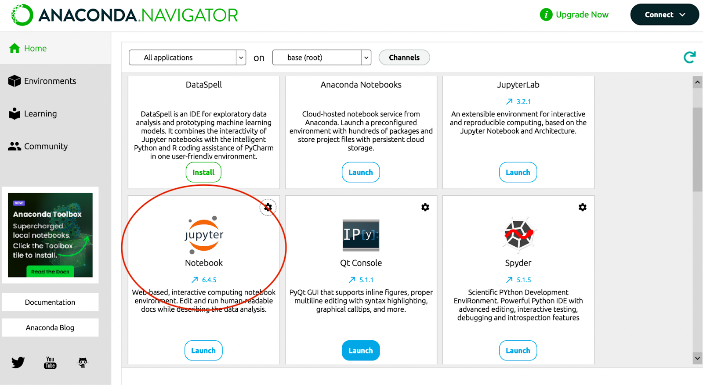
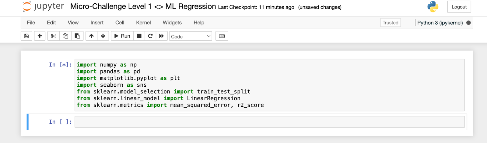
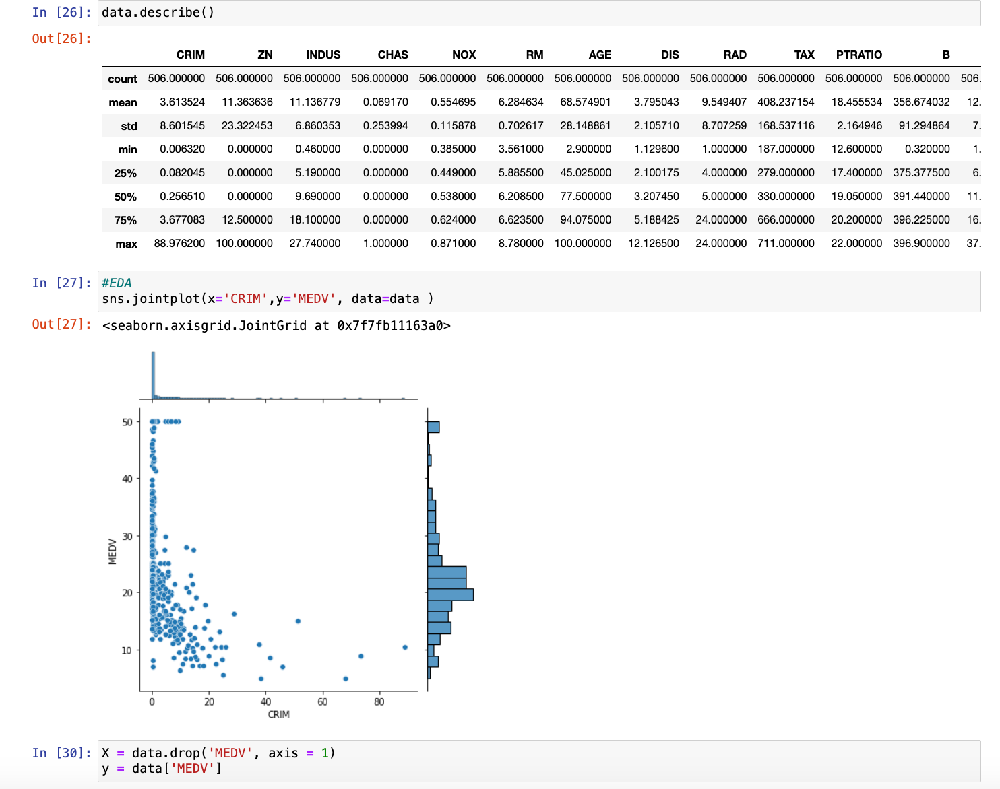
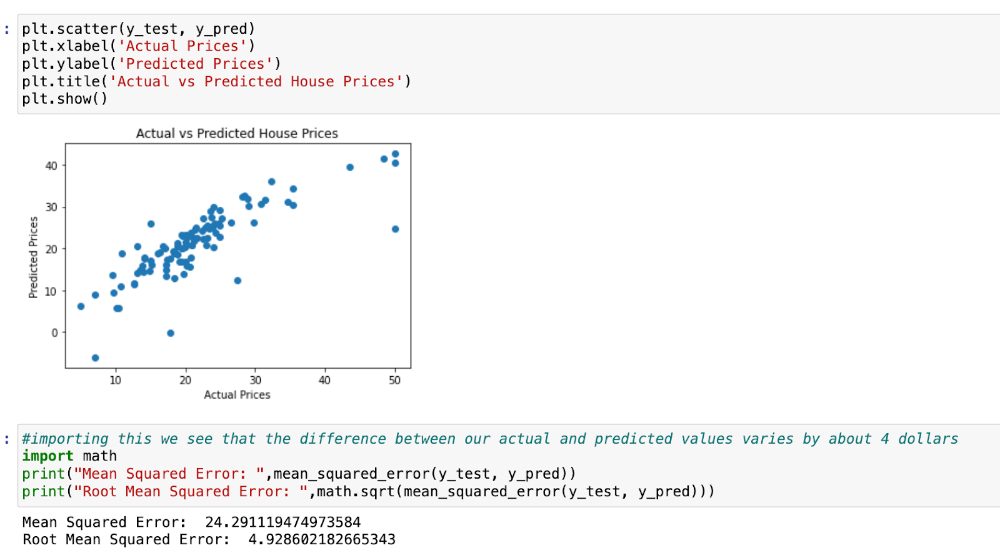

# Machine Learning Main Quest

Machine learning is a system or branch of Artificial Intelligence within Computer Science that focuses on teaching computers to make predictions, create descriptions, and prescribe certain methods of action without being explicitly told to do so (The computer in a way is being trained by means of analyzing historical data to act on its own). Some examples of machine learning algorithms include Neural Networks (models inspired by the human brain that analyze data via layers of linked nodes), Clustering (grouping data points together based on similar characteristics), and Decision Trees (models that split data into branches based on decision rules to reach a prediction or classification).

### Level One: 
→ Instructions shown below.
### Level Two: 
→ A beginner machine-learning challenge for practicing model building and evaluation on a real-world dataset.You can accept the assignment [<u>here</u>](https://classroom.github.com/a/pjAJqyVR). 
### Level Three: 
→ Creating your own project. The instructions can be found [<u>here</u>](https://github.com/BU-Spark-Learning-Ambassadors/ML-level-3).

---
# Machine Learning (Regression) Level One
## Overview
### I. What Machine Learning Is
- **Algorithm —** In anything from mathematics to computer science, an algorithm refers to any set of instructions that are completed in a certain order to attain a particular goal/result. Algorithms are the main building blocks of machine learning models as they take in inputs and then run them through an ordered series of steps to classify data or make predictions.
- **Model —** A program that uses multiple algorithms to identify patterns in data and then create prescriptions, descriptions, or predictions based on the nature of our system. A model is essentially the final result when you combine an ML algorithm with data.
**Key Functions of Machine Learning (ML) Algorithms and Models**
- **Descriptive —** Focused on understanding and recognizing patterns in historical data. Outputs summaries such as charts, tables, and graphs describing relationships and trends.
- **Predictive —** Uses historical data to forecast future outcomes or values. Common techniques include regression and decision trees.
- **Prescriptive —** Combines predictive and descriptive approaches to recommend actions or strategies that lead to desired outcomes.

### II. Types of Machine Learning
- **Supervised Machine Learning —** Training a model using labeled data where each input is paired with a known output. The model learns to map inputs to outputs and can then predict outcomes for new data.
- **Unsupervised Machine Learning —** Training a model on unlabeled data so it discovers patterns or structure on its own, such as clustering similar items together.

### III. How Models Learn (Datasets)
- **Training Data —** The portion of data used to teach the model to recognize relationships between variables.
- **Validation Data —** A separate dataset used during training to fine-tune the model and help prevent overfitting.
- **Testing Data —** New, unseen data used after training to evaluate how well the model performs on real-world data.

### IV. Learning Tasks & Regression
- **Classification —** Assigning inputs into categories (ex: spam vs not spam).
- **Regression —** Predicting continuous numerical values (ex: predicting a house price).
- **Linear, Multiple Linear, and Polynomial Regression —** Linear regression models the relationship between one input variable and one output using a straight line. Multiple regression uses several input variables. Polynomial regression models curved, non-linear relationships.

### V. Model Components

**Parameters vs Variables —** Variables (features) are the input characteristics used for prediction. Parameters are internal values learned by the model during training (such as regression coefficients or neural network weights).

### VI. Evaluating Model Performance
- **R-Squared and Adjusted R-Squared —** A measure of how well a regression model explains variation in the dependent variable. Adjusted R² accounts for the number of predictors used.
- **Root Mean Squared Error (RMSE) —** The square root of the average squared difference between predicted and actual values. Lower RMSE indicates more accurate predictions.

### VII. Common Problems in Machine Learning
- **Overfitting —** When a model learns the training data too closely and performs poorly on new data.
- **Multicollinearity —** When predictor variables are highly correlated, making it difficult to determine each variable’s true impact.
- **Regularization —** A technique that prevents overfitting by penalizing overly complex models.

### Questions You’ll Be Able to Answer

- What are Machine Learning (ML) and Regression?
- What software and prerequisite Python knowledge is required?
- What are the steps in the ML process?
- How do I train and evaluate ML models?
- What metrics help evaluate models?
- What are drawbacks of Machine Learning?
- What are real-world applications of ML?

## WHAT IS MACHINE LEARNING AND REGRESSION?

**Machine learning** is a system or branch of Artificial Intelligence
within Computer Science that focuses on teaching computers to make
predictions, create descriptions, and prescribe certain methods of
action without being explicitly told to do so (The computer in a way is
being trained by means of analyzing historical data to act on its own).
Some examples of machine learning algorithms include Neural Networks
(models inspired by the human brain that analyze data via layers of
linked nodes), Clustering (grouping data points together based on
similar characteristics), and Decision Trees (models that split data
into branches based on decision rules to reach a prediction or
classification).

**Regression** is another ML algorithm and will be the primary focus of
this guide; in its simplest form, regression, whether linear, multiple
linear, or polynomial, is a technique used to predict a continuous
outcome (such as a person's pay based on their experience) by
determining the link between the input data and the output. A simple
breakdown of the way regression works in ML is that you start off with
inputting data in the model through Python, such as hours studied as an
independent variable and exam scores as the dependent. From there, the
regression model is trained by analyzing the data and learning the
overall relationship between the hours studied and the exam scores
students receive. Once trained, the model can then predict students’
exam scores based on the amount of hours they studied.

### Why understand Regression in Machine Learning?

Understanding regression as a Machine Learning algorithm has become increasing crucial not only for the purpose of excelling in a lot of the Data and Computer Science courses that BU has to offer, but also due to the fact that **such a field gives students the ability to assess and anticipate real-world data - a process becoming increasingly relevant in a variety of industries.** Whether in banking, economics, marketing, or technology, regression aids in data-driven decision-making, trend identification, and difficult issue resolution. **As more and more corporations begin to take a data and AI driven approach to operations and success analytics, knowing how to use regression enables students to properly evaluate data, make predictions, and obtain a competitive advantage in their jobs.** To further exemplify the importance of Regression, some amazing softwares out there that use it include Netflix (To predict user preferences and recommend movies or shows based on viewing history), Amazon (To forecast product demand, optimize inventory, and recommend products to customers), and Zillow (To estimate property values based on features like location, size, and recent sales data).

### Okay, what are the essentials?

**First,** to begin performing Regression analysis as an ML algorithm
through python, you do need a basic mathematical understanding of
descriptive statistics (parameters like mean, median, mode, standard
deviation, etc), correlation and covariance, and regression as a whole
(including the interpretation of coefficients, residuals, and
goodness-of-fit measures (like R-squared). The link
[<u>here</u>](https://www.geeksforgeeks.org/ml-linear-regression/) is a
great way to develop this understanding.

**Second,** you will need access to a Python development environment,
such as Jupyter Notebook, which would allow you to write and test python
code interactively. The link
[<u>here</u>](https://mas-dse.github.io/startup/anaconda-macosx-install/)
teaches you how to download and access a Jupyter notebook to begin
coding in Python. Google Colab can also work and you can access this
through google drive. Knowing how to use libraries like scikit-learn,
pandas, and numpy in Python will also be very helpful in implementing
regression models.

**Last**, you will need to learn how to download a data set from a
website like Kaggle as a “.csv” and then import it onto your Jupyter
notebook so you can then begin analyzing it. On this
[<u>link</u>](https://www.geeksforgeeks.org/how-to-download-kaggle-datasets-into-jupyter-notebook/),
use the second method they mention to manually download the data set and
import it.

## LET'S GET STARTED!

First, let’s work on loading up our Jupyter Notebook through the
Anaconda Navigator and then creating a new Python Notebook. Post that,
you’ll be able to then name your newly created notebook and then import
the necessary libraries you need to not only load your data set but also
carry out analysis. This can be done as shown in the image below.

{:style="width:700px; display:inline-block;"}

{:style="width:700px; display:inline-block;"}

At this point, you’ll now be able to find a data set that can be
downloaded through Kaggle and then imported on to Jupyter Notebook by
just dragging it on to the main page and then utilizing the pandas
library to load the data set, read it, and describe it. Here, you may
also want to take additional steps in order to pre-process the data,
which consists of dropping missing values in the data set and converting
categorical variables into numbers if needed. In order to effectively do
this, I’d also recommend taking a look at our Level 1 Data Prep and
Visualization document.

{:style="width:700px; display:inline-block;"}

When selecting the variables you’d like to feature in your model, such
as the multiple x-variables and the singular y-variable or dependent
variable, it's essential to choose x-variables that are relevant and
likely to influence the y-variable. This can be done by analyzing the
data, looking for correlations, and understanding the domain knowledge
behind the dataset. In a regression model, understanding the effect of
various characteristics on house prices, for example, your y-variable
would be the house price, and the x-variables could include factors like
the number of bedrooms, square footage, and location. It’s important to
select variables that have a meaningful impact on the outcome, avoid
multicollinearity (highly correlated x-variables), and possibly use
feature selection methods like stepwise selection or Lasso regression to
identify the most significant predictors.

The next step would be splitting our data into training data and testing
data, which we defined the value of earlier. Typically, the data is
split with 70-80% allocated to training and 20-30% for testing. This
ensures the model has enough data to learn patterns while reserving
enough unseen data to evaluate its performance. You can easily split the
data using the train\_test\_split function from
sklearn.model\_selection, specifying the appropriate proportions.

After our data has been split, we’re just using the LinearRegression
command on the training data and then making predictions using the test
data. It is also a good habit to create a graph of our predictions, so
that it’s much easier to visualize our data when it comes to actually
talking about the efficiency of our model. If you followed the similar
steps to the image below, we should now have the completed model.

## YOU’VE CREATED YOUR REGRESSION MODEL? WHAT NEXT?

Now that you’ve created your regression model, you have to take measures
to evaluate your model and understand how well it actually is performing
on that unseen, test data. In order to engage in this evaluation, we
primarily do three things: calculate our MSE or RMSE, which was
previously defined in the vocabulary section, calculate our R-Squared,
and compare our Actual Y-Variable with the Y-Variable we’ve predicted.

{:style="width:700px; display:inline-block;"}

**First**, when it comes to evaluating the MSE, we know that this is a
metric that calculates the average squared difference between the test
set's actual values and the model's projected values. The lower the MSE,
the better as it’s telling us that the model’s predictions are closer to
the actual values. We have to also calculate the square root of this MSE
to get RMSE in order to bring this error metric back to the same unit as
our target variable (which is dollars for the price of each house). For
instance, if RMSE is $10,000, you know that, on average, your
predictions are off by about $10,000. Our RMSE also accounts for factors
such as outliers in the dataset.

**Second**, we must also create a plot of our actual vs predicted data
as shown on the right. A visual representation of the model's
performance may be obtained by charting the test set's actual housing
prices versus the model's anticipated values.

Points in this figure should be around a 45-degree line, which
represents the point where actual and anticipated values coincide. A
large distribution of points suggests low prediction accuracy.

**Third**, we must go into calculating our R-Squared value in order to
evaluate our model as this will enable us to comprehend
how well the model fits the data by calculating the
fraction of variation in the dependent variable (house prices) that can
be explained by our independent variables. In order to do this, you can
take additional calculations (r2 = r2\_score(y\_test, y\_pred)). An
R-squared value of 0.66 indicates that our model explains 66% of the
variance in the target variable (house prices, in this case) based on
the features you’ve included in the model. This can be improved by
accounting for different factors, which we’ll explore!

## COOL! HOW CAN I NOW IMPROVE MY MODEL?

You’re asking the right questions! As good practice, you’re going to
want to explore some of the ways you can increase your r-squared score
and lower your RMSE. Three possible ways include the following:

- **Explore Residuals:** Investigate the residuals (the differences between
  actual and predicted values) to see if there are any patterns that
  your model isn’t capturing.

- **Feature Engineering:** Consider adding or transforming features that
  might better capture the factors influencing house prices.

- **Model Complexity:** Experiment with more complex models or
  regularization techniques to see if they improve the R-squared without
  overfitting.

Furthermore, you can also take advantage of the Ordinary Least Squares
method to improve your model, as this is a more complex type of
regression that allows for improved interpretability.

## DRAWBACKS/LIMITATIONS AND REAL-LIFE APPLICATIONS

While ML Regression algorithms are a great tool for the analysis of
continuous variables and predictive processes, they do have limitations
and drawbacks that ensure correlation in models will not lead to
causation. Regression models frequently include assumptions about a
linear connection, constant error variance (homoscedasticity), and
errors' independence. Violations of these assumptions might result in
biased or incorrect forecasts. Additionally, a strong correlation
between independent variables might destabilize model coefficients,
making them difficult to understand. For a lot of corporations, there is
also the issue of scalability, where large datasets or high-dimensional
data can make regression models computationally expensive and
time-consuming to train.

This all being said, Regression is still a very useful tool to have in
any student’s armory regardless of what major they are as it will always
be applicable in the more data-driven world we’re seeing in the modern
day. Whether it be in the housing market, where users may estimate
property values based on characteristics such as location and size
(allowing buyers and sellers to make more informed decisions) or
marketing analytics, where users could determine the impact of
advertising spend on sales and optimizes marketing tactics, Regression
is applicable to a wide range of careers; its success is just dependent
on careful model selection, evaluation, and feature engineering.

---

### HOW TO CONTINUE THIS MAIN QUEST?

Take the quiz [<u>here</u>](https://docs.google.com/forms/d/e/1FAIpQLSdaWV6sIpCZvopCa7RITIbr3L-EeKWyD10-rIqBXrf2n5qTRg/viewform?usp=sf_link) to finalize Level One, then apply your knowledge with Level Two. After completing that, you can create your own project with some guidelines for Level Three!
---

For any information or quality issues, please contact:

Kaylin Von Bergen  - [<u>kaylinvb@bu.edu</u>](mailto:kaylinvb@bu.edu)  

---

Author of this Code Quest:

Aarnav - [<u>aarnavp@bu.edu</u>](mailto:aarnavp@bu.edu)

