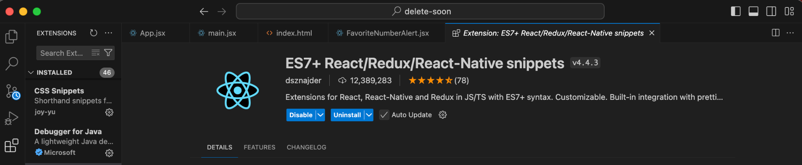
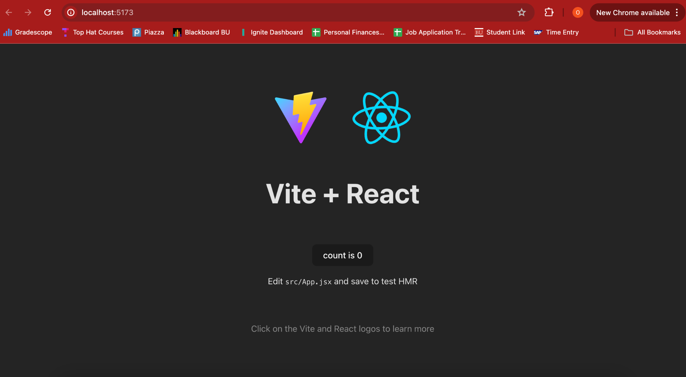
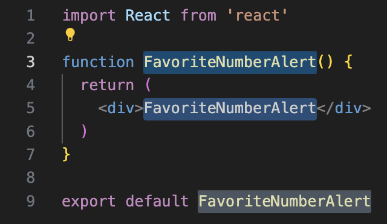

# React Main Quest

React is a web development framework that is wildly popular and promotes a component based architecture. It was created by Facebook to address building and maintaining complex, dynamic user interfaces. React allows developers to build web applications that can update and render efficiently in response to data changes.

### Level One: 
→ Instructions shown below.
### Level Two: 
→ Create your own weather app for the United States! You can accept the assignment <a href="https://classroom.github.com/a/1QZf8t1T" target="_blank" rel="noopener noreferrer"><u>here</u></a>.
### Level Three: 
→ Creating your own project. The instructions can be found <a href="https://github.com/BU-Spark-Learning-Ambassadors/react-level-3" target="_blank" rel="noopener noreferrer"><u>here</u></a>.

---

# React Level One
## VOCABULARY
- **Web Development Framework** — A collection of tools, libraries, and conventions designed to simplify building web applications. It handles lower-level tasks (HTTP requests, routing, authentication, project structure) so developers can focus on creating features. Frameworks typically integrate multiple libraries together into a complete system. React itself is actually a library, while tools built around it (like Next.js) form a framework.
- **State** — The current data of an application at a specific moment, including variables, user inputs, and component status.
- **Component** — A self-contained, reusable piece of code that defines part of a user interface, including its structure (HTML/JSX), behavior (JavaScript logic), and often styling (CSS).
- **Hook** — A special React function that lets functional components use features like state management and lifecycle behavior. They always start with ``use``.
- **JSX** — Stands for JavaScript XML. A syntax extension for JavaScript that looks like HTML and is used in React to describe UI components.
- **Node.js** — An open-source runtime environment that allows JavaScript to run outside of a web browser. This makes it possible to build servers, command-line tools, and development tooling using JavaScript, enabling full-stack development in a single language.
- **Vite** — A fast modern development server and build tool for web projects, used to create and run React apps locally.
- **Next.js** — A React-based web framework that adds features such as server-side rendering and built-in routing to build scalable web applications.

## COMMANDS AND CONFIGURATION
**`npm create vite@latest`** — Creates a new Vite project and generates the initial project structure.

**`npm install`** — Installs all required dependencies listed in `package.json`.

**`npm run dev`** — Starts the local development server so the website can be viewed in a browser.

**`.env` + `.gitignore`**: 
- `.env` stores environment variables such as API keys and secrets.  
- `.gitignore` prevents sensitive or unnecessary files (like `.env` and `node_modules`) from being uploaded to GitHub.

## WHAT IS REACT.JS?

**React** is a web development framework that is wildly popular and
promotes a component based architecture. It was created by Facebook to
address building and maintaining complex, dynamic user interfaces. React
allows developers to build web applications that can update and render
efficiently in response to data changes.

### Why do I need to know anything about React.js?

HTML, CSS, and vanilla JavaScript are good places to start, but building
pages or even applications with them becomes tiresome very quickly.
Developers end up rewriting or copy and pasting code which leads to
errors and unnecessary large codebases. And just imagine trying to make
a small change to a block of code you copied all over your website; it's
a headache. Instead with React.js you can change it in one file and it
will apply to all of its components. (Vanilla JS has a way to repeat the
code but it isn’t widely used and isn’t as optimized for making complex
UI’s)

React.js is an industry standard and has grown a massive community that
continues to develop / maintain open source libraries which developers
can leverage to use other people’s code. Examples of these libraries include a UI
Component Library called <a href="https://mui.com/" target="_blank" rel="noopener noreferrer"><u>MUI</u></a> and a modern
build tool called <a href="http://vite.dev" target="_blank" rel="noopener noreferrer"><u>Vite</u></a>.

### Okay, what are the essentials?

#### <u>Prerequisites</u>: 

You will need to first <a href="https://nodejs.org/en/download" target="_blank" rel="noopener noreferrer"><u>install Node.js</u></a> which is defined above. This will allow us to work in JS for both frontend and backend development. You will also need an IDE, a popular one we recommend is <a href="https://code.visualstudio.com/download" target="_blank" rel="noopener noreferrer"><u>VSCode</u></a>.

Within VSCode, install this extension which will let you use syntax
shortcuts. You can do so by going into “Extensions” within VSCode,
typing in “ES7+ React/Redux/React-Native snippets” and pressing
“install”.

{:style="width:800px; display: block; margin-left: auto; margin-right: auto;"}

You will first need to understand what goes into a “boilerplate”
React.js application.

#### THE PARTS OF A BOILERPLATE VITE APP

- `/public` – the directory where all image files will live  
- `/src` – the directory where all source code lives. All of your
  frontend code will go in here  
- `index.html` – the core file that controls what the user sees in the
  tab preview at the top of the browser like site logo + name  
- `package.json` – where metadata, scripts, and project dependencies are
  documented.  
  - When we run `npm run dev` we are running the `dev` script  
  - When we run `npm install <package-name-here>` we are adding
    another dependency  

*\* It is important to know that Vite is a layer on top of React.js that
we will be using to help build our app, so the anatomy of an app made
with a different build tool will vary slightly*

Let’s build our own now so you can see what’s inside! Follow these
steps:

#### GENERATING THE BOILERPLATE

1. Open your IDE of choice (VSCode, IntelliJ, etc.)
2. Open a terminal and type:  
   `npm create vite@latest my-first-react-app -- --template react`
3. Then run the commands it tells you in the terminal and copy the
   localhost url into your browser to get this:

{:style="width:800px; display: block; margin-left: auto; margin-right: auto;"}

I encourage you to poke around the various files and see what you find.
See if you can change the text on the screen or if you can change the
images to be something from Google!

TIP: To stop the terminal from running you can stop any process by doing
Ctrl + C

#### EXAMINING THE CODE

`/src/App.jsx` – This is an example of a simple component. Notice the name of a component file is capitalized. A component is essentially a function that returns code, thus you can reuse it by calling the function.

See how `useState()` is used on lines 7 and 21. This is a simple
counter that manages the value of `count` via a setter called
`setCount`. Think of this pair of variables as the following structure:

```js
const [getter, setter] = useState(initial_value)
```

**Experiment #1:**

1. Replace line 7 with simply `var count = 0`
2. And line 21 with `onClick={() => count += 1}`
3. Click on the button in your browser and see if “count” increments

> **Explanation**: `useState()` forces a re-render of affected
> components whenever a state variable is changed. Non-state variables
> don’t, thus you will never see the difference.

`index.html` – Think of this as the root, you won’t do much here but
this assigns important metadata that we can mess with.

**Experiment #2:**

1. Look at the tab header for your localhost, it should be the Vite
   logo and “Vite + React”
2. Find the `<title>` tag on/around line 8, change the text between the
   tags to your name
3. Find the `<link>` tag and change the text inside the quotes
   of `href`. <a href="https://share.google/7ydsxwWMqOqRkTPKm" target="_blank" rel="noopener noreferrer"><u>Go to this link</u></a> and click *“Copy Image Address”* and paste it into the string.
4. Check out the tab header and see what has changed

> **Explanation:** You have set the metadata for your app so now it
> displays a personalized preview!

---

## CREATING YOUR OWN COMPONENT

Up to now, you have been *using* components — but you have not actually
learned what a React component really is.

### What is a Component?

A **React component** is simply a JavaScript function that returns JSX
(the UI). React repeatedly calls this function whenever the page needs
to update.

Example:

```jsx
function HelloWorld() {
  return <h1>Hello world!</h1>
}

export default HelloWorld
```

## ADDITIONS TO THE APP

We will now create our first component that makes use of one of the
other most popular hooks: `useEffect()`.

**useEffect( )** – runs a block of code after React updates the screen. It can be thought of as a “listener” that reacts to state changes. The behavior depends on the dependency array:

- No dependency array → runs after **every render**
- Empty array `[]` → runs **once when the page first loads** (component mount)
- `[variable]` → runs whenever that specific variable changes


### Implementing a Favorite Number Alert

Everybody has their own favorite number, so **we are going to make a
component that tells the user when count reaches my favorite number:
4.**

#### FAVORITE NUMBER COMPONENT

Within `/src` create a new file called `FavoriteNumberAlert.jsx`. It is important that the file name ends in that extension so we can use the special syntax.

1. Type `rfce` in the empty file and wait a couple seconds for the
   shortcut preview to come up, press tab to auto complete and you
   should get something like this:

{:style="width:300px; display: block; margin-left: auto; margin-right: auto;"}

2. Then import `useEffect` from `'react'`.
3. Next add a parameter into the method signature called `currNum`.
   - You will need to “destructure” the parameter by putting it in `{ }`.
     Otherwise we would need to do `props.currNum` to access it.
4. Define a constant called `favNum` and assign it your favorite number
   (not too high though).
5. Now copy and paste our `useEffect` hook above the return statement:

```js
useEffect(() => {
  if (currNum == favNum) {
    window.alert(`${currNum} is my favorite number!!!`)
  }
}, [currNum])
```

6. Next we need to call this component inside of `/src/App.jsx`. Go to
   that file and import it.
7. Finally, add this bit of code under the button and test the live
   app:

```jsx
<FavoriteNumberAlert currNum={count} />
```

8. You should get the following. Once you click okay, `count` will
   change to the correct number:

{:style="width:800px; display: block; margin-left: auto; margin-right: auto;"}

**Explanation:** Our `useEffect()` listener triggers an alert once the
`currNum` that we passed into our function equals `favNum`. This is
called **“passing down state”** which we will use again later to connect
layered components and reduce the number of rerenders.

**Passing Down State:** the practice of transferring data from a parent
component to its child components through props, allowing child
components to access and use that data without having to manage it
themselves.

---

## WRAP-UP

Congrats! You now know the basics of React.js, a modern web development
framework. You should be able to answer the following questions and
accomplish the following tasks:

## QUESTIONS (you should be able to answer)

1. What is React.js? What is it used for?
2. What makes React.js better than HTML, CSS, and Vanilla JS? Given
   what you’ve seen about the boilerplate, what might be a scenario
   when you would stick with HTML, CSS, and Vanilla JS?
3. What is the role of Vite and Node.js in our React app?
4. What is `useState()` used for? What about `useEffect()`?

## Tasks

1. Make the tab preview have your name and an image from Google.
2. Make a new Component called `BooleanButton.jsx`  
   1. Make a new button that alternates between true and false when
      you click on it  
   2. Import it into `/src/App.jsx` and put it below the other button  
3. Make a new Component called `PerfectScenario.jsx` which makes an
   alert when the following two things are true:  
   1. `currNum == favNum`  
   2. The boolean value == true  
   3. Hint: for this you should create a global `favNum` and
      `[isClicked, setIsClicked]` and you will need to pass `favNum`
      into `FavoriteNumberAlert.jsx` and `PerfectScenario.jsx` and
      `setIsClicked` into `PerfectScenario.jsx`.

---

## HOW TO CONTINUE THIS MAIN QUEST?

Take the quiz <a href="https://docs.google.com/forms/d/e/1FAIpQLSfH1R2lsM85JQHq454_-SPmR3AWSCoQsoHEojo2M2k7bIJRoQ/viewform?usp=sf_link" target="_blank" rel="noopener noreferrer"><u>here</u></a> to finalize Level One, then apply your knowledge with Level Two. After completing that, you can create your own project with some guidelines for Level Three!

---

### For any information or quality issues, please contact:  

Kaylin Von Bergen (Spark! Code Quest Lead) via <a href="https://github.com/BU-Spark/bu-spark/issues/new?title=Issue%20with%20Code%20Quest%20%E2%80%94%20%5BINSERT%20SPECIFIC%20CODE%20QUEST%5D&body=%40kaylinvonbergen%20%40langdon%0A%0APlease%20describe%20the%20issue%20below%3A%0A" target="_blank" rel="noopener noreferrer"><u>GitHub issue</u></a>

---

### Author of this Code Quest:  

Owen Mariani
