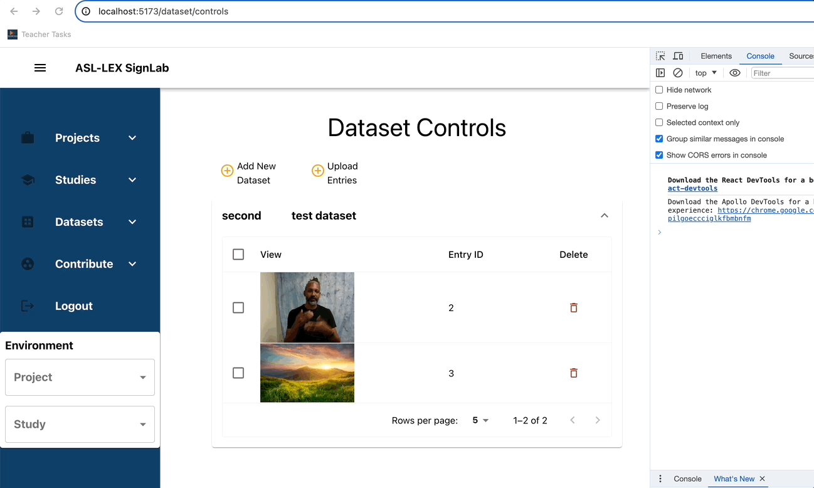

# What to do when reviewing Pull Requests
- Ensure Pull Request is complete. A complete Pull      Request;
  - Must have a clear description of feature or bug 
Should include a gif/video of before and after feature was added, if it introduces visual features. 
Eg: 

  - Contains code that all contributes to a single feature.
  - Must not be commits behind main branch
  - Passes all CI/CD checks

- Provide actionable comments. 
State directly what should be changed and why
Egs: 
I am not clear on what’s going here -> group lines 23-65 into a function “calculateCoordinatesOfScalingBox()”  and move it to a utils.ts file to make your code more readable	
Your branch doesn’t seem to be up to date -> Merge with main to get latest changes

- Run branch locally to verify functionality
- Approve asap
