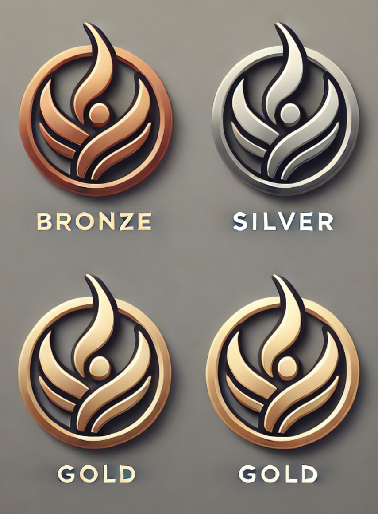

{:style="width:100px; display: block; margin-left: auto; margin-right: auto;"}

# Data Visualization and Prep ⚛

Data preparation is the essential first step in data analysis, involving cleaning, transforming, and structuring raw data for effective use. 
Data visualization then brings data to life through charts, graphs, and maps, making patterns, trends, and insights easier to understand at a glance. Together, these processes ensure data is both accurate and actionable.

### 🔭 Level 1

_Learn the basics of what Data Prep and Visualization consists of. Then, complete a quiz to earn the bronze badge!_

**📄 [Start your Journey](https://docs.google.com/document/d/18_ZVhirAt81yvmG9FOMpRf-SUflxO5okIWH-bBR29FU/edit?usp=drive_link)**

**📝 [Take the Quiz](https://docs.google.com/forms/d/e/1FAIpQLSeqUG5yvqxUSn176WHaj52fDRuqzP91K3cx1mXk8FZXvjlinQ/viewform?usp=sf_link)**

### 🗺️ Level 2

🧑‍💻 Complete a **[Data Prep & Visualization Microchallenge: A Python script to transform thr Iris dataset](https://github.com/BU-Spark-Learning-Ambassadors/react-level-2)**

### 🏔️ Level 3

_Takeoff to conduct your own analyses and make visualizations to communcate your insights: ⚔_

**See the [Github Repository](https://github.com/BU-Spark-Learning-Ambassadors/DataPrepVisual-level-3.git)** for directions, advice, and submission details!

{:style="width:600px; display: block; margin-left: auto; margin-right: auto;"}
