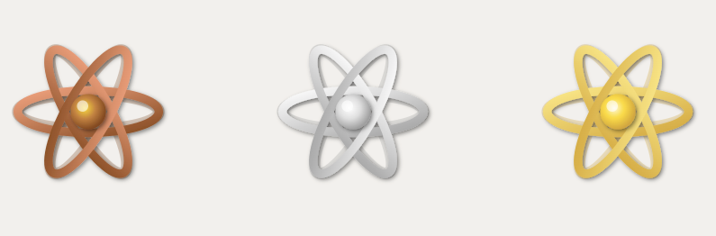

<!--  -->

# React.js ⚛

React is a web development framework that is wildly popular and promotes a component based architecture. It was created by Facebook to address building and maintaining complex, dynamic user interfaces. React allows developers to build web applications that can update and render efficiently in response to data changes.

### 🔭 Level 1

_Learn the basics of what React is and complete a quiz to earn a bronze badge!_

**📄 [Start your Journey](https://docs.google.com/document/d/1L0hJvgYaieCaWLcDV3GWahOx1ePttg_Fw-OZKf9_O1w/edit?tab=t.0#heading=h.nbh7wby3scga)**

**📝 [Take the Quiz](https://docs.google.com/forms/d/e/1FAIpQLSfH1R2lsM85JQHq454_-SPmR3AWSCoQsoHEojo2M2k7bIJRoQ/viewform?usp=sf_link)**

### 🗺️ Level 2

_Start building an app of your own with guidance by doing one of the following_

1. **Attend Hack4Impact's React Workshop** November 5th ([Subscribe to Google Calendar](https://calendar.google.com/calendar/u/0?cid=Y19iZDQyZWYwMzQwZmU1ZGZhYTk5NGI5NDQyNWM2YzE1Y2M0NThmYWE5YmZhNzg0MGY0N2E3MTUzYzg5NTY4YWE0QGdyb3VwLmNhbGVuZGFyLmdvb2dsZS5jb20))
2. Complete a React Microchallenge [ COMING SOON ]

### 🏔️ Level 3

_Blaze your own trail by making an app entirely on your own ⚔_

**See the [Github Repository](https://github.com/BU-Spark-Learning-Ambassadors/react-level-3)** for directions, advice, and submission details!

<!--  -->

    

