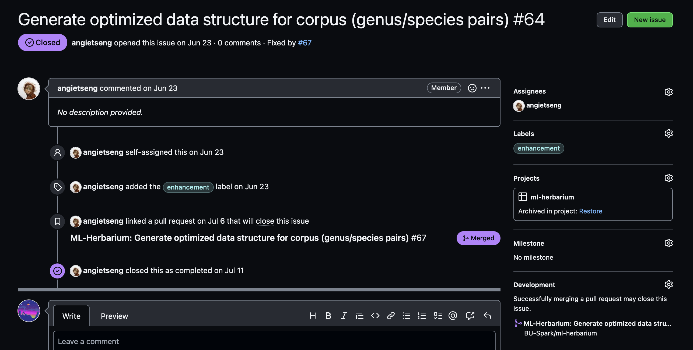

# Jump to Section

- [Motivation](#motivation)
- [Git Basics](#git-basics)
  - [Initializing a New Repository](#initializing-a-new-repository)
  - [Staging Files](#staging-files)
  - [Commits](#commits)
  - [GitHub & Pushing](#github--pushing)
  - [Branches](#branches)
- [GitHub Features](#github-features)
  - [Pull Requests](#pull-requests)
  - [Issues](#issues)
  - [Projects](#projects)
- [Best Practices](#best-practices)
  - [Branching](#branching)
  - [Issues](#issues)
  - [Projects](#projects)
- [Sources & Further Reading](#sources--further-reading)
# Motivation
The purpose of a version control system (VCS), like Git, is **to allow software teams track changes to the code, while enhancing communication and collaboration between team members**. Version control facilitates a continuous, simple way to develop software.

Git is free and open source software for distributed version control: tracking changes in any set of files, usually used for coordinating work among programmers collaboratively developing source code during software development.

Think of Google Drive's collaboration history, except its much more detailed and gives you far more control.

# Git Basics
We use git because it is a powerful tool that allows us to:
- Track changes to our code
- Collaborate with others
- Create backups of our code
- Create branches to work on new features and bug fixes
- Create pull requests to merge our branches into the main branch

Git can prevent situations where you have to rewrite your code because you forgot to save a file, or you accidentally deleted a file. Git also allows you to work on multiple features at the same time, and merge them into the main branch when they are ready.

## Initializing a New Repository
The first steps to using Git after installing are to initialize a repository and and staging files. `git init` is a one-time command you use during the initial setup of a new repo. It will create a new .git subdirectory in your current working directory. This will also create a new main branch.

## Staging Files
Staged files are files that are ready to be committed to the repository you are working on. You will learn more about commit shortly. To stage a file:
```shell
$ git add [filename]
```

or to stage all changed/new files:
```shell
$ git add *
```
## Tracking

Each file in your working directory can be in one of two states:
- tracked
- untracked

Tracked files are files that were in the last snapshot, as well as any newly staged files; they can be `unmodified`, `modified`, or `staged`. In short, tracked files are files that Git knows about. Untracked files are everything else.

To see which files are tracked and which are untracked, use the `git status` command.

## Commits
A `commit` is essentially a "save point" in your git version history. It is a point in the project you can go back to if you find a bug, or want to make a change.

When we `commit`, we should **always** include a **descriptive  commit message** including details on what was changed.

Commit with:
```shell
$ git commit -m "commit message"
```

## Branches
A `branch` is a new/separate version of the main repository. More technically, they are effectivly a pointer to a snapshot of your changes. 

When you want to add a new feature or fix a bug—no matter how big or how small—you spawn a new branch to encapsulate your changes. This makes it harder for unstable code to get merged into the main code base, and it gives you the chance to clean up your future's history before merging it into the main branch.

To list all branches and see which branch you are on:
``` shell
$ git branch
```

To create a branch:
```shell
$ git branch [new branch name]
```
> Note: Your new branch's source will come from whichever branch you are currently on

To switch branches (or `checkout` a branch):
```shell
$ git checkout [existing branch name]
```

To delete a branch:
```shell
$ git branch -d [branch name]
```

# GitHub Features
Now that you have learned the basics of Git, let's take a look at how GitHub will help with collaboration.

## GitHub & Pushing
We will now discuss the role of *hosted* version control systems (VCS) like GitHub. It provides the distributed version control of Git plus access control, bug tracking, software feature requests, task management, continuous integration, and wikis for every project.

After committing your code, the next step is to push it to some `remote origin`, like Github. A repository can have multiple remotes if desired.

You can add and verify a new remote (like GitHub) with:
```shell
$ git remote add origin https://github.com/USER/REPO>.git
# Set a new remote

$ git remote -v
# Verify new remote
> origin  https://github.com/USER/REPO.git (fetch)
> origin  https://github.com/USER/REPO.git (push)
```
> Note: You only need to do this once.

You can then push your commits to the remote with:
```shell
$ git push
```

## Pull Requests
Pull requests (PRs) are a mechanism for a developer to notify team members that they have completed a feature. This lets everybody involved know that they need to review the code and merge it into the `main`  or `dev` branch.

The pull request is more than just a notification—it’s a dedicated forum for discussing the proposed feature. If there are any problems with the changes, teammates can post feedback in the pull request and even tweak the feature by pushing follow-up commits. All of this activity is tracked directly inside of the pull request.

### How it works
1. A developer creates the feature in a dedicated branch in their local repo.
2. The developer pushes the branch to a remote repository (like GitHub).
3. The developer files a pull request via GitHub.
4. The rest of the team reviews the code, discusses it, and alters it as needed.
5. The project maintainer or a team member merges the feature into the official repository and closes the pull request.

## Issues

Think of issues like a todo list. An issue allows developers to document and track bugs, features, and other required changes to a repository. You can assign team members to issues so that everyone knows who is working on what. You can also attach a new branch or a pull request to issues, which will allow team members and clients to see what code cooresponds with what issue. You can also use issues as a forum for discussing a proposed feature—similar to a PR—before any code is written.




# Best Practices
You've made it to the end. You know enough to use Git and GitHub effectively, but lets take a look at some best practices so you can make the most of your new knoledge.

## Branching
We are back to branching. I cannot stress this enough:
***THE `MAIN` BRANCH IS ONLY FOR WORKING, PRODUCTION QUALITY CODE.***


You should also have a `dev` branch and have `feature` or `bugfix` branches for each issue you are working on.

Once you are done with your issue, make a PR into `dev` and get at least one review from a team member or project maintainer.

After your dev branch has gotten to a point where your team would be comfortable 'shipping' the repo to clients or consumers, make a PR into `main`. Code in `main` should be bug free, and ready for use by its intended audience.

> Note: No two developers should ***ever*** work on the same branch. At first it might seem effective to collaborate together, but you will eventually have conflicts and overwrite each other's code. This is not a fun problem to deal with.

### Example
1. I found a memory leak in our `dev` branch! :(
2. I will branch off from `dev` into my new branch named `bugfix_memory-leak`
3. I'll fix our big problem then create a PR from `bugfix_memory-leak` into `dev`
4. I'll get at least one team member/maintainer to review my changes
5. I'll merge my changes into dev
6. Much later, after my team is happy with the state of the project and all the progress made, we will decide its time to merge our `dev` branch into `main`. We get many reviews from team members and maintainers, then merge our PR.

## Issues
If you are using Issues, leave a detailed description on each issue page you create. Everyone working on an issue should be assigned to it (usually people assign themselves to issues). Be sure to leave comments if you are blocked, and feel free to tag team members, PRs, or other Issues in those comments. If you aren't planning on fixing an issue, tag it with `wontfix` and explain why you aren't fixing it in a comment before closing it. Otherwise link a merged PR that solves the issue before closing it.

# That's pretty much it.
Have fun using Git! If you do it right it will save you a ton of time and trouble, especially when your repo or team grows.

# Sources & Further Reading
- https://about.gitlab.com/topics/version-control/
- https://www.w3schools.com/git/
- https://www.atlassian.com/git/tutorials/syncing
- https://medium.com/@jonathanmines/the-ultimate-github-collaboration-guide-df816e98fb67

# Author
Written by [Eamon Niknafs](https://github.com/eamonniknafs)
