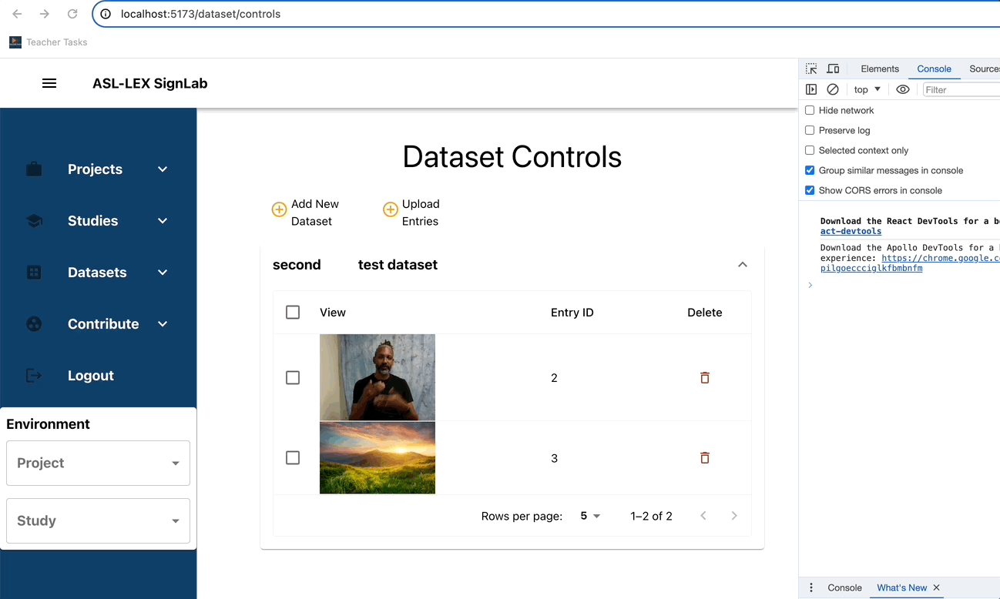

# Code review goals

- Teach best practices.
  - Students should not only learn but also demonstrate their understanding of best software practices by delivering code that meets high standards.
- Produce quality product for clients and next batch of students.
  - Spark wants continued collaboration with clients.
  - Students should be able to focus on their contribution rather than fixing previous code.

# What to do when reviewing a pull requests

- Ensure pull request is complete. A complete pull request;

  - Must have a clear description of feature or bug.
  - Should include a gif/video of before and after feature was added, if it introduces visual features.
    Eg: 

  - Contains code that all contributes to a single feature.
  - Must not be commits behind main branch (or the branch it's about to merge into).
  - Passes all CI/CD checks.

- Provide actionable comments.
  State directly what should be changed and why
  Egs:

  - Instead of "I am not clear on what’s going here", you could comment "group lines 23-65 into a function “calculateCoordinatesOfScalingBox()” and move it to a utils.ts file to make your code more readable".

  - Instead of "Your branch doesn’t seem to be up to date", you could comment "Merge with main to get latest changes".

- Run branch locally to verify functionality.
- Approve asap.

# Code review checklist

- Project structure

  - Organized according to conventions of frameworks used. - Egs
    [Nextjs](https://nextjs.org/docs/getting-started/project-structure)
  - Make use of folders. Eg [folder-structure-for-modern-web-applications](https://dev.to/noruwa/folder-structure-for-modern-web-applications-4d11)
  - Folders and files should have a consistent naming convention.

- Code organization

  - On frontend, adhere to [Atomic Design](https://bradfrost.com/blog/post/atomic-web-design/) as much as possible.
  - Repeated code should be made into functions.
  - Files shouldn’t be too long.
    - Most files should be less than 100 lines. Ideally, no file should exceed 400 lines.

- File formatting
  - Code should be formatted using a formatting tool.
    - Stick to prettier.
  - Files should have a consistent naming convention.
- Git management

  - Has gitignore file.
  - Node_modules, env files, build folders/files (dist etc), log files etc should not be pushed to remote repo.

- ReadMe
  - Changes should be reflected in README.md
    - A code change that contradicts the readme, makes it obsolete or insufficient, should be accompanied by changes in readme.
    - “Best time to add documentation is before implementation. Worst time is after implementation. At the very least, document during implementation.”
- Logging
  - Errors should be logged with console.error .
  - Remove all console.logs. They are not necessary in a well organized, commented, documented codebase.
- Common code smells

  - Unused imports, packages and functions should be removed.
  - Long, repeated If else blocks should be replaced with a switch statement or a map.
  - Magic numbers should be replaced with named constants placed at the top of a file or in a constants.ts/config.ts file, accompanied by necessary comments.
  - Code blocks prone to unpredictable errors should be placed in a try catch block or handled gracefully.
    - Eg are file i/o, network requests, etc
  - if else should be simplified with ternary statements where possible.

  ```
  if(age >= 18 ){
     const message =  "You are an adult";
   }else{
     const message =   "You are not an adult yet";
   }
  // can be replaced with

   const message = (age >= 18) ? "You are an adult" : "You are not an adult yet";

  ```

  - See [here](https://axolo.co/blog/p/top-10-code-smells-to-identify-in-pull-requests-with-code-examples) for more examples of code smells.

- Common React pitfalls

  - Elements in a list should have keys.

  ```
  export const DatasetsView: React.FC<DatasetsViewProps> = ({ datasets, additionalColumns }) => {
    return (
    <>
        {datasets.map((dataset: Dataset) => (				 // add a key to each elements in list
        <Accordion key={dataset._id} disableGutters>
            <AccordionSummary expandIcon={<ExpandMore />}>
            …
            </AccordionSummary>
        </Accordion>
        ))}
    </>
    );
    };

  ```

  - Custom hooks
    - Code that resides in a hook (eg useState, useEffect, useCallback etc) and is repeated in multiple files should be refactored into a [custom hook](https://legacy.reactjs.org/docs/hooks-custom.html).

- Nits:
  - Comments should add context rather than repeat code.
  - There shouldn’t be confusing spelling mistakes in variable/function names.
  - Short, non descriptive variable/function names must be used.
