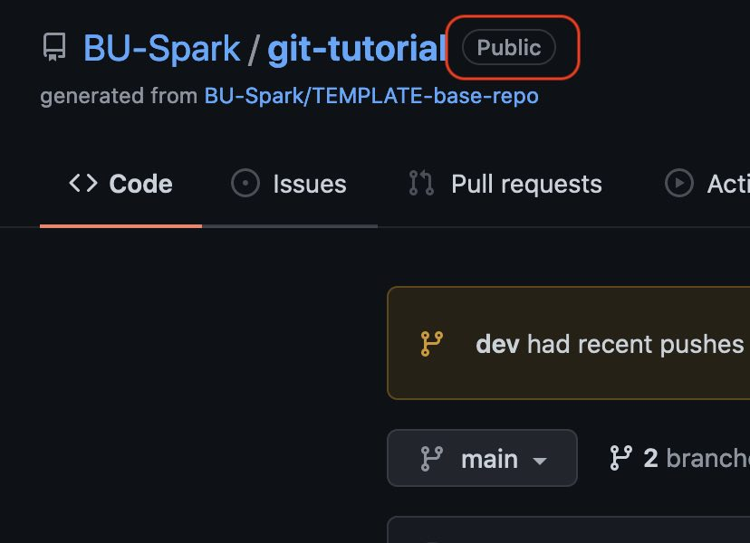
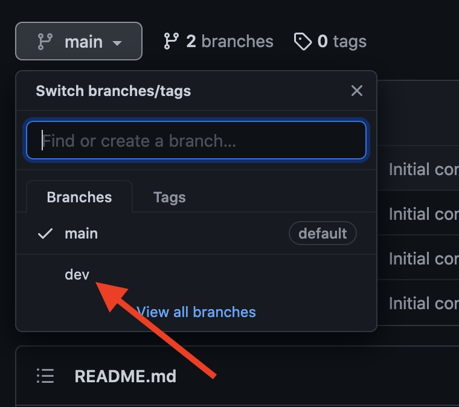
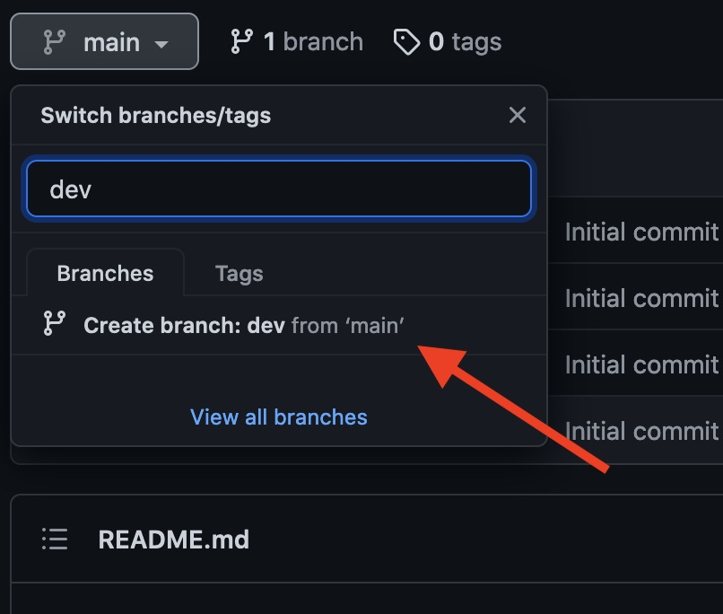
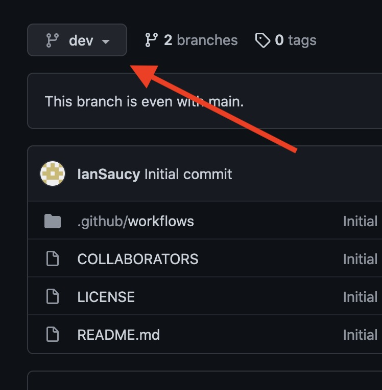
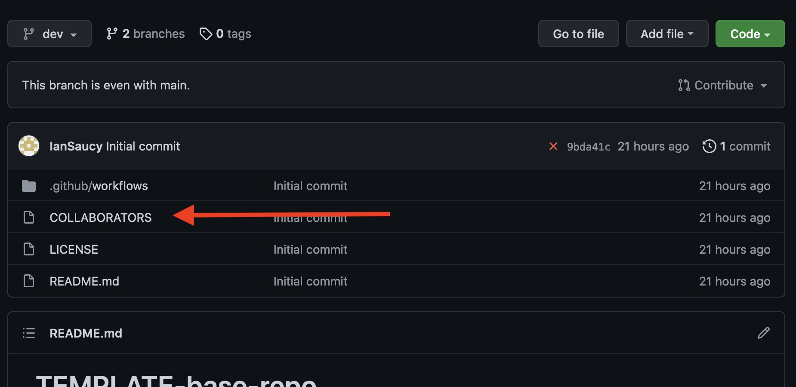
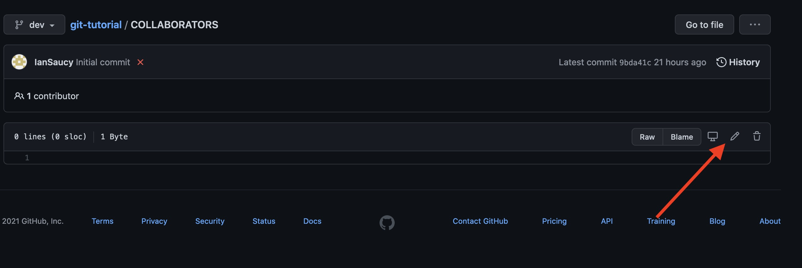
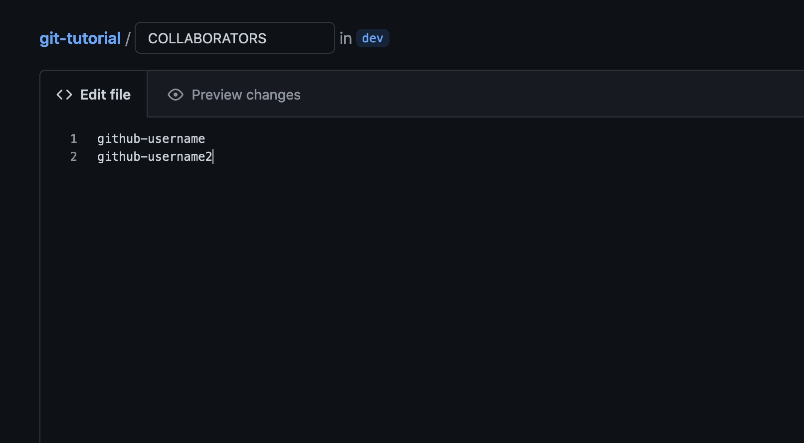
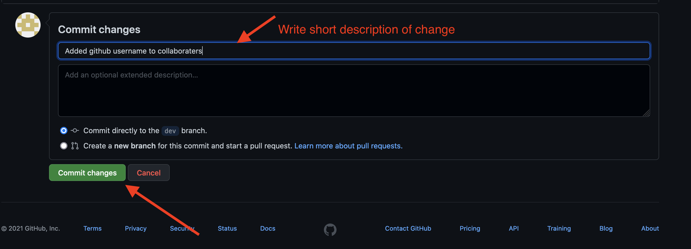

# What is this document

This document will guide you through administration of a Spark! owned Github repository, adding and managing collaborators and basic branch use.

# Introduction

Spark! utilizes Github.com to store and manage all code produced from our various projects. It is treated as the single source of truth for code from projects and is used both during active development and for archival purposes.

# Quick Summary

To add users to a repository utilize the `COLLABORATORS` file located in the root of the repository. Put a single Github username per line and commit to `main` or `master`. In the case that either branch is protected you can commit to `dev`. A Github Action will run automatically and send invites to the new users and remove users who are no longer on the list.

# In depth

This part will go over in more detail the process and intricacies of adding and managing users.

## Types of Repositories

Repositories can be of two types, private or public. Private repositories can only be viewed by those who have been explicitly added whereas public repositories can be viewed by anyone (including non-BU affiliated individuals). In both cases, users must be added as collaborators in order to contribute code to the repository.

Look for the label next to the name of the repository on Github to identify if it is public or private.

{: width="500px"}

## Adding or removing a user to a repository

To add a user you need to add their Github username to the `COLLABORATORS` file and commit it to the correct branch(typically `dev`). In this case we will edit the file directly on Github so you do not have to download anything to your computer.

### Select `dev` branch

The first step is selecting the `dev` branch from the list of branches on Github.

{: width="500px"}

### Create `dev` if it does not exist

If the `dev` branch does not exist you will need to create it by typing it in the box as shown below and choosing "Create branch: dev from 'main'":

{: width="500px"}

### Verify current branch

Once you have created or selected the `dev` branch you should verify that the you are indeed on the `dev` branch by looking at the branch indicator on the left corner:

{: width="500px"}

### Locate file

Now that you are on the `dev` branch, locate the `COLLABORATORS` file in the root of the repository and select it

{: width="1000px"}

### Edit `COLLABORATORS` file

Next you need to enter edit mode in order to add Github usernames, this is located on the right hand side of the screen:

{: width="1000px"}

### Add Github usernames

Now you are editing the file and can add or remove usernames from the list. There should only be one Github username to per line. Do **NOT** use email addresses, this must be their github account name.

{: width="1000px"}

### Commit changes

Now that the username(s) have been added/removed we need to commit the changes to the `dev` branch. Scroll down and you will see a small form that you can fill out describing the changes. You only need to fill in the first text field unless further explanation is required -- good documentation is always appreciated! Verify that "Commit directly to `dev` branch" is selected and click "Commit Changes" button.

{: width="1000px"}

### Complete

You have now added/removed users and just need to wait for the automatic process to execute. New users will receive an email invite that will be valid for 7-days. They can click this invitation to become a collaborator on the project and be able to push code to the repository.

## Why not commit directly to main?

It might seem odd that we have made the change on `dev` instead of `main` or `master`. We have chosen `dev` because `main` and `master` are typically protected branches that do not allow anyone other than Spark! staff to make changes. This includes making edits to files such as `COLLABORATORS` or pushing changes from their local machines. For this reason, `dev` is used throughout the semester and is where students and PMs can make changes to files.
