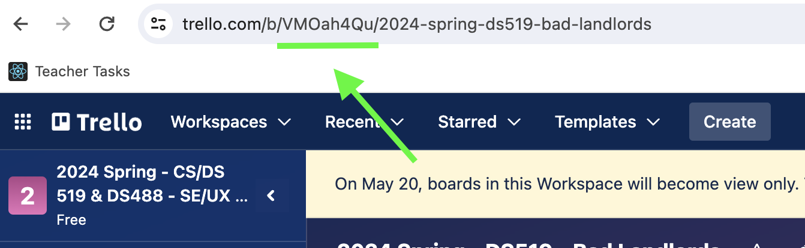
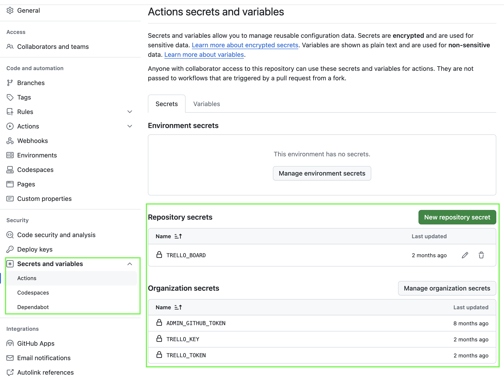
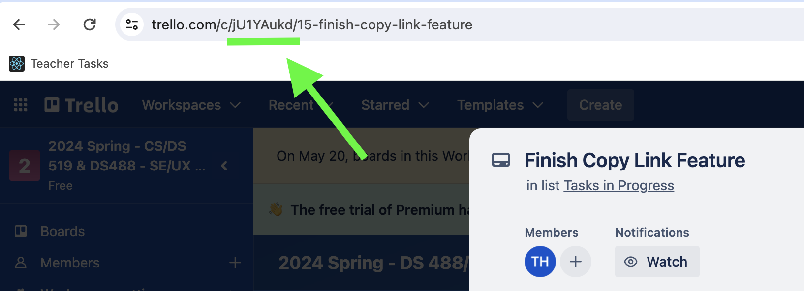

## Trello + Github sync

Tasks defined in Trello are linked to github branches to help product managers and technical product managers keep track of progress.

This linkage is achieved with a Github Action, [sync-with-trello](https://github.com/mannyakosah/sync-with-trello).

## What sync-with-trello does

With this action in place, important github activities are automatically recorded on the corresponding trello card. Specifically,

- Commits and pull requests are added to the trello card as attachments.
- Trello card is moved into the appropriate list depending on the status of the github branch.
  - Card is moved to "Review" list when a pull request is created.
  - Card is moved to "Done" list when a pull request is approved and merged.

These capabilities ensure that product managers, technical product managers and developers are all on the same page about the progress of a task.

## How to setup the Github action

The are two major steps

1. Get api access to trello.
2. Configure action for Github repo.

### 1. Get api access to trello

- In Trello, create a [Power-Up](https://trello.com/power-ups/admin/new).
- Select workspace.

  Spark has multiple trello workspaces. Select the one associated with the Github repos you intend to sync.

- Generate api.
- Generate token.
- Copy the id of the trello board you want to sync.
  

### 2. Configure action for a repo.

- Update tokens in github organization.

  Once you've secured the the api keys from trello, add them to Github. To do so, click on the Settings tab from the Github repository page. Set these variables in 'Secrets and variables'.

  - TRELLO_KEY
  - TRELLO_TOKEN
  - TRELLO_BOARD : the board id you copied earlier

  

- Add action workflow file.

  For a particular repo to run the github action, it must have the action defined in a yaml file in it's .github/worflows folder. See [an example here](https://github.com/BU-Spark/se-computerized-mapping-visual-fields/blob/dev/.github/workflows/trello.yml)

  - check the readme of [sync-with-trello](https://github.com/mannyakosah/sync-with-trello) for available options.

## Usage

Once the github is set up for repo, developers can link a trello card to their github branch by doing the following;

- Copy the id of the trello card you want to sync. - Click on the card to open it. - In the url displayed in the browser, copy the alphanumeric code after 'trello.com/c' and before the next '/' .
  
  In the image shown, the id is jU1YAukd .

- Include the id in your Github branch name with a preceeding '#'. for eg;

  - mannyakosah/add-save-feature-#w8RWQ59F
  - danieloh/make-canvas-dynamic#RWObTE6d

  The #[trello-card-id] pattern can appear anywhere in the branch name.

That's all! the github action will automatically update your trello card after every commit, pr and merge.
