# Getting Started With Exploratory Data Analysis (EDA)

This notebook serves as a starter guide or template for exploratory data analysis. It will go over the topics mentioned in the EDA guide. 


```python
# let's start off by importing the libraries we will need for eda
import pandas as pd
import numpy as np 

# for visualizations : 
import seaborn as sns
import matplotlib.pyplot as plt
```

The dataset we will be using in this tutorial is from Analyze Boston. Analyze Boston is the City of Boston's data hub and is a great resource for data sets regarding the city. 

We will be working with the 2022 311 Service Requests dataset. The dataset consists of service requests from all channels of engagement. 311 allows you to report non-emergency issues or request non-emergency City services. 

Link: https://data.boston.gov/dataset/311-service-requests 


```python
# to run in colab, run the following lines 
# from google.colab import drive
# drive.mount('/content/drive')
```

    Mounted at /content/drive


```python
# read in dataset
df = pd.read_csv('311-requests.csv') 
pd.set_option('display.max_columns', 6)
```


```python
# let's look at the first five rows of the dataset
df.head()
```


<div>
<style scoped>
    .dataframe tbody tr th:only-of-type {
        vertical-align: middle;
    }

    .dataframe tbody tr th {
        vertical-align: top;
    }

    .dataframe thead th {
        text-align: right;
    }
</style>
<table border="1" class="dataframe">
  <thead>
    <tr style="text-align: right;">
      <th></th>
      <th>case_enquiry_id</th>
      <th>open_dt</th>
      <th>target_dt</th>
      <th>...</th>
      <th>latitude</th>
      <th>longitude</th>
      <th>source</th>
    </tr>
  </thead>
  <tbody>
    <tr>
      <th>0</th>
      <td>101004116078</td>
      <td>2022-01-04 15:34:00</td>
      <td>NaN</td>
      <td>...</td>
      <td>42.3818</td>
      <td>-71.0322</td>
      <td>Citizens Connect App</td>
    </tr>
    <tr>
      <th>1</th>
      <td>101004113538</td>
      <td>2022-01-01 13:40:13</td>
      <td>2022-01-04 08:30:00</td>
      <td>...</td>
      <td>42.3376</td>
      <td>-71.0774</td>
      <td>City Worker App</td>
    </tr>
    <tr>
      <th>2</th>
      <td>101004120888</td>
      <td>2022-01-09 12:40:43</td>
      <td>2022-01-11 08:30:00</td>
      <td>...</td>
      <td>42.3431</td>
      <td>-71.0683</td>
      <td>City Worker App</td>
    </tr>
    <tr>
      <th>3</th>
      <td>101004120982</td>
      <td>2022-01-09 13:56:00</td>
      <td>NaN</td>
      <td>...</td>
      <td>42.3810</td>
      <td>-71.0256</td>
      <td>Constituent Call</td>
    </tr>
    <tr>
      <th>4</th>
      <td>101004127209</td>
      <td>2022-01-15 20:42:00</td>
      <td>2022-01-20 08:30:00</td>
      <td>...</td>
      <td>42.3266</td>
      <td>-71.0704</td>
      <td>Constituent Call</td>
    </tr>
  </tbody>
</table>
<p>5 rows × 29 columns</p>
</div>


How many observations/rows are there? <br>

How many variables/columns are there? <br>

What kinds of variables are there? Qualitative? Quantitative? Both? <br>


```python
# number of observations 
df.shape[0]
```


    146373


```python
# to see column name, count, and dtype of each column 
df.info()
```

    <class 'pandas.core.frame.DataFrame'>
    RangeIndex: 146373 entries, 0 to 146372
    Data columns (total 29 columns):
     #   Column                          Non-Null Count   Dtype  
    ---  ------                          --------------   -----  
     0   case_enquiry_id                 146373 non-null  int64  
     1   open_dt                         146373 non-null  object 
     2   target_dt                       129475 non-null  object 
     3   closed_dt                       125848 non-null  object 
     4   ontime                          146373 non-null  object 
     5   case_status                     146373 non-null  object 
     6   closure_reason                  146373 non-null  object 
     7   case_title                      146371 non-null  object 
     8   subject                         146373 non-null  object 
     9   reason                          146373 non-null  object 
     10  type                            146373 non-null  object 
     11  queue                           146373 non-null  object 
     12  department                      146373 non-null  object 
     13  submittedphoto                  55740 non-null   object 
     14  closedphoto                     0 non-null       float64
     15  location                        146373 non-null  object 
     16  fire_district                   146149 non-null  object 
     17  pwd_district                    146306 non-null  object 
     18  city_council_district           146358 non-null  object 
     19  police_district                 146306 non-null  object 
     20  neighborhood                    146210 non-null  object 
     21  neighborhood_services_district  146358 non-null  object 
     22  ward                            146373 non-null  object 
     23  precinct                        146270 non-null  object 
     24  location_street_name            145030 non-null  object 
     25  location_zipcode                110519 non-null  float64
     26  latitude                        146373 non-null  float64
     27  longitude                       146373 non-null  float64
     28  source                          146373 non-null  object 
    dtypes: float64(4), int64(1), object(24)
    memory usage: 32.4+ MB


There are 146373 rows (observations). <br>

There are 29 columns (variables). <br> 

There are both categorical and numerical variables. At quick glance there seems to be more categorical variables than numerical variables. 

Categorical Variables:
```case_status```, ```neighborhood```, ```source```, etc. 

Numerical Variables: 
... maybe not?

The ```case_enquiry_id``` is a unique identifier for each row, ```closedphoto``` has 0 non-null values so it might be worth it to drop this column since there is no additional information we can gather, columns such as ```location_zipcode```, ```latitude```, ```longitude``` not exactly numeric varaibles, since they are numbers that represent different codes. 

### Cleaning 

Let's convert the three time variables (```open_dt```, ```target_dt```, and ```closed_dt```) from objects to pandas datetime objects.
Let's focus on service requests for a set period of time in 2022. 
We will start by filtering for service requests that were opened from January 2022 to March 2022. 


```python
# changing the three columns with dates and times to pandas datetime object 
df['open_dt'] = pd.to_datetime(df['open_dt'])
df['target_dt'] = pd.to_datetime(df['target_dt'])
df['closed_dt'] = pd.to_datetime(df['closed_dt'])

# output is long, but run the line below to check the type of the three columns 
#df.dtypes
```


```python
# filter data for 311 requests from january 2022 to march 2022 
df_filtered = df.loc[(df['open_dt'] >= '2022-01-01') &
                  (df['open_dt'] < '2022-03-31')]
df_filtered.head()
```


<div>
<style scoped>
    .dataframe tbody tr th:only-of-type {
        vertical-align: middle;
    }

    .dataframe tbody tr th {
        vertical-align: top;
    }

    .dataframe thead th {
        text-align: right;
    }
</style>
<table border="1" class="dataframe">
  <thead>
    <tr style="text-align: right;">
      <th></th>
      <th>case_enquiry_id</th>
      <th>open_dt</th>
      <th>target_dt</th>
      <th>...</th>
      <th>latitude</th>
      <th>longitude</th>
      <th>source</th>
    </tr>
  </thead>
  <tbody>
    <tr>
      <th>0</th>
      <td>101004116078</td>
      <td>2022-01-04 15:34:00</td>
      <td>NaT</td>
      <td>...</td>
      <td>42.3818</td>
      <td>-71.0322</td>
      <td>Citizens Connect App</td>
    </tr>
    <tr>
      <th>1</th>
      <td>101004113538</td>
      <td>2022-01-01 13:40:13</td>
      <td>2022-01-04 08:30:00</td>
      <td>...</td>
      <td>42.3376</td>
      <td>-71.0774</td>
      <td>City Worker App</td>
    </tr>
    <tr>
      <th>2</th>
      <td>101004120888</td>
      <td>2022-01-09 12:40:43</td>
      <td>2022-01-11 08:30:00</td>
      <td>...</td>
      <td>42.3431</td>
      <td>-71.0683</td>
      <td>City Worker App</td>
    </tr>
    <tr>
      <th>3</th>
      <td>101004120982</td>
      <td>2022-01-09 13:56:00</td>
      <td>NaT</td>
      <td>...</td>
      <td>42.3810</td>
      <td>-71.0256</td>
      <td>Constituent Call</td>
    </tr>
    <tr>
      <th>4</th>
      <td>101004127209</td>
      <td>2022-01-15 20:42:00</td>
      <td>2022-01-20 08:30:00</td>
      <td>...</td>
      <td>42.3266</td>
      <td>-71.0704</td>
      <td>Constituent Call</td>
    </tr>
  </tbody>
</table>
<p>5 rows × 29 columns</p>
</div>


From our previous observation, since ```closedphoto``` column does not contain any non-null values, let's drop it. 


```python
# drop closedphoto column
df_filtered = df_filtered.drop(columns=['closedphoto'])
```

After filtering the service requests, let's see how many observations we are left with.  


```python
# how many requests were opened from Jan 2022 to March 2022
df_filtered.shape[0]
```


    66520


From a quick preview of the dataframe, we can see that some of the requests are still open. 
Let's see how many observations are open vs. closed and then how many are ontime vs. overdue from the set of requests from January 2022 to March 2022. 


```python
# checking how many open vs. closed cases
df_filtered['case_status'].value_counts()
```


    Closed    59420
    Open       7100
    Name: case_status, dtype: int64


```python
# visualize case_status in pie chart, set color palette 
colors = sns.color_palette('muted')[0:5]
ax = df_filtered['case_status'].value_counts().plot.pie(colors=colors)
ax.yaxis.set_visible(False)
```


    
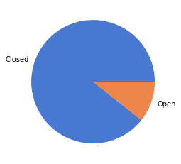
    


```python
# checking how many ontime vs. overdue cases 
df_filtered['ontime'].value_counts()
```


    ONTIME     55089
    OVERDUE    11431
    Name: ontime, dtype: int64


```python
# visualize ontime in pie chart, set color palette 
colors = sns.color_palette('bright')[0:5]
ax = df_filtered['ontime'].value_counts().plot.pie(colors=colors)
ax.yaxis.set_visible(False)
```


    
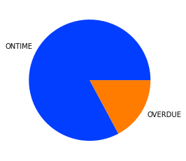
    


### Descriptive Statistics 

Pandas makes this easy! We can use ```describe()``` to get the descriptive statistics of the numerical columns. 


```python
df_filtered.describe()
```


<div>
<style scoped>
    .dataframe tbody tr th:only-of-type {
        vertical-align: middle;
    }

    .dataframe tbody tr th {
        vertical-align: top;
    }

    .dataframe thead th {
        text-align: right;
    }
</style>
<table border="1" class="dataframe">
  <thead>
    <tr style="text-align: right;">
      <th></th>
      <th>case_enquiry_id</th>
      <th>location_zipcode</th>
      <th>latitude</th>
      <th>longitude</th>
    </tr>
  </thead>
  <tbody>
    <tr>
      <th>count</th>
      <td>6.652000e+04</td>
      <td>49807.000000</td>
      <td>66520.000000</td>
      <td>66520.000000</td>
    </tr>
    <tr>
      <th>mean</th>
      <td>1.010042e+11</td>
      <td>2126.916719</td>
      <td>42.335694</td>
      <td>-71.075337</td>
    </tr>
    <tr>
      <th>std</th>
      <td>3.745629e+04</td>
      <td>17.188931</td>
      <td>0.032066</td>
      <td>0.032259</td>
    </tr>
    <tr>
      <th>min</th>
      <td>1.010041e+11</td>
      <td>2108.000000</td>
      <td>42.231500</td>
      <td>-71.185400</td>
    </tr>
    <tr>
      <th>25%</th>
      <td>1.010042e+11</td>
      <td>2119.000000</td>
      <td>42.314500</td>
      <td>-71.087600</td>
    </tr>
    <tr>
      <th>50%</th>
      <td>1.010042e+11</td>
      <td>2126.000000</td>
      <td>42.345900</td>
      <td>-71.062200</td>
    </tr>
    <tr>
      <th>75%</th>
      <td>1.010042e+11</td>
      <td>2130.000000</td>
      <td>42.359400</td>
      <td>-71.058700</td>
    </tr>
    <tr>
      <th>max</th>
      <td>1.010042e+11</td>
      <td>2467.000000</td>
      <td>42.395200</td>
      <td>-70.994900</td>
    </tr>
  </tbody>
</table>
</div>


As mentioned before, the ```case_enquiry_id```, ```location_zipcode```, ```latitude```, and ```longitude``` columns are not numeric variables. The descriptive statistics are not very useful in this situation. 

What would be a useful numeric variable is the duration of a request. Let's calculate the duration of each of the requests from January 2022 to March 2022 and add it as a new column in our dataframe. 


```python
# calculating case duration and adding a new column (case_duration) to the dataframe 
duration = df_filtered['closed_dt'] - df_filtered['open_dt']
df_filtered = df_filtered.assign(case_duration=duration)
df_filtered.head()
```


<div>
<style scoped>
    .dataframe tbody tr th:only-of-type {
        vertical-align: middle;
    }

    .dataframe tbody tr th {
        vertical-align: top;
    }

    .dataframe thead th {
        text-align: right;
    }
</style>
<table border="1" class="dataframe">
  <thead>
    <tr style="text-align: right;">
      <th></th>
      <th>case_enquiry_id</th>
      <th>open_dt</th>
      <th>target_dt</th>
      <th>...</th>
      <th>longitude</th>
      <th>source</th>
      <th>case_duration</th>
    </tr>
  </thead>
  <tbody>
    <tr>
      <th>0</th>
      <td>101004116078</td>
      <td>2022-01-04 15:34:00</td>
      <td>NaT</td>
      <td>...</td>
      <td>-71.0322</td>
      <td>Citizens Connect App</td>
      <td>NaT</td>
    </tr>
    <tr>
      <th>1</th>
      <td>101004113538</td>
      <td>2022-01-01 13:40:13</td>
      <td>2022-01-04 08:30:00</td>
      <td>...</td>
      <td>-71.0774</td>
      <td>City Worker App</td>
      <td>0 days 03:42:02</td>
    </tr>
    <tr>
      <th>2</th>
      <td>101004120888</td>
      <td>2022-01-09 12:40:43</td>
      <td>2022-01-11 08:30:00</td>
      <td>...</td>
      <td>-71.0683</td>
      <td>City Worker App</td>
      <td>0 days 12:44:07</td>
    </tr>
    <tr>
      <th>3</th>
      <td>101004120982</td>
      <td>2022-01-09 13:56:00</td>
      <td>NaT</td>
      <td>...</td>
      <td>-71.0256</td>
      <td>Constituent Call</td>
      <td>NaT</td>
    </tr>
    <tr>
      <th>4</th>
      <td>101004127209</td>
      <td>2022-01-15 20:42:00</td>
      <td>2022-01-20 08:30:00</td>
      <td>...</td>
      <td>-71.0704</td>
      <td>Constituent Call</td>
      <td>0 days 11:36:09</td>
    </tr>
  </tbody>
</table>
<p>5 rows × 29 columns</p>
</div>


Now we can see the new ```case_duration``` column. Some values are ```NaT```, which means there is a missing date. This makes sense because the ```case_status``` is ```OPEN```. 

Let's filter out the open cases and focus on analyzing the duration of the closed cases. 


```python
# filter out the open cases
df_closed = df_filtered.loc[(df_filtered['case_status'] == "Closed")]
df_closed.head()
```


<div>
<style scoped>
    .dataframe tbody tr th:only-of-type {
        vertical-align: middle;
    }

    .dataframe tbody tr th {
        vertical-align: top;
    }

    .dataframe thead th {
        text-align: right;
    }
</style>
<table border="1" class="dataframe">
  <thead>
    <tr style="text-align: right;">
      <th></th>
      <th>case_enquiry_id</th>
      <th>open_dt</th>
      <th>target_dt</th>
      <th>...</th>
      <th>longitude</th>
      <th>source</th>
      <th>case_duration</th>
    </tr>
  </thead>
  <tbody>
    <tr>
      <th>1</th>
      <td>101004113538</td>
      <td>2022-01-01 13:40:13</td>
      <td>2022-01-04 08:30:00</td>
      <td>...</td>
      <td>-71.0774</td>
      <td>City Worker App</td>
      <td>0 days 03:42:02</td>
    </tr>
    <tr>
      <th>2</th>
      <td>101004120888</td>
      <td>2022-01-09 12:40:43</td>
      <td>2022-01-11 08:30:00</td>
      <td>...</td>
      <td>-71.0683</td>
      <td>City Worker App</td>
      <td>0 days 12:44:07</td>
    </tr>
    <tr>
      <th>4</th>
      <td>101004127209</td>
      <td>2022-01-15 20:42:00</td>
      <td>2022-01-20 08:30:00</td>
      <td>...</td>
      <td>-71.0704</td>
      <td>Constituent Call</td>
      <td>0 days 11:36:09</td>
    </tr>
    <tr>
      <th>5</th>
      <td>101004113302</td>
      <td>2022-01-01 00:36:24</td>
      <td>2022-01-04 08:30:00</td>
      <td>...</td>
      <td>-71.0587</td>
      <td>Citizens Connect App</td>
      <td>1 days 23:36:53</td>
    </tr>
    <tr>
      <th>6</th>
      <td>101004113331</td>
      <td>2022-01-01 03:11:23</td>
      <td>NaT</td>
      <td>...</td>
      <td>-71.0587</td>
      <td>Constituent Call</td>
      <td>3 days 05:12:07</td>
    </tr>
  </tbody>
</table>
<p>5 rows × 29 columns</p>
</div>


With the closed cases, let's calculate the descriptive statistics of the new ```case_duration``` column. 


```python
# let's calculate the descriptive statistics again 
# using double brackets to display in a *fancy* table format
df_closed[['case_duration']].describe()
```


<div>
<style scoped>
    .dataframe tbody tr th:only-of-type {
        vertical-align: middle;
    }

    .dataframe tbody tr th {
        vertical-align: top;
    }

    .dataframe thead th {
        text-align: right;
    }
</style>
<table border="1" class="dataframe">
  <thead>
    <tr style="text-align: right;">
      <th></th>
      <th>case_duration</th>
    </tr>
  </thead>
  <tbody>
    <tr>
      <th>count</th>
      <td>59420</td>
    </tr>
    <tr>
      <th>mean</th>
      <td>4 days 12:09:14.466526422</td>
    </tr>
    <tr>
      <th>std</th>
      <td>15 days 09:54:44.441079417</td>
    </tr>
    <tr>
      <th>min</th>
      <td>0 days 00:00:04</td>
    </tr>
    <tr>
      <th>25%</th>
      <td>0 days 01:26:54.750000</td>
    </tr>
    <tr>
      <th>50%</th>
      <td>0 days 09:01:45</td>
    </tr>
    <tr>
      <th>75%</th>
      <td>1 days 15:40:08.250000</td>
    </tr>
    <tr>
      <th>max</th>
      <td>181 days 14:24:23</td>
    </tr>
  </tbody>
</table>
</div>


From the table, we can see that the average case duration is ~4.5 days. <br>
The standard deviation for the case duration is ~15.4 days. <br>
The minimum time a case takes to close is 4 minutes. <br>
The maximum time a case takes to close is ~181.6 days. <br>
The inter-quartile range (IQR) is the difference between the 25% and 75% quantiles. <br>


We can also calculate the *mode* and *median*.


```python
df_closed['case_duration'].mode()
```


    0   0 days 00:00:54
    1   0 days 00:00:57
    2   0 days 00:01:03
    Name: case_duration, dtype: timedelta64[ns]


```python
df_closed['case_duration'].median()
```


    Timedelta('0 days 09:01:45')


The descriptive statistics summary in table form is nice, but it would be nice to visualize the data in a histogram. Simply trying to plot using the values in the ```case_duration``` column will case an error. 

Currently, the values in ```case_duration``` are of type ```timedelta64[ns]```, ```df_closed['case_duration']``` is a Timedelta Series. We will need to apply what is called a frequency conversion to the values. 

"Timedelta Series, TimedeltaIndex, and Timedelta scalars can be converted to other 'frequences' by dividing by another timedelta, or by astyping to a specific timedelta type." (See the link below for more information and code examples!)

https://pandas.pydata.org/pandas-docs/stable/user_guide/timedeltas.html


```python
# dividing the case_duration values by Timedelta of 1 day 
duration_days = ( df_closed['case_duration'] / pd.Timedelta(days=1))

# adding calculation to dataframe under duration_in_days column 
df_closed = df_closed.assign(duration_in_days=duration_days)

# display descriptive statistics summary with new column addition 
df_closed[['duration_in_days']].describe()
```


<div>
<style scoped>
    .dataframe tbody tr th:only-of-type {
        vertical-align: middle;
    }

    .dataframe tbody tr th {
        vertical-align: top;
    }

    .dataframe thead th {
        text-align: right;
    }
</style>
<table border="1" class="dataframe">
  <thead>
    <tr style="text-align: right;">
      <th></th>
      <th>duration_in_days</th>
    </tr>
  </thead>
  <tbody>
    <tr>
      <th>count</th>
      <td>59420.000000</td>
    </tr>
    <tr>
      <th>mean</th>
      <td>4.506417</td>
    </tr>
    <tr>
      <th>std</th>
      <td>15.413014</td>
    </tr>
    <tr>
      <th>min</th>
      <td>0.000046</td>
    </tr>
    <tr>
      <th>25%</th>
      <td>0.060356</td>
    </tr>
    <tr>
      <th>50%</th>
      <td>0.376215</td>
    </tr>
    <tr>
      <th>75%</th>
      <td>1.652873</td>
    </tr>
    <tr>
      <th>max</th>
      <td>181.600266</td>
    </tr>
  </tbody>
</table>
</div>


```python
# using seaborn library for visualizations 
sns.set_theme() # use this if you dont want the visualizations to be default matplotlibstyle
sns.displot(df_closed, x="duration_in_days", binwidth=1)
```


    <seaborn.axisgrid.FacetGrid at 0x16ae584c0>


    
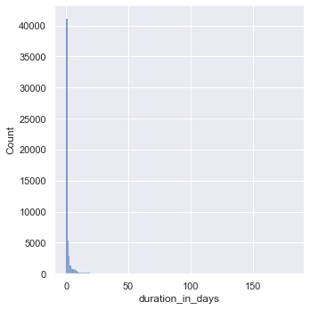
    


From the plot above, the data seems to be skewed right meaning the right tail is much longer than the left. Let's try playing with different bin widths. 


```python
# trying different bin sizes 
sns.displot(df_closed, x="duration_in_days", binwidth=5)
```


    <seaborn.axisgrid.FacetGrid at 0x16b031790>


    
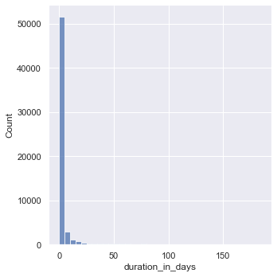
    


```python
# trying different bin sizes
sns.displot(df_closed, x="duration_in_days", binwidth=25)
```


    <seaborn.axisgrid.FacetGrid at 0x16b06b340>


    
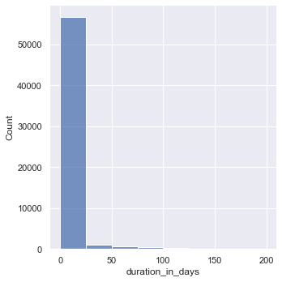
    


Since the data is heavily skewed, let's apply log transformation to the data. The log transformation will *hopefully* reduce or remove the skewness of the original data. The assumption is that the original data follows a log-normal distribution. 


```python
# log-scale transformation since the data is heavliy skewed 
# add bin_width parameter to change bin sizes
sns.displot(df_closed, x="duration_in_days", log_scale=True)
```


    <seaborn.axisgrid.FacetGrid at 0x16b5577f0>


    
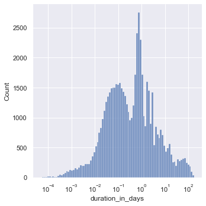
    


### Which neighborhoods had the most requests from January 2022 - March 2022? 

To answer this question, we will take a look at the ```neighborhood``` column. 


```python
# has 25 unique values so a pie chart probably is not the best option
len(df_closed['neighborhood'].unique()) 
```


    25


```python
# plot neighborhood counts 
sns.countplot(x="neighborhood", data=df_closed).set_title('Number of Requests by Neighborhood')
```


    Text(0.5, 1.0, 'Number of Requests by Neighborhood')


    
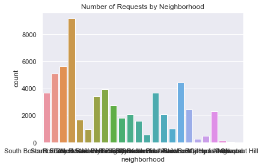
    


Yikes! The x-axis labels are pretty hard to read. Let's fix that by plotting the bars horizontally. 


```python
# fixing orientation of the labels 
sns.countplot(y="neighborhood", data=df_closed).set_title('Number of Requests by Neighborhood')
```


    Text(0.5, 1.0, 'Number of Requests by Neighborhood')


    
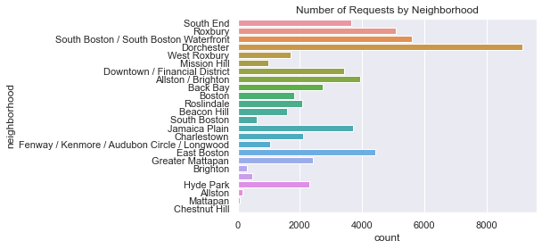
    


From the plot we can see that Dorchester has the most requests, followed by South Boston/South Boston Waterfront, then Roxbury. There's a bar that doesn't have a name...that's strange. Let's display the exact counts for each neighborhood. 


```python
# displaying number of requests by neighborhood in table form 
df_closed['neighborhood'].value_counts()
```


    Dorchester                                      9148
    South Boston / South Boston Waterfront          5608
    Roxbury                                         5097
    East Boston                                     4420
    Allston / Brighton                              3945
    Jamaica Plain                                   3696
    South End                                       3666
    Downtown / Financial District                   3419
    Back Bay                                        2740
    Greater Mattapan                                2429
    Hyde Park                                       2308
    Charlestown                                     2096
    Roslindale                                      2083
    Boston                                          1803
    West Roxbury                                    1698
    Beacon Hill                                     1595
    Fenway / Kenmore / Audubon Circle / Longwood    1034
    Mission Hill                                     990
    South Boston                                     600
                                                     476
    Brighton                                         293
    Allston                                          141
    Mattapan                                          72
    Chestnut Hill                                      4
    Name: neighborhood, dtype: int64


There are 476 requests without a neighborhood label. 


```python
# uncomment and run the line below to check for the empty neighborhood label 
# print(df_closed['neighborhood'].unique())

# gather the rows where neighborhood == ' ' 
df_no_neighborhood = df_closed.loc[(df_closed['neighborhood'] == ' ')]
df_no_neighborhood.head(15) # display first 15 rows
```


<div>
<style scoped>
    .dataframe tbody tr th:only-of-type {
        vertical-align: middle;
    }

    .dataframe tbody tr th {
        vertical-align: top;
    }

    .dataframe thead th {
        text-align: right;
    }
</style>
<table border="1" class="dataframe">
  <thead>
    <tr style="text-align: right;">
      <th></th>
      <th>case_enquiry_id</th>
      <th>open_dt</th>
      <th>target_dt</th>
      <th>...</th>
      <th>source</th>
      <th>case_duration</th>
      <th>duration_in_days</th>
    </tr>
  </thead>
  <tbody>
    <tr>
      <th>163</th>
      <td>101004115729</td>
      <td>2022-01-04 11:11:00</td>
      <td>2022-02-03 11:11:34</td>
      <td>...</td>
      <td>Constituent Call</td>
      <td>0 days 22:32:58</td>
      <td>0.939560</td>
    </tr>
    <tr>
      <th>207</th>
      <td>101004117130</td>
      <td>2022-01-05 14:25:00</td>
      <td>2022-01-14 14:25:51</td>
      <td>...</td>
      <td>Constituent Call</td>
      <td>35 days 20:34:15</td>
      <td>35.857118</td>
    </tr>
    <tr>
      <th>301</th>
      <td>101004118921</td>
      <td>2022-01-07 12:55:08</td>
      <td>NaT</td>
      <td>...</td>
      <td>Constituent Call</td>
      <td>2 days 20:25:31</td>
      <td>2.851053</td>
    </tr>
    <tr>
      <th>640</th>
      <td>101004123032</td>
      <td>2022-01-11 14:00:00</td>
      <td>2022-01-25 14:00:53</td>
      <td>...</td>
      <td>Constituent Call</td>
      <td>0 days 22:37:49</td>
      <td>0.942928</td>
    </tr>
    <tr>
      <th>882</th>
      <td>101004121696</td>
      <td>2022-01-10 10:35:00</td>
      <td>2022-01-17 10:35:33</td>
      <td>...</td>
      <td>Employee Generated</td>
      <td>0 days 00:31:04</td>
      <td>0.021574</td>
    </tr>
    <tr>
      <th>1280</th>
      <td>101004141822</td>
      <td>2022-01-20 12:49:51</td>
      <td>2022-01-31 12:49:51</td>
      <td>...</td>
      <td>Self Service</td>
      <td>0 days 21:40:40</td>
      <td>0.903241</td>
    </tr>
    <tr>
      <th>1509</th>
      <td>101004129011</td>
      <td>2022-01-18 09:11:00</td>
      <td>2022-02-01 09:11:09</td>
      <td>...</td>
      <td>Constituent Call</td>
      <td>0 days 01:11:18</td>
      <td>0.049514</td>
    </tr>
    <tr>
      <th>1574</th>
      <td>101004144874</td>
      <td>2022-01-24 09:32:51</td>
      <td>2022-02-07 09:32:51</td>
      <td>...</td>
      <td>Constituent Call</td>
      <td>0 days 00:22:13</td>
      <td>0.015428</td>
    </tr>
    <tr>
      <th>1612</th>
      <td>101004146190</td>
      <td>2022-01-25 12:48:25</td>
      <td>2022-02-08 12:48:25</td>
      <td>...</td>
      <td>Constituent Call</td>
      <td>0 days 03:36:25</td>
      <td>0.150289</td>
    </tr>
    <tr>
      <th>1777</th>
      <td>101004145555</td>
      <td>2022-01-24 18:24:00</td>
      <td>2022-02-03 08:30:00</td>
      <td>...</td>
      <td>Constituent Call</td>
      <td>15 days 15:08:31</td>
      <td>15.630914</td>
    </tr>
    <tr>
      <th>2433</th>
      <td>101004115813</td>
      <td>2022-01-04 12:06:54</td>
      <td>2022-01-06 12:07:26</td>
      <td>...</td>
      <td>Constituent Call</td>
      <td>0 days 02:50:24</td>
      <td>0.118333</td>
    </tr>
    <tr>
      <th>2489</th>
      <td>101004116451</td>
      <td>2022-01-05 02:15:02</td>
      <td>2022-01-12 08:30:00</td>
      <td>...</td>
      <td>Constituent Call</td>
      <td>0 days 05:25:57</td>
      <td>0.226354</td>
    </tr>
    <tr>
      <th>2521</th>
      <td>101004155729</td>
      <td>2022-01-31 12:20:00</td>
      <td>2022-02-07 12:21:11</td>
      <td>...</td>
      <td>Employee Generated</td>
      <td>0 days 02:28:06</td>
      <td>0.102847</td>
    </tr>
    <tr>
      <th>2677</th>
      <td>101004156474</td>
      <td>2022-01-31 15:32:00</td>
      <td>2022-02-14 15:32:53</td>
      <td>...</td>
      <td>Constituent Call</td>
      <td>3 days 02:58:57</td>
      <td>3.124271</td>
    </tr>
    <tr>
      <th>2687</th>
      <td>101004156811</td>
      <td>2022-01-31 16:48:07</td>
      <td>2022-02-14 16:48:07</td>
      <td>...</td>
      <td>Constituent Call</td>
      <td>0 days 00:03:00</td>
      <td>0.002083</td>
    </tr>
  </tbody>
</table>
<p>15 rows × 30 columns</p>
</div>


```python
print(df_no_neighborhood['latitude'].unique())
print(df_no_neighborhood['longitude'].unique())
```

    [42.3594]
    [-71.0587]


The latitude and longitude values are the same for all of the rows without a ```neighborhood``` value. We can use the *Geopy* module to convert the latitude and longitude coordinates to a place or location address - also referred to as reverse geocoding. 


```python
# import geopy 
from geopy.geocoders import Nominatim 

# make a Nominatim object and initialize, specify a user_agent 
# Nominatim requires this value to be set to your application name, to be able to limit the number of requests per application
# Nominatim is a free service but provides low request limits: https://operations.osmfoundation.org/policies/nominatim/
geolocator = Nominatim(user_agent="eda_geotest")

# set latitude and longitude and convert to string 
lat = str(df_no_neighborhood['latitude'].unique()[0])
long = str(df_no_neighborhood['longitude'].unique()[0])

# get the location information
location = geolocator.reverse(lat + "," +long)

# display location information, add .raw for more details
print(location.raw)
```

    {'place_id': 264213803, 'licence': 'Data © OpenStreetMap contributors, ODbL 1.0. https://osm.org/copyright', 'osm_type': 'way', 'osm_id': 816277585, 'lat': '42.3594696', 'lon': '-71.05880376899256', 'display_name': "Sears' Crescent and Sears' Block Building, Franklin Avenue, Downtown Crossing, Downtown Boston, Boston, Suffolk County, Massachusetts, 02201, United States", 'address': {'building': "Sears' Crescent and Sears' Block Building", 'road': 'Franklin Avenue', 'neighbourhood': 'Downtown Crossing', 'suburb': 'Downtown Boston', 'city': 'Boston', 'county': 'Suffolk County', 'state': 'Massachusetts', 'ISO3166-2-lvl4': 'US-MA', 'postcode': '02201', 'country': 'United States', 'country_code': 'us'}, 'boundingbox': ['42.3593149', '42.3596061', '-71.0592779', '-71.0584887']}


Quick Google Maps search of the location confirms that (42.3594, -71.0587) is Government Center. The output from *geopy* is Sear's Crescent and Sears' Block which are a pair of buildings adjacent to City Hall and City Hall Plaza, Government Center.

Another quick look at the output from *geopy* shows that the ```lat``` and ```lon``` values are similar but different from the latitude and longitude values in the dataset. 

The requests without a neighborhood value have a general location of Government Center. At least we can confirm that requests without a neighborhood value are not outside of Boston or erroneous. 


### During January 2022 - March 2022, where did the most case requests come from?

To answer this question, we will take a look at the ```source``` column. 


```python
# has only 5 unique values so in this case we can use a pie chart 
len(df_closed['source'].unique())
```


    5


```python
# displaying the number of requests by each source type 
df_closed['source'].value_counts()
```


    Citizens Connect App    32066
    Constituent Call        21051
    City Worker App          3795
    Self Service             1632
    Employee Generated        876
    Name: source, dtype: int64


```python
# visualizing the breakdown of where case requests come from 
# seaborn doesn't have a default pie chart but you can add seaborn color palettes to matplotlib plots

colors = sns.color_palette('pastel')[0:5]
ax = df_closed['source'].value_counts().plot.pie(colors=colors)
```


    
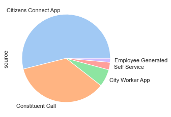
    


```python
# label each slice with the percentage of requests per source 
ax = df_closed['source'].value_counts().plot.pie(colors=colors,autopct='%1.1f%%')

# run the following to remove the default column name label *source*
#ax.yaxis.set_visible(False)
```


    
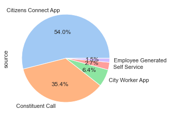
    


From the pie chart, 54% of the requests from January 2022 - March 2022 came from the Citizens Connect App, 35.4% came from a Constituent Call, followed by 6.4% from the City Worker App. 

### How many different types of requests were there from January 2022 - March 2022?

To answer this question, we will take a look at the ```reason``` column. 


```python
# how many different reasons are there 
len(df_closed['reason'].unique())
```


    38


```python
# number of requests by reason 
df_closed['reason'].value_counts()
```


    Enforcement & Abandoned Vehicles     14908
    Code Enforcement                     10437
    Street Cleaning                       8477
    Sanitation                            5993
    Highway Maintenance                   5032
    Signs & Signals                       2202
    Street Lights                         1774
    Recycling                             1690
    Housing                               1529
    Needle Program                        1298
    Building                              1293
    Park Maintenance & Safety             1001
    Trees                                  762
    Animal Issues                          580
    Environmental Services                 560
    Employee & General Comments            366
    Health                                 344
    Graffiti                               297
    Administrative & General Requests      261
    Notification                           141
    Traffic Management & Engineering       113
    Abandoned Bicycle                      108
    Sidewalk Cover / Manhole                53
    Catchbasin                              40
    Fire Hydrant                            26
    Noise Disturbance                       24
    Programs                                23
    Pothole                                 22
    Air Pollution Control                   13
    Operations                              11
    Neighborhood Services Issues             9
    Weights and Measures                     8
    Cemetery                                 7
    Generic Noise Disturbance                7
    Parking Complaints                       5
    Fire Department                          3
    Office of The Parking Clerk              2
    Billing                                  1
    Name: reason, dtype: int64


There were 38 different types of requests from January 2022 - March 2022, the top three with most requests being *Enforcement & Abandoned Vehicles* with 14,908 requests, *Code Enforcement* with 10,437 requests, then *Street Cleaning* with 8,477 requests. 


```python
# top case request reason by neighborhood 
df_closed.groupby(['neighborhood'])['reason'].describe()
```


<div>
<style scoped>
    .dataframe tbody tr th:only-of-type {
        vertical-align: middle;
    }

    .dataframe tbody tr th {
        vertical-align: top;
    }

    .dataframe thead th {
        text-align: right;
    }
</style>
<table border="1" class="dataframe">
  <thead>
    <tr style="text-align: right;">
      <th></th>
      <th>count</th>
      <th>unique</th>
      <th>top</th>
      <th>freq</th>
    </tr>
    <tr>
      <th>neighborhood</th>
      <th></th>
      <th></th>
      <th></th>
      <th></th>
    </tr>
  </thead>
  <tbody>
    <tr>
      <th></th>
      <td>476</td>
      <td>17</td>
      <td>Employee &amp; General Comments</td>
      <td>278</td>
    </tr>
    <tr>
      <th>Allston</th>
      <td>141</td>
      <td>17</td>
      <td>Code Enforcement</td>
      <td>29</td>
    </tr>
    <tr>
      <th>Allston / Brighton</th>
      <td>3945</td>
      <td>31</td>
      <td>Enforcement &amp; Abandoned Vehicles</td>
      <td>1065</td>
    </tr>
    <tr>
      <th>Back Bay</th>
      <td>2740</td>
      <td>29</td>
      <td>Enforcement &amp; Abandoned Vehicles</td>
      <td>678</td>
    </tr>
    <tr>
      <th>Beacon Hill</th>
      <td>1595</td>
      <td>23</td>
      <td>Street Cleaning</td>
      <td>467</td>
    </tr>
    <tr>
      <th>Boston</th>
      <td>1803</td>
      <td>30</td>
      <td>Enforcement &amp; Abandoned Vehicles</td>
      <td>378</td>
    </tr>
    <tr>
      <th>Brighton</th>
      <td>293</td>
      <td>21</td>
      <td>Enforcement &amp; Abandoned Vehicles</td>
      <td>64</td>
    </tr>
    <tr>
      <th>Charlestown</th>
      <td>2096</td>
      <td>27</td>
      <td>Enforcement &amp; Abandoned Vehicles</td>
      <td>766</td>
    </tr>
    <tr>
      <th>Chestnut Hill</th>
      <td>4</td>
      <td>3</td>
      <td>Health</td>
      <td>2</td>
    </tr>
    <tr>
      <th>Dorchester</th>
      <td>9148</td>
      <td>32</td>
      <td>Enforcement &amp; Abandoned Vehicles</td>
      <td>2195</td>
    </tr>
    <tr>
      <th>Downtown / Financial District</th>
      <td>3419</td>
      <td>28</td>
      <td>Enforcement &amp; Abandoned Vehicles</td>
      <td>807</td>
    </tr>
    <tr>
      <th>East Boston</th>
      <td>4420</td>
      <td>27</td>
      <td>Enforcement &amp; Abandoned Vehicles</td>
      <td>1935</td>
    </tr>
    <tr>
      <th>Fenway / Kenmore / Audubon Circle / Longwood</th>
      <td>1034</td>
      <td>28</td>
      <td>Enforcement &amp; Abandoned Vehicles</td>
      <td>202</td>
    </tr>
    <tr>
      <th>Greater Mattapan</th>
      <td>2429</td>
      <td>27</td>
      <td>Sanitation</td>
      <td>546</td>
    </tr>
    <tr>
      <th>Hyde Park</th>
      <td>2308</td>
      <td>28</td>
      <td>Sanitation</td>
      <td>431</td>
    </tr>
    <tr>
      <th>Jamaica Plain</th>
      <td>3696</td>
      <td>28</td>
      <td>Code Enforcement</td>
      <td>819</td>
    </tr>
    <tr>
      <th>Mattapan</th>
      <td>72</td>
      <td>16</td>
      <td>Street Cleaning</td>
      <td>19</td>
    </tr>
    <tr>
      <th>Mission Hill</th>
      <td>990</td>
      <td>25</td>
      <td>Enforcement &amp; Abandoned Vehicles</td>
      <td>208</td>
    </tr>
    <tr>
      <th>Roslindale</th>
      <td>2083</td>
      <td>30</td>
      <td>Enforcement &amp; Abandoned Vehicles</td>
      <td>387</td>
    </tr>
    <tr>
      <th>Roxbury</th>
      <td>5097</td>
      <td>30</td>
      <td>Enforcement &amp; Abandoned Vehicles</td>
      <td>1019</td>
    </tr>
    <tr>
      <th>South Boston</th>
      <td>600</td>
      <td>19</td>
      <td>Enforcement &amp; Abandoned Vehicles</td>
      <td>243</td>
    </tr>
    <tr>
      <th>South Boston / South Boston Waterfront</th>
      <td>5608</td>
      <td>27</td>
      <td>Enforcement &amp; Abandoned Vehicles</td>
      <td>2530</td>
    </tr>
    <tr>
      <th>South End</th>
      <td>3666</td>
      <td>27</td>
      <td>Code Enforcement</td>
      <td>775</td>
    </tr>
    <tr>
      <th>West Roxbury</th>
      <td>1698</td>
      <td>24</td>
      <td>Sanitation</td>
      <td>450</td>
    </tr>
  </tbody>
</table>
</div>


```python
# get counts for each request reason by neighborhood 
reason_by_neighborhood = df_closed.groupby(['neighborhood', 'reason'])['duration_in_days'].describe()[['count']]
reason_by_neighborhood
```


<div>
<style scoped>
    .dataframe tbody tr th:only-of-type {
        vertical-align: middle;
    }

    .dataframe tbody tr th {
        vertical-align: top;
    }

    .dataframe thead th {
        text-align: right;
    }
</style>
<table border="1" class="dataframe">
  <thead>
    <tr style="text-align: right;">
      <th></th>
      <th></th>
      <th>count</th>
    </tr>
    <tr>
      <th>neighborhood</th>
      <th>reason</th>
      <th></th>
    </tr>
  </thead>
  <tbody>
    <tr>
      <th rowspan="5" valign="top"></th>
      <th>Cemetery</th>
      <td>7.0</td>
    </tr>
    <tr>
      <th>Code Enforcement</th>
      <td>9.0</td>
    </tr>
    <tr>
      <th>Employee &amp; General Comments</th>
      <td>278.0</td>
    </tr>
    <tr>
      <th>Enforcement &amp; Abandoned Vehicles</th>
      <td>17.0</td>
    </tr>
    <tr>
      <th>Environmental Services</th>
      <td>3.0</td>
    </tr>
    <tr>
      <th>...</th>
      <th>...</th>
      <td>...</td>
    </tr>
    <tr>
      <th rowspan="5" valign="top">West Roxbury</th>
      <th>Signs &amp; Signals</th>
      <td>95.0</td>
    </tr>
    <tr>
      <th>Street Cleaning</th>
      <td>159.0</td>
    </tr>
    <tr>
      <th>Street Lights</th>
      <td>50.0</td>
    </tr>
    <tr>
      <th>Traffic Management &amp; Engineering</th>
      <td>4.0</td>
    </tr>
    <tr>
      <th>Trees</th>
      <td>72.0</td>
    </tr>
  </tbody>
</table>
<p>594 rows × 1 columns</p>
</div>


```python
# run this cell to write the reason by neighborhood to a csv to see all rows of data 
reason_by_neighborhood.to_csv('reasons_by_neighborhood.csv')
```


```python
# let's take a look at the South End neighborhood specifically 
south_end_df = df_closed.loc[(df_closed['neighborhood'] == 'South End')]
south_end_df.groupby(['reason'])['duration_in_days'].describe()[['count']]
```


<div>
<style scoped>
    .dataframe tbody tr th:only-of-type {
        vertical-align: middle;
    }

    .dataframe tbody tr th {
        vertical-align: top;
    }

    .dataframe thead th {
        text-align: right;
    }
</style>
<table border="1" class="dataframe">
  <thead>
    <tr style="text-align: right;">
      <th></th>
      <th>count</th>
    </tr>
    <tr>
      <th>reason</th>
      <th></th>
    </tr>
  </thead>
  <tbody>
    <tr>
      <th>Abandoned Bicycle</th>
      <td>8.0</td>
    </tr>
    <tr>
      <th>Administrative &amp; General Requests</th>
      <td>10.0</td>
    </tr>
    <tr>
      <th>Air Pollution Control</th>
      <td>4.0</td>
    </tr>
    <tr>
      <th>Animal Issues</th>
      <td>16.0</td>
    </tr>
    <tr>
      <th>Building</th>
      <td>52.0</td>
    </tr>
    <tr>
      <th>Code Enforcement</th>
      <td>775.0</td>
    </tr>
    <tr>
      <th>Employee &amp; General Comments</th>
      <td>1.0</td>
    </tr>
    <tr>
      <th>Enforcement &amp; Abandoned Vehicles</th>
      <td>712.0</td>
    </tr>
    <tr>
      <th>Environmental Services</th>
      <td>48.0</td>
    </tr>
    <tr>
      <th>Fire Hydrant</th>
      <td>2.0</td>
    </tr>
    <tr>
      <th>Graffiti</th>
      <td>55.0</td>
    </tr>
    <tr>
      <th>Health</th>
      <td>8.0</td>
    </tr>
    <tr>
      <th>Highway Maintenance</th>
      <td>360.0</td>
    </tr>
    <tr>
      <th>Housing</th>
      <td>40.0</td>
    </tr>
    <tr>
      <th>Needle Program</th>
      <td>269.0</td>
    </tr>
    <tr>
      <th>Neighborhood Services Issues</th>
      <td>1.0</td>
    </tr>
    <tr>
      <th>Noise Disturbance</th>
      <td>2.0</td>
    </tr>
    <tr>
      <th>Notification</th>
      <td>2.0</td>
    </tr>
    <tr>
      <th>Park Maintenance &amp; Safety</th>
      <td>73.0</td>
    </tr>
    <tr>
      <th>Recycling</th>
      <td>29.0</td>
    </tr>
    <tr>
      <th>Sanitation</th>
      <td>242.0</td>
    </tr>
    <tr>
      <th>Sidewalk Cover / Manhole</th>
      <td>1.0</td>
    </tr>
    <tr>
      <th>Signs &amp; Signals</th>
      <td>76.0</td>
    </tr>
    <tr>
      <th>Street Cleaning</th>
      <td>717.0</td>
    </tr>
    <tr>
      <th>Street Lights</th>
      <td>118.0</td>
    </tr>
    <tr>
      <th>Traffic Management &amp; Engineering</th>
      <td>7.0</td>
    </tr>
    <tr>
      <th>Trees</th>
      <td>38.0</td>
    </tr>
  </tbody>
</table>
</div>


### What types of cases typically take the longest to resolve?

To answer this question, let's take a look at the ```duration_in_days``` and ```reason``` columns.


```python
# what types of cases typically take the longest 
# case_duration by reason 

sns.catplot(x="reason", y="duration_in_days", kind="box", data=df_closed,)
```


    <seaborn.axisgrid.FacetGrid at 0x16ba4bf10>


    
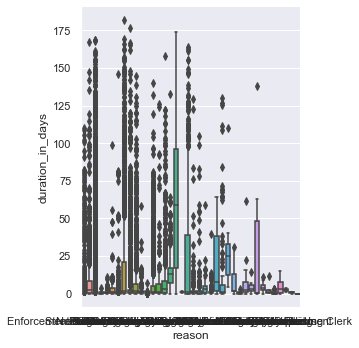
    


```python
# The chart is kind of difficult to read... 
# Let's fix the size of the chart and flip the labels on the x-axis 

sns.catplot(y="reason", x="duration_in_days", kind="box", data=df_closed,
            height = 8, aspect = 1.25)
```


    <seaborn.axisgrid.FacetGrid at 0x16bfc04c0>


    
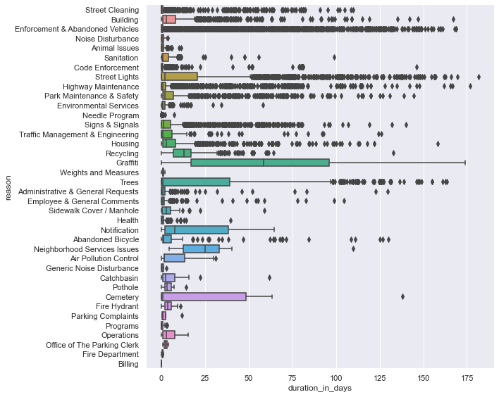
    


Box plots display the five-number-summary, which includes: the minimum, the maximum, the sample median, and the first and third quartiles. 

The box plot shows the distribution ```duration_in_days``` in a way that allows comparisions between case ```reasons```. Box plots show the distribution of a numerical variable broken down by a categorical variable. 

The box shows the quartiles of the ```duration_in_days``` and the whiskers extend to show the rest of the distribution (minimum and maximum). Points that are shown outside of the whiskers are determined to be *outliers*. The line inside the box is the median. 


```python
# descriptive statistics for duration_in_days by case reason 
# box plot in table form 
pd.set_option('display.max_columns', None)
df_closed.groupby(['reason'])['duration_in_days'].describe()
```


<div>
<style scoped>
    .dataframe tbody tr th:only-of-type {
        vertical-align: middle;
    }

    .dataframe tbody tr th {
        vertical-align: top;
    }

    .dataframe thead th {
        text-align: right;
    }
</style>
<table border="1" class="dataframe">
  <thead>
    <tr style="text-align: right;">
      <th></th>
      <th>count</th>
      <th>mean</th>
      <th>std</th>
      <th>min</th>
      <th>25%</th>
      <th>50%</th>
      <th>75%</th>
      <th>max</th>
    </tr>
    <tr>
      <th>reason</th>
      <th></th>
      <th></th>
      <th></th>
      <th></th>
      <th></th>
      <th></th>
      <th></th>
      <th></th>
    </tr>
  </thead>
  <tbody>
    <tr>
      <th>Abandoned Bicycle</th>
      <td>108.0</td>
      <td>15.100783</td>
      <td>30.637974</td>
      <td>0.005799</td>
      <td>0.610787</td>
      <td>1.154815</td>
      <td>5.827731</td>
      <td>129.944907</td>
    </tr>
    <tr>
      <th>Administrative &amp; General Requests</th>
      <td>261.0</td>
      <td>3.812869</td>
      <td>13.899890</td>
      <td>0.000081</td>
      <td>0.114005</td>
      <td>0.781192</td>
      <td>1.984132</td>
      <td>129.670035</td>
    </tr>
    <tr>
      <th>Air Pollution Control</th>
      <td>13.0</td>
      <td>8.872239</td>
      <td>10.842552</td>
      <td>0.001528</td>
      <td>1.787616</td>
      <td>1.790822</td>
      <td>13.153194</td>
      <td>30.967199</td>
    </tr>
    <tr>
      <th>Animal Issues</th>
      <td>580.0</td>
      <td>0.904125</td>
      <td>1.086867</td>
      <td>0.000127</td>
      <td>0.075793</td>
      <td>0.705457</td>
      <td>1.238536</td>
      <td>11.121447</td>
    </tr>
    <tr>
      <th>Billing</th>
      <td>1.0</td>
      <td>0.009178</td>
      <td>NaN</td>
      <td>0.009178</td>
      <td>0.009178</td>
      <td>0.009178</td>
      <td>0.009178</td>
      <td>0.009178</td>
    </tr>
    <tr>
      <th>Building</th>
      <td>1293.0</td>
      <td>8.183306</td>
      <td>16.727784</td>
      <td>0.000046</td>
      <td>0.642755</td>
      <td>2.649641</td>
      <td>8.094919</td>
      <td>167.316273</td>
    </tr>
    <tr>
      <th>Catchbasin</th>
      <td>40.0</td>
      <td>6.295217</td>
      <td>10.713959</td>
      <td>0.000174</td>
      <td>0.946927</td>
      <td>2.444572</td>
      <td>7.476412</td>
      <td>61.852523</td>
    </tr>
    <tr>
      <th>Cemetery</th>
      <td>7.0</td>
      <td>33.686310</td>
      <td>52.072679</td>
      <td>0.000127</td>
      <td>0.113744</td>
      <td>0.594907</td>
      <td>48.409045</td>
      <td>138.163553</td>
    </tr>
    <tr>
      <th>Code Enforcement</th>
      <td>10437.0</td>
      <td>0.646142</td>
      <td>3.440879</td>
      <td>0.000069</td>
      <td>0.054375</td>
      <td>0.234653</td>
      <td>0.752095</td>
      <td>146.231354</td>
    </tr>
    <tr>
      <th>Employee &amp; General Comments</th>
      <td>366.0</td>
      <td>3.045888</td>
      <td>11.407637</td>
      <td>0.000243</td>
      <td>0.050307</td>
      <td>0.607309</td>
      <td>1.707879</td>
      <td>104.725579</td>
    </tr>
    <tr>
      <th>Enforcement &amp; Abandoned Vehicles</th>
      <td>14908.0</td>
      <td>4.326244</td>
      <td>17.119537</td>
      <td>0.000058</td>
      <td>0.057263</td>
      <td>0.177986</td>
      <td>0.620069</td>
      <td>168.863750</td>
    </tr>
    <tr>
      <th>Environmental Services</th>
      <td>560.0</td>
      <td>1.750664</td>
      <td>3.612940</td>
      <td>0.000069</td>
      <td>0.500052</td>
      <td>0.870752</td>
      <td>1.994499</td>
      <td>57.933796</td>
    </tr>
    <tr>
      <th>Fire Department</th>
      <td>3.0</td>
      <td>0.598248</td>
      <td>0.542678</td>
      <td>0.001887</td>
      <td>0.365845</td>
      <td>0.729803</td>
      <td>0.896429</td>
      <td>1.063056</td>
    </tr>
    <tr>
      <th>Fire Hydrant</th>
      <td>26.0</td>
      <td>4.028460</td>
      <td>2.648591</td>
      <td>0.000914</td>
      <td>2.174317</td>
      <td>3.593819</td>
      <td>5.515179</td>
      <td>10.837072</td>
    </tr>
    <tr>
      <th>Generic Noise Disturbance</th>
      <td>7.0</td>
      <td>0.809901</td>
      <td>1.071081</td>
      <td>0.000498</td>
      <td>0.010162</td>
      <td>0.476505</td>
      <td>1.120243</td>
      <td>2.931493</td>
    </tr>
    <tr>
      <th>Graffiti</th>
      <td>297.0</td>
      <td>60.795557</td>
      <td>44.483313</td>
      <td>0.000278</td>
      <td>16.802164</td>
      <td>58.580428</td>
      <td>95.905475</td>
      <td>173.824433</td>
    </tr>
    <tr>
      <th>Health</th>
      <td>344.0</td>
      <td>1.524580</td>
      <td>3.127143</td>
      <td>0.000058</td>
      <td>0.143215</td>
      <td>0.894028</td>
      <td>1.253898</td>
      <td>39.648924</td>
    </tr>
    <tr>
      <th>Highway Maintenance</th>
      <td>5032.0</td>
      <td>4.621423</td>
      <td>14.838073</td>
      <td>0.000081</td>
      <td>0.070668</td>
      <td>0.775781</td>
      <td>2.315587</td>
      <td>176.714560</td>
    </tr>
    <tr>
      <th>Housing</th>
      <td>1529.0</td>
      <td>7.676885</td>
      <td>14.967539</td>
      <td>0.000058</td>
      <td>0.692222</td>
      <td>2.935729</td>
      <td>8.104514</td>
      <td>158.114988</td>
    </tr>
    <tr>
      <th>Needle Program</th>
      <td>1298.0</td>
      <td>0.079918</td>
      <td>0.243719</td>
      <td>0.000081</td>
      <td>0.017248</td>
      <td>0.029554</td>
      <td>0.053157</td>
      <td>7.152766</td>
    </tr>
    <tr>
      <th>Neighborhood Services Issues</th>
      <td>9.0</td>
      <td>31.791151</td>
      <td>31.721388</td>
      <td>4.324954</td>
      <td>12.663229</td>
      <td>24.884931</td>
      <td>32.983403</td>
      <td>109.890347</td>
    </tr>
    <tr>
      <th>Noise Disturbance</th>
      <td>24.0</td>
      <td>0.909435</td>
      <td>1.072071</td>
      <td>0.000104</td>
      <td>0.005830</td>
      <td>0.614433</td>
      <td>1.358082</td>
      <td>3.525995</td>
    </tr>
    <tr>
      <th>Notification</th>
      <td>141.0</td>
      <td>19.565133</td>
      <td>20.603048</td>
      <td>0.000544</td>
      <td>1.802569</td>
      <td>7.719329</td>
      <td>38.391088</td>
      <td>64.423113</td>
    </tr>
    <tr>
      <th>Office of The Parking Clerk</th>
      <td>2.0</td>
      <td>2.440463</td>
      <td>2.261498</td>
      <td>0.841343</td>
      <td>1.640903</td>
      <td>2.440463</td>
      <td>3.240023</td>
      <td>4.039583</td>
    </tr>
    <tr>
      <th>Operations</th>
      <td>11.0</td>
      <td>4.725810</td>
      <td>5.460231</td>
      <td>0.000266</td>
      <td>0.697992</td>
      <td>2.894306</td>
      <td>7.657731</td>
      <td>15.175023</td>
    </tr>
    <tr>
      <th>Park Maintenance &amp; Safety</th>
      <td>1001.0</td>
      <td>10.480097</td>
      <td>21.813287</td>
      <td>0.000347</td>
      <td>0.710787</td>
      <td>1.846771</td>
      <td>6.700729</td>
      <td>144.606782</td>
    </tr>
    <tr>
      <th>Parking Complaints</th>
      <td>5.0</td>
      <td>3.200009</td>
      <td>4.912111</td>
      <td>0.387477</td>
      <td>0.388090</td>
      <td>0.889826</td>
      <td>2.483206</td>
      <td>11.851447</td>
    </tr>
    <tr>
      <th>Pothole</th>
      <td>22.0</td>
      <td>3.910974</td>
      <td>3.141983</td>
      <td>0.001771</td>
      <td>1.924826</td>
      <td>3.009109</td>
      <td>5.652931</td>
      <td>14.102245</td>
    </tr>
    <tr>
      <th>Programs</th>
      <td>23.0</td>
      <td>0.658821</td>
      <td>1.055246</td>
      <td>0.000336</td>
      <td>0.001233</td>
      <td>0.056863</td>
      <td>0.813414</td>
      <td>3.142951</td>
    </tr>
    <tr>
      <th>Recycling</th>
      <td>1690.0</td>
      <td>12.245377</td>
      <td>9.035924</td>
      <td>0.000081</td>
      <td>6.856282</td>
      <td>12.930035</td>
      <td>16.928313</td>
      <td>132.917153</td>
    </tr>
    <tr>
      <th>Sanitation</th>
      <td>5993.0</td>
      <td>2.403129</td>
      <td>3.185305</td>
      <td>0.000058</td>
      <td>0.260671</td>
      <td>0.979294</td>
      <td>3.836354</td>
      <td>98.852222</td>
    </tr>
    <tr>
      <th>Sidewalk Cover / Manhole</th>
      <td>53.0</td>
      <td>4.735583</td>
      <td>8.858981</td>
      <td>0.000127</td>
      <td>0.358148</td>
      <td>2.873461</td>
      <td>5.035451</td>
      <td>58.847674</td>
    </tr>
    <tr>
      <th>Signs &amp; Signals</th>
      <td>2202.0</td>
      <td>6.620529</td>
      <td>14.839239</td>
      <td>0.000185</td>
      <td>0.143718</td>
      <td>1.167795</td>
      <td>5.073134</td>
      <td>140.114028</td>
    </tr>
    <tr>
      <th>Street Cleaning</th>
      <td>8477.0</td>
      <td>1.082891</td>
      <td>6.127272</td>
      <td>0.000046</td>
      <td>0.037975</td>
      <td>0.100706</td>
      <td>0.605370</td>
      <td>109.824236</td>
    </tr>
    <tr>
      <th>Street Lights</th>
      <td>1774.0</td>
      <td>18.585520</td>
      <td>32.664829</td>
      <td>0.000104</td>
      <td>0.148079</td>
      <td>1.984855</td>
      <td>20.707622</td>
      <td>181.600266</td>
    </tr>
    <tr>
      <th>Traffic Management &amp; Engineering</th>
      <td>113.0</td>
      <td>11.388050</td>
      <td>25.003672</td>
      <td>0.000729</td>
      <td>0.085231</td>
      <td>0.842176</td>
      <td>6.080509</td>
      <td>125.919988</td>
    </tr>
    <tr>
      <th>Trees</th>
      <td>762.0</td>
      <td>25.210341</td>
      <td>41.285189</td>
      <td>0.000139</td>
      <td>0.018481</td>
      <td>0.804022</td>
      <td>39.169418</td>
      <td>163.697106</td>
    </tr>
    <tr>
      <th>Weights and Measures</th>
      <td>8.0</td>
      <td>0.985169</td>
      <td>0.558955</td>
      <td>0.107234</td>
      <td>0.741134</td>
      <td>0.900399</td>
      <td>1.207185</td>
      <td>1.808912</td>
    </tr>
  </tbody>
</table>
</div>


Graffiti cases take on average take the longests time to resolve, 60.796 days. 

Do cases typically take longer in one neighborhood over another?


```python
# do cases typically take longer in one neighborhood over another?

sns.catplot(y="neighborhood", x="duration_in_days", kind="box", data=df_closed,
            height = 8, aspect = 1.25)
```


    <seaborn.axisgrid.FacetGrid at 0x16c38f880>


    
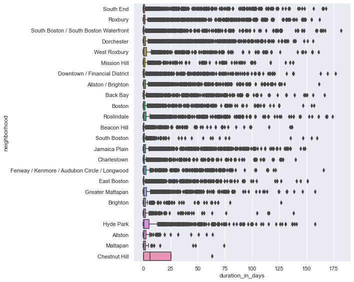
    


The box plot above shows several outliers for each category (```neighborhood```) making it difficult to read and quite overwhelming. 

Let's display the information in table form. 


```python
# in table form 
df_closed.groupby(['neighborhood'])['duration_in_days'].describe()
```


<div>
<style scoped>
    .dataframe tbody tr th:only-of-type {
        vertical-align: middle;
    }

    .dataframe tbody tr th {
        vertical-align: top;
    }

    .dataframe thead th {
        text-align: right;
    }
</style>
<table border="1" class="dataframe">
  <thead>
    <tr style="text-align: right;">
      <th></th>
      <th>count</th>
      <th>mean</th>
      <th>std</th>
      <th>min</th>
      <th>25%</th>
      <th>50%</th>
      <th>75%</th>
      <th>max</th>
    </tr>
    <tr>
      <th>neighborhood</th>
      <th></th>
      <th></th>
      <th></th>
      <th></th>
      <th></th>
      <th></th>
      <th></th>
      <th></th>
    </tr>
  </thead>
  <tbody>
    <tr>
      <th></th>
      <td>476.0</td>
      <td>4.178610</td>
      <td>13.672122</td>
      <td>0.000127</td>
      <td>0.058209</td>
      <td>0.705318</td>
      <td>2.208099</td>
      <td>138.163553</td>
    </tr>
    <tr>
      <th>Allston</th>
      <td>141.0</td>
      <td>3.947410</td>
      <td>9.929540</td>
      <td>0.000058</td>
      <td>0.134988</td>
      <td>0.873414</td>
      <td>2.763426</td>
      <td>63.832847</td>
    </tr>
    <tr>
      <th>Allston / Brighton</th>
      <td>3945.0</td>
      <td>4.622345</td>
      <td>14.786827</td>
      <td>0.000185</td>
      <td>0.075984</td>
      <td>0.511424</td>
      <td>1.995000</td>
      <td>161.749630</td>
    </tr>
    <tr>
      <th>Back Bay</th>
      <td>2740.0</td>
      <td>4.900469</td>
      <td>16.733563</td>
      <td>0.000197</td>
      <td>0.043553</td>
      <td>0.215110</td>
      <td>1.172946</td>
      <td>166.873588</td>
    </tr>
    <tr>
      <th>Beacon Hill</th>
      <td>1595.0</td>
      <td>2.485273</td>
      <td>10.776832</td>
      <td>0.000301</td>
      <td>0.042506</td>
      <td>0.167801</td>
      <td>0.863617</td>
      <td>136.561204</td>
    </tr>
    <tr>
      <th>Boston</th>
      <td>1803.0</td>
      <td>5.152869</td>
      <td>17.959729</td>
      <td>0.000046</td>
      <td>0.041944</td>
      <td>0.345833</td>
      <td>1.555781</td>
      <td>156.934120</td>
    </tr>
    <tr>
      <th>Brighton</th>
      <td>293.0</td>
      <td>5.162394</td>
      <td>14.575959</td>
      <td>0.000266</td>
      <td>0.078623</td>
      <td>0.547211</td>
      <td>2.031343</td>
      <td>126.706586</td>
    </tr>
    <tr>
      <th>Charlestown</th>
      <td>2096.0</td>
      <td>4.147373</td>
      <td>14.840357</td>
      <td>0.000081</td>
      <td>0.067653</td>
      <td>0.278171</td>
      <td>1.162135</td>
      <td>139.983704</td>
    </tr>
    <tr>
      <th>Chestnut Hill</th>
      <td>4.0</td>
      <td>19.075249</td>
      <td>30.039288</td>
      <td>0.148611</td>
      <td>0.185148</td>
      <td>6.448744</td>
      <td>25.338845</td>
      <td>63.254896</td>
    </tr>
    <tr>
      <th>Dorchester</th>
      <td>9148.0</td>
      <td>3.956899</td>
      <td>12.579649</td>
      <td>0.000046</td>
      <td>0.068087</td>
      <td>0.515260</td>
      <td>1.883400</td>
      <td>156.208553</td>
    </tr>
    <tr>
      <th>Downtown / Financial District</th>
      <td>3419.0</td>
      <td>3.475034</td>
      <td>13.957725</td>
      <td>0.000231</td>
      <td>0.050648</td>
      <td>0.234988</td>
      <td>0.973443</td>
      <td>176.714560</td>
    </tr>
    <tr>
      <th>East Boston</th>
      <td>4420.0</td>
      <td>2.777781</td>
      <td>10.877246</td>
      <td>0.000058</td>
      <td>0.037833</td>
      <td>0.181094</td>
      <td>0.902786</td>
      <td>150.815174</td>
    </tr>
    <tr>
      <th>Fenway / Kenmore / Audubon Circle / Longwood</th>
      <td>1034.0</td>
      <td>7.722932</td>
      <td>19.772496</td>
      <td>0.000150</td>
      <td>0.101777</td>
      <td>0.636291</td>
      <td>2.556918</td>
      <td>165.773264</td>
    </tr>
    <tr>
      <th>Greater Mattapan</th>
      <td>2429.0</td>
      <td>4.807563</td>
      <td>14.036534</td>
      <td>0.000104</td>
      <td>0.084375</td>
      <td>0.678646</td>
      <td>2.818472</td>
      <td>158.114988</td>
    </tr>
    <tr>
      <th>Hyde Park</th>
      <td>2308.0</td>
      <td>6.664146</td>
      <td>16.259478</td>
      <td>0.000127</td>
      <td>0.081476</td>
      <td>0.747078</td>
      <td>5.331976</td>
      <td>157.788715</td>
    </tr>
    <tr>
      <th>Jamaica Plain</th>
      <td>3696.0</td>
      <td>6.216330</td>
      <td>18.281044</td>
      <td>0.000104</td>
      <td>0.081823</td>
      <td>0.569161</td>
      <td>2.147717</td>
      <td>148.726493</td>
    </tr>
    <tr>
      <th>Mattapan</th>
      <td>72.0</td>
      <td>3.742091</td>
      <td>11.557064</td>
      <td>0.000069</td>
      <td>0.071858</td>
      <td>0.725631</td>
      <td>2.012494</td>
      <td>74.130579</td>
    </tr>
    <tr>
      <th>Mission Hill</th>
      <td>990.0</td>
      <td>5.582632</td>
      <td>18.433571</td>
      <td>0.000081</td>
      <td>0.055107</td>
      <td>0.281186</td>
      <td>1.690460</td>
      <td>137.808854</td>
    </tr>
    <tr>
      <th>Roslindale</th>
      <td>2083.0</td>
      <td>7.048947</td>
      <td>21.030090</td>
      <td>0.000289</td>
      <td>0.109369</td>
      <td>0.714190</td>
      <td>2.658108</td>
      <td>173.824433</td>
    </tr>
    <tr>
      <th>Roxbury</th>
      <td>5097.0</td>
      <td>5.020254</td>
      <td>17.307327</td>
      <td>0.000069</td>
      <td>0.070324</td>
      <td>0.495382</td>
      <td>1.817338</td>
      <td>161.948993</td>
    </tr>
    <tr>
      <th>South Boston</th>
      <td>600.0</td>
      <td>3.175501</td>
      <td>14.327518</td>
      <td>0.000058</td>
      <td>0.055269</td>
      <td>0.228287</td>
      <td>1.015081</td>
      <td>159.967488</td>
    </tr>
    <tr>
      <th>South Boston / South Boston Waterfront</th>
      <td>5608.0</td>
      <td>3.160470</td>
      <td>14.300232</td>
      <td>0.000150</td>
      <td>0.051296</td>
      <td>0.181863</td>
      <td>0.827731</td>
      <td>181.600266</td>
    </tr>
    <tr>
      <th>South End</th>
      <td>3666.0</td>
      <td>4.225789</td>
      <td>16.643360</td>
      <td>0.000243</td>
      <td>0.043921</td>
      <td>0.187778</td>
      <td>0.967399</td>
      <td>167.869965</td>
    </tr>
    <tr>
      <th>West Roxbury</th>
      <td>1698.0</td>
      <td>6.004628</td>
      <td>17.783995</td>
      <td>0.000081</td>
      <td>0.106288</td>
      <td>0.787685</td>
      <td>3.035735</td>
      <td>161.054688</td>
    </tr>
  </tbody>
</table>
</div>


In January 2022 - March 2022, cases took the longest in Chestnut Hill. Cases typically lasted on average 19.075 days but there were only 4 cases located in Chestnut Hill during this time. Smaller sample sizes could mean more variability (look at standard deviation to explain the spread of observations).  

We can further look at the population of Chestnut Hill versus the other neighborhoods to try and make sense of this low case count. Additionally, we can broaden the time period of the cases to see if Chestnut Hill still has a low case count. 

From the table above we can see how long cases take by each neighborhood, it would be interesting to further breakdown by case reason for each neighborhood. 

### Wrap Up, Next Steps 

Further analysis could be done using the 311 dataset. Using the 311 data from previous years, we can see how number of requests have changed over the years, or how case duration may have changed over the years. 

Since most requests have latitude and longitude coordinates it could be interesting to plot each case request on a map to see if there are clusters of requests in certain locations.  

Next steps could include gathering demographic data to overlay on top of the 311 dataset for further analysis. Another possible next step would be to build a model to predict how long a request could take given the request reason, subject, location, source, etc. 

Click [here](https://drive.google.com/drive/u/2/folders/1R5H3c4R_WYmPp5c7MdhYFVd79H-5WXfA) to download this Jupyter Notebook (make sure you are signed in with your BU email)!
