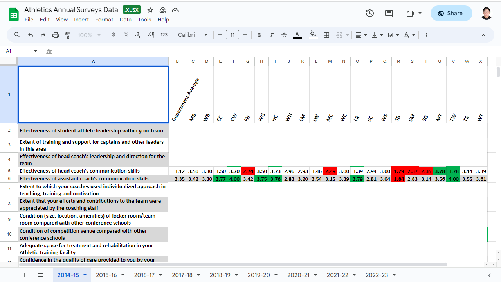
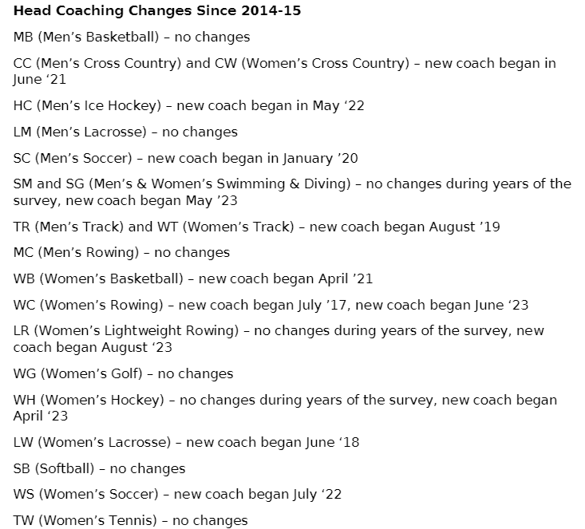

# How to Present Data Science Findings to Clients -- 3 Principles and a Case Study

# Background

Students enrolled in Spark! courses/practicum are usually loaded with adequate technical skills to perform data analytics. However, there might not be a consensus how to present our findings/results to a client. Below is a blog post, originated from my team slack message, that could give you some insights on **How to Present Data Science Findings to Clients**.

# 3 Principles
1. Use data-driven strategies for storytellings. Support your conclusions and hypothesis with data.
2. Level your presentations with your clients and explain in ways they can understand.
3. Embrace [Ownership Principle](https://www.amazon.jobs/content/en/our-workplace/leadership-principles). Task shouldn't be limited to completing the code/presentation/report; avoid the mindset that the rest is "not my job". Consider the bigger picture of how findings could benefit the client.

# Case Study
## Case Study Background

The case study used in the blog post is from the [BU Athletics Survey project's fa23-team](https://github.com/BU-Spark/ds-bu-athletics-survey/tree/main/fa23-team), where we want to help analyze survey data over the past 8-9 years. For a desensitized data, please refer to [this spreadsheet](https://docs.google.com/spreadsheets/d/1wBBV9612tsHR8MsMihHI3gY7ebE2YMsE/edit?usp=sharing&ouid=101499547981540031808&rtpof=true&sd=true) (Every data entry is populized with augumented data).

## Case Study Practice

Before going deep into the blog post, imagine you were given a tabular survey data for 20 BU athletics teams and their survey data of across 10 years e.g. "Effectiveness of head coach's communication skills (on a scale from 1 to 4)". How would you use it to answer the following questions, "How have athletes' perceptions of coach communication evolved over the 8-9 year period?".

> Survey Data
>
> 

> Headcoach Change
>
> 

## Two Options
**Option A**: 

1. A list of scatter plots of all teams throughout the 10 years
2. A statistical test findings over a ANOVA table and F-test to show that there is/isn't a statistical significant difference between the years.

Here is a team member's implementation for this question:

**Scatter Plot**

**ANOVA Table**

**Option B**: 

*I took some time to re-do some of the analysis problems of BU Athletics project by utilizing the Tableau software. Find [the dashboard](https://public.tableau.com/app/profile/handi.xie/viz/BU_Athletics/BUAthletics-CoachPerceptionsReport) here.*

1. A written conclusion indicating which team are under-performing/over-performing, which teams have experienced a large spike (upward and downward), whether the head coach change will impact the communications.
2. An interactive dashboard to show each individual team's survey rating and head coach changing history.

**Conclusion Panel**

**Dashboard Panel**

Which one would you choose?

# Presentation Principles Breakdown
If you are not sure which one to choose, please read along and reflect. 

## Role of a Data Scientist / Business Analyst

The first question that might pop into your head is: Why should I care about how I present my data findings? My model/report/analysis speaks for themselves! However, learning from my professional experience, being a data scientist / business analyst is not all about deploying a model, building a dashboard. These tasks are repetitive and highly exchangeable for anyone with the particular skill set. 

What we really want to do is to push your client (might be your stake-holders, your manager or your product team) with your data-driven conclusions to form data-driven decisions. In that way you are part of the decision-making process and your values are magnified to a larger scale. 

So how do you convince your client that your idea/strategy are viable?

## Modes of Persuasion

In Aristotle's *Rhetoric*, strategies to persuasion consist of, Ethos *(an appeal to the authority or credibility of the presenter)*, Pathos *(an appeal to the audience's emotions)*, and Logos *(logical appeal or the simulation of it)*. They are often referred as the modes of persuasion or the modes of appeal.

Although ancient, it provides a great guideline on how to persuade others. After plugging in the context of data science and analytics, here are 3 most important aspects where you could apply them:

## Principle 1: Data-Driven
The most unique quality you possess, as a Data scientist or a Business Analyst (compared to a product manager or a software engineer),is your ability to combine storytelling and data. When doing analysis, you are often flooded with all kinds of data and metrics, and you get to be familiar with the statistical definition of the metrics. Thus, finding the correct metrics to pursue your claim is a critical step of your final deliverables. Therefore, the first principle, derived from Logos, **data-driven**.

In the case of our BU Athletics case study, both options have presented data and graphs to support its conclusions. However, option A has no clear defined conclusions while option B as a clear conclusion, drawn from data -- "The picking and changing of head coaches has been really successful".

The power of data-driven also lies in making actionable plans or hypothesis in the process of decision making. Suppose we are doing further correlation analysis on the survey data and you were to find directions for further improvements. 

Anyone can propose something or make an educated guess, what makes you different? What justifies a good idea and a bad idea? **Data**. 

Based on imagination, you threw out a few hypothesis:
1. We could keep the head coach and let the him/her takes a communication course;
2. We could make an assistant position who is hired from the third party to ensure the communication goes well.
3. We could replace the head coach with someone with more experience.

All of the hypothesis seems helpful, but only the third one is proved by our survey data. Thus, making it more convincing in the decision-making process. To further improve, the lean book series, especially [Lean Analytics](https://leananalyticsbook.com/), is a good place to seek inspirations.

*The book provides many insights and frameworks that are suitable for startups and analytics. For example, the AARRR(A) a common metrics framework providing guidance to many products*

But is mastering the data-driven story telling enough? The answer is not yet! In many cases, your clients have a different background then yours thus leading to potential blockers in communications.

## Principle 2: Know-Your-Audience

Compared to other technical positions such as software engineer or a machine learning engineer, data scientist and business analyst involve a lot more communication with clients from different background. Therefore, choosing the correct approach to communicate is essential, and the key to choosing the approach, derived from Pathos, is via understanding your clients and level-up with him/her.

*A data science venn diagram I love to use*

Besides coding, statistics and, domain knowledge (business), communication is an important aspect of a data scientist's responsibility. Imagine in a scenario, your client excels in business administration and haven't touched statistics for a long time. Imagine the following (Also a very common data science interview questions): How would you explain **p-value** to your client?

Many answers pop inside your head. Citing wikipedia's definition, "In null-hypothesis significance testing, the p-value is the probability of obtaining test results at least as extreme as the result actually observed, under the assumption that the null hypothesis is correct." Perhaps this is not the optimal way to reciting its strict definition to your client since that will bring more jargons to the table: "test results at least as extreme", "null hypothesis", etc.

For this particular question, I would recommend checking out Cassie Kozyrkov (Google's former Chief Decision Scientist)'s blog post where she used an excellent analogy to explain the concept: [Explaining p-values with puppies](https://kozyrkov.medium.com/explaining-p-values-with-puppies-af63d68005d0).

However, know your audience doesn't simply translate to "use as simple words as possible", and it's more like "use the most accurate and concise words that your audience could understand". If your audience comes from a STEM or technical background, then there is no need to re-explain basic concepts. Instead, finding the balance to communicate is what you are looking for.

In the BU Athletics projects, an ANOVA table were presented to show that there is statistical significant correlations between coaching communication and winning across all team. However, applying the data-driven and know-your-audience principles, it could translate to: our analysis shows coaching communication has shown a strong correlation with seasonal placing, *insert detailed metrics* and by changing head coach to teams showing bad communication scores, we are certainly likely to, *insert probability or other statistical metrics*, increase our seasonal placing by a small/medium/huge advancements. 

Furthermore, coupled with a few presentation tricks like, putting conclusion first, repeat conclusions in different ways, and hiding the details in addendum, will extremely boost the effectiveness of a client meeting.

Now, you have become an excellent data scientist. But is there room improvement? The last but most important principle:

## Principle 3: Ownership

The word ownership is discussed at a lot of technology companies, but most commonly appeared in Amazon's [Leadership Principles](https://www.amazon.jobs/content/en/our-workplace/leadership-principles). In short, one's work shouldn't be halted if the works goes out of the scope, using "not my business" as an excuse to avoid taking responsibilities. 

In the context of a data science project, an analysis shouldn't stop after just finishing a data visualization or a statistical analysis. In work, a large amount of the time you spent is on the technical process. However, the presentation is just as important as the process itself. While startups and VCs were at its peak a few years ago, sometimes a successful roadshow with a powerpoint presentation and no concrete product serves enough purpose to win over investors.

The Ownership principle could also be interpreted as "thinking in the shoes of the clients". In the context of BU Athletics, when the Spark! team presented their findings to its client, what will the client do with the findings? Will he/she use it to leverage change and make decisions to help the 20 teams in Boston University's Athletics department? If so, will the findings be sufficient for he/she to convince her supervisor? her manager? Will he/she have doubts utilizing many jargons in the findings? How would he/she explain them?

If you have shown great ownership and leadership in your work, then naturally trusts are built between you and your client, thus deriving from Ethos, further communications would be easier.

# Summary
In summary, presenting data science findings effectively to clients involves three key principles:

1. Data-Driven Approach: Always back your conclusions with solid data. This forms the core of your credibility and persuasiveness.

2. Know Your Audience: Tailor your presentation to suit the background and understanding level of your clients. Avoid jargon and use clear, relatable language.

3. Ownership: Go beyond just presenting data. Think about how your findings can be applied in practical scenarios to benefit the client. Show initiative and consider the broader impact of your work.

Applying these principles, as shown in the BU Athletics case study, will help you communicate your findings more effectively, ensuring they're not only understood but also actionable. Remember, your role is to make data meaningful and useful for decision-making, bridging the gap between technical analysis and practical application.
