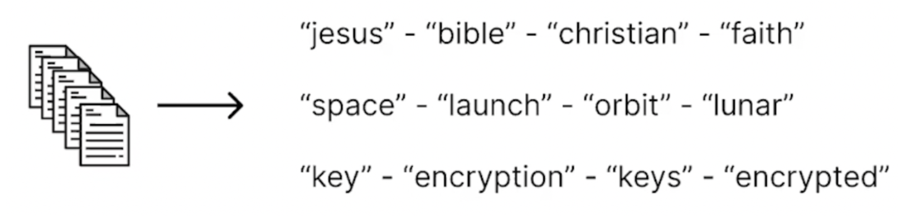
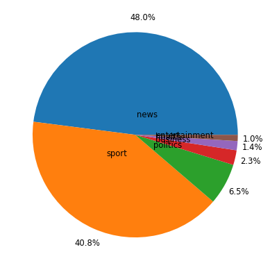
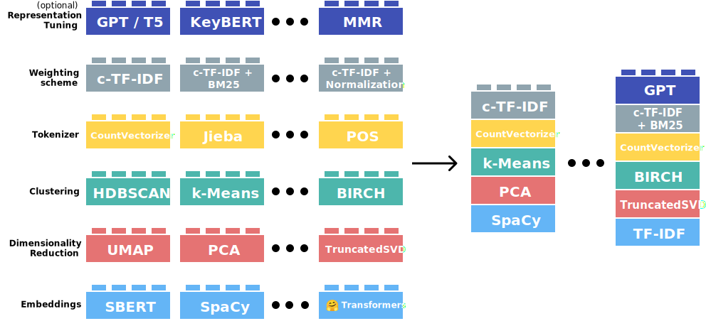
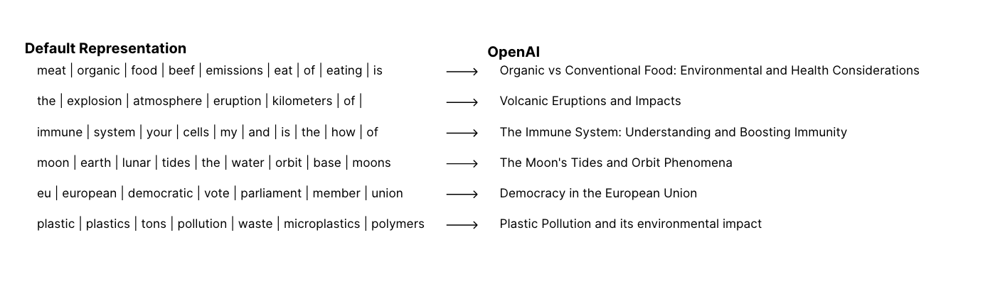

## Analyzing Text Data with Topic Modeling 
March 27, 2024

### What is Topic Modeling?

- Manually reading hundreds of thousands of texts to gather insights takes time (a lot of time)
- Useful method for automatically finding themes in large uncategorized groups of text
- Applications include:
  - Analyzing customer reviews or feedback 
  - Categorizing news articles 
  - Social Media Analysis, analyzing political campaign ads 
  - Gene Expression Analysis and other applications in Bioinformatics
  - Categorizing bills
  - Analyzing themes in free form surveys



### Dataset
The original dataset contains around 38000 lines of articles from CNN news from the year 2011 to 2022.  
The dataset used in this tutorial is a sample of this and includes 45% of the articles from the original dataset. 

See more details [here](https://huggingface.co/datasets/AyoubChLin/CNN_News_Articles_2011-2022)


```python
import warnings
warnings.filterwarnings('ignore')
```


```python
import pandas as pd 
import matplotlib.pyplot as plt
import numpy as np
import re
```


```python
# load dataset and preview
df = pd.read_csv('./data/CNN_articles_sample.csv')
df.head()
```


<div>
<style scoped>
    .dataframe tbody tr th:only-of-type {
        vertical-align: middle;
    }

    .dataframe tbody tr th {
        vertical-align: top;
    }

    .dataframe thead th {
        text-align: right;
    }
</style>
<table border="1" class="dataframe">
  <thead>
    <tr style="text-align: right;">
      <th></th>
      <th>Unnamed: 0.1</th>
      <th>Unnamed: 0</th>
      <th>text</th>
      <th>label</th>
    </tr>
  </thead>
  <tbody>
    <tr>
      <th>0</th>
      <td>16381</td>
      <td>16381</td>
      <td>Story highlightsJenson Button says there's a "...</td>
      <td>5</td>
    </tr>
    <tr>
      <th>1</th>
      <td>24435</td>
      <td>24435</td>
      <td>Story highlightsF1's drivers have expressed th...</td>
      <td>5</td>
    </tr>
    <tr>
      <th>2</th>
      <td>12801</td>
      <td>12801</td>
      <td>Story highlightsThe Georgia Dome is scheduled ...</td>
      <td>5</td>
    </tr>
    <tr>
      <th>3</th>
      <td>12482</td>
      <td>12482</td>
      <td>(CNN)There are few places on Earth that human...</td>
      <td>3</td>
    </tr>
    <tr>
      <th>4</th>
      <td>3</td>
      <td>3</td>
      <td>Story highlightsLondon's Metropolitan Police s...</td>
      <td>3</td>
    </tr>
  </tbody>
</table>
</div>


- 0 - Business
- 1 - Entertainment
- 2 - Health
- 3 - News
- 4 - Politics
- 5 - Sport


```python
# add a column for section name 
section_map = {0: 'business',
               1: 'entertainment',
               2: 'health',
               3: 'news',
               4: 'politics',
               5: 'sport'}

df['section_name'] = df['label'].map(section_map)
df.head()
```


<div>
<style scoped>
    .dataframe tbody tr th:only-of-type {
        vertical-align: middle;
    }

    .dataframe tbody tr th {
        vertical-align: top;
    }

    .dataframe thead th {
        text-align: right;
    }
</style>
<table border="1" class="dataframe">
  <thead>
    <tr style="text-align: right;">
      <th></th>
      <th>Unnamed: 0.1</th>
      <th>Unnamed: 0</th>
      <th>text</th>
      <th>label</th>
      <th>section_name</th>
    </tr>
  </thead>
  <tbody>
    <tr>
      <th>0</th>
      <td>16381</td>
      <td>16381</td>
      <td>Story highlightsJenson Button says there's a "...</td>
      <td>5</td>
      <td>sport</td>
    </tr>
    <tr>
      <th>1</th>
      <td>24435</td>
      <td>24435</td>
      <td>Story highlightsF1's drivers have expressed th...</td>
      <td>5</td>
      <td>sport</td>
    </tr>
    <tr>
      <th>2</th>
      <td>12801</td>
      <td>12801</td>
      <td>Story highlightsThe Georgia Dome is scheduled ...</td>
      <td>5</td>
      <td>sport</td>
    </tr>
    <tr>
      <th>3</th>
      <td>12482</td>
      <td>12482</td>
      <td>(CNN)There are few places on Earth that human...</td>
      <td>3</td>
      <td>news</td>
    </tr>
    <tr>
      <th>4</th>
      <td>3</td>
      <td>3</td>
      <td>Story highlightsLondon's Metropolitan Police s...</td>
      <td>3</td>
      <td>news</td>
    </tr>
  </tbody>
</table>
</div>


```python
plt.style.use('fivethirtyeight')
```


```python
# let's look at the distribution of section labels
fig, ax = plt.subplots()
labels = ['news', 'sport', 'politics', 
          'business', 'health', 'entertainment']
counts = df['section_name'].value_counts()
ax.pie(counts, labels=labels, textprops={'size': 'smaller'}, 
       autopct='%1.1f%%', pctdistance=1.15, labeldistance=.2)
plt.show()
```


    

    


```python
# filter out any empty articles 
empty_rows = df[df['text'].isnull()]
empty_rows
```


<div>
<style scoped>
    .dataframe tbody tr th:only-of-type {
        vertical-align: middle;
    }

    .dataframe tbody tr th {
        vertical-align: top;
    }

    .dataframe thead th {
        text-align: right;
    }
</style>
<table border="1" class="dataframe">
  <thead>
    <tr style="text-align: right;">
      <th></th>
      <th>Unnamed: 0.1</th>
      <th>Unnamed: 0</th>
      <th>text</th>
      <th>label</th>
      <th>section_name</th>
    </tr>
  </thead>
  <tbody>
    <tr>
      <th>4714</th>
      <td>27580</td>
      <td>27580</td>
      <td>NaN</td>
      <td>3</td>
      <td>news</td>
    </tr>
    <tr>
      <th>14711</th>
      <td>14100</td>
      <td>14100</td>
      <td>NaN</td>
      <td>3</td>
      <td>news</td>
    </tr>
    <tr>
      <th>15938</th>
      <td>36067</td>
      <td>3849</td>
      <td>NaN</td>
      <td>3</td>
      <td>news</td>
    </tr>
  </tbody>
</table>
</div>


```python
# remove empty rows from the dataframe 
df_cleaned = df.dropna()
df_cleaned.head()
```


<div>
<style scoped>
    .dataframe tbody tr th:only-of-type {
        vertical-align: middle;
    }

    .dataframe tbody tr th {
        vertical-align: top;
    }

    .dataframe thead th {
        text-align: right;
    }
</style>
<table border="1" class="dataframe">
  <thead>
    <tr style="text-align: right;">
      <th></th>
      <th>Unnamed: 0.1</th>
      <th>Unnamed: 0</th>
      <th>text</th>
      <th>label</th>
      <th>section_name</th>
    </tr>
  </thead>
  <tbody>
    <tr>
      <th>0</th>
      <td>16381</td>
      <td>16381</td>
      <td>Story highlightsJenson Button says there's a "...</td>
      <td>5</td>
      <td>sport</td>
    </tr>
    <tr>
      <th>1</th>
      <td>24435</td>
      <td>24435</td>
      <td>Story highlightsF1's drivers have expressed th...</td>
      <td>5</td>
      <td>sport</td>
    </tr>
    <tr>
      <th>2</th>
      <td>12801</td>
      <td>12801</td>
      <td>Story highlightsThe Georgia Dome is scheduled ...</td>
      <td>5</td>
      <td>sport</td>
    </tr>
    <tr>
      <th>3</th>
      <td>12482</td>
      <td>12482</td>
      <td>(CNN)There are few places on Earth that human...</td>
      <td>3</td>
      <td>news</td>
    </tr>
    <tr>
      <th>4</th>
      <td>3</td>
      <td>3</td>
      <td>Story highlightsLondon's Metropolitan Police s...</td>
      <td>3</td>
      <td>news</td>
    </tr>
  </tbody>
</table>
</div>


```python
# lowercase the text and remove leading and ending spaces
df_cleaned['text'] = df_cleaned['text'].apply(
                        lambda x: x.lower().strip())
```


```python
# remove potential noise like CNN at beginning or "Story Highlights"
# remove in following pattern (CNN TERM phrase)
# if first characters are story highlights 
cnn = r'\(cnn(?:\s\w+)?\)'
story = re.escape('story highlights')
df_cleaned['cleaned_text'] = df_cleaned['text'].apply(
                                lambda x: re.sub(cnn, '', x))
df_cleaned['cleaned_text'] = df_cleaned['cleaned_text'].apply(
                                lambda x: re.sub(story, '', x))
df_cleaned.head(2)
```


<div>
<style scoped>
    .dataframe tbody tr th:only-of-type {
        vertical-align: middle;
    }

    .dataframe tbody tr th {
        vertical-align: top;
    }

    .dataframe thead th {
        text-align: right;
    }
</style>
<table border="1" class="dataframe">
  <thead>
    <tr style="text-align: right;">
      <th></th>
      <th>Unnamed: 0.1</th>
      <th>Unnamed: 0</th>
      <th>text</th>
      <th>label</th>
      <th>section_name</th>
      <th>cleaned_text</th>
    </tr>
  </thead>
  <tbody>
    <tr>
      <th>0</th>
      <td>16381</td>
      <td>16381</td>
      <td>story highlightsjenson button says there's a "...</td>
      <td>5</td>
      <td>sport</td>
      <td>jenson button says there's a "good chance" he ...</td>
    </tr>
    <tr>
      <th>1</th>
      <td>24435</td>
      <td>24435</td>
      <td>story highlightsf1's drivers have expressed th...</td>
      <td>5</td>
      <td>sport</td>
      <td>f1's drivers have expressed their support for ...</td>
    </tr>
  </tbody>
</table>
</div>


```python
# to understand our data better, let's look at the distribution of the articles' length. 
# show descriptive statistics for the column 
df_cleaned['text_length'] = df_cleaned['cleaned_text'].apply(lambda x: len(x))
df_cleaned['text_length'].describe()
```


    count     17044.000000
    mean       5747.173257
    std        5949.797299
    min          35.000000
    25%        2718.750000
    50%        4251.500000
    75%        6792.000000
    max      111427.000000
    Name: text_length, dtype: float64


```python
# after cleaning remove rows with word count 0 
df_cleaned = df_cleaned[df_cleaned['text_length'] != 0]
df_cleaned
```


<div>
<style scoped>
    .dataframe tbody tr th:only-of-type {
        vertical-align: middle;
    }

    .dataframe tbody tr th {
        vertical-align: top;
    }

    .dataframe thead th {
        text-align: right;
    }
</style>
<table border="1" class="dataframe">
  <thead>
    <tr style="text-align: right;">
      <th></th>
      <th>Unnamed: 0.1</th>
      <th>Unnamed: 0</th>
      <th>text</th>
      <th>label</th>
      <th>section_name</th>
      <th>cleaned_text</th>
      <th>text_length</th>
    </tr>
  </thead>
  <tbody>
    <tr>
      <th>0</th>
      <td>16381</td>
      <td>16381</td>
      <td>story highlightsjenson button says there's a "...</td>
      <td>5</td>
      <td>sport</td>
      <td>jenson button says there's a "good chance" he ...</td>
      <td>5104</td>
    </tr>
    <tr>
      <th>1</th>
      <td>24435</td>
      <td>24435</td>
      <td>story highlightsf1's drivers have expressed th...</td>
      <td>5</td>
      <td>sport</td>
      <td>f1's drivers have expressed their support for ...</td>
      <td>3018</td>
    </tr>
    <tr>
      <th>2</th>
      <td>12801</td>
      <td>12801</td>
      <td>story highlightsthe georgia dome is scheduled ...</td>
      <td>5</td>
      <td>sport</td>
      <td>the georgia dome is scheduled to be imploded m...</td>
      <td>4891</td>
    </tr>
    <tr>
      <th>3</th>
      <td>12482</td>
      <td>12482</td>
      <td>(cnn)there are few places on earth that humans...</td>
      <td>3</td>
      <td>news</td>
      <td>there are few places on earth that humans have...</td>
      <td>5416</td>
    </tr>
    <tr>
      <th>4</th>
      <td>3</td>
      <td>3</td>
      <td>story highlightslondon's metropolitan police s...</td>
      <td>3</td>
      <td>news</td>
      <td>london's metropolitan police says it is droppi...</td>
      <td>2413</td>
    </tr>
    <tr>
      <th>...</th>
      <td>...</td>
      <td>...</td>
      <td>...</td>
      <td>...</td>
      <td>...</td>
      <td>...</td>
      <td>...</td>
    </tr>
    <tr>
      <th>17052</th>
      <td>19975</td>
      <td>19975</td>
      <td>(cnn)teenager coco gauff stunned defending cha...</td>
      <td>5</td>
      <td>sport</td>
      <td>teenager coco gauff stunned defending champion...</td>
      <td>3200</td>
    </tr>
    <tr>
      <th>17053</th>
      <td>19503</td>
      <td>19503</td>
      <td>(cnn)gianni infantino, the president of footba...</td>
      <td>5</td>
      <td>sport</td>
      <td>gianni infantino, the president of football's ...</td>
      <td>4007</td>
    </tr>
    <tr>
      <th>17054</th>
      <td>29008</td>
      <td>29008</td>
      <td>(cnn)the price the world has already paid for ...</td>
      <td>3</td>
      <td>news</td>
      <td>the price the world has already paid for the c...</td>
      <td>7402</td>
    </tr>
    <tr>
      <th>17055</th>
      <td>21777</td>
      <td>21777</td>
      <td>(cnn)the nba trade moratorium had been lifted ...</td>
      <td>5</td>
      <td>sport</td>
      <td>the nba trade moratorium had been lifted for b...</td>
      <td>2979</td>
    </tr>
    <tr>
      <th>17056</th>
      <td>25139</td>
      <td>25139</td>
      <td>arapoema, brazil (cnn) -- in this small town o...</td>
      <td>3</td>
      <td>news</td>
      <td>arapoema, brazil  -- in this small town on the...</td>
      <td>9012</td>
    </tr>
  </tbody>
</table>
<p>17044 rows × 7 columns</p>
</div>


```python
df_cleaned.to_csv('./data/CNN_articles_sample_clean.csv')
```


```python
df_cleaned = pd.read_csv('./data/CNN_articles_sample_clean.csv')
```

### Topic Modeling with BERTopic

BERTopic is a topic modeling technique. It leverages transformers and c-TF-IDF to create interpretable topic representations




```python
from bertopic import BERTopic
from sentence_transformers import SentenceTransformer
```

    /opt/anaconda3/envs/naacp-topic-model/lib/python3.10/site-packages/tqdm/auto.py:22: TqdmWarning: IProgress not found. Please update jupyter and ipywidgets. See https://ipywidgets.readthedocs.io/en/stable/user_install.html
      from .autonotebook import tqdm as notebook_tqdm


```python
from bertopic import BERTopic
from sentence_transformers import SentenceTransformer
```


```python
# article text
docs = list(df_cleaned.cleaned_text.values)

# train the model 
embedding_model = SentenceTransformer("all-MiniLM-L6-v2")
topic_model = BERTopic(low_memory=True, verbose=True, 
                       embedding_model=embedding_model)
topics, probs = topic_model.fit_transform(docs)
```


```python
# article text
docs = list(df_cleaned.cleaned_text.values)

# train the model 
embedding_model = SentenceTransformer("all-MiniLM-L6-v2")
topic_model = BERTopic(low_memory=True, verbose=True, 
                       embedding_model=embedding_model)
topics, probs = topic_model.fit_transform(docs)
```

    Batches: 100%|██████████| 533/533 [09:12<00:00,  1.04s/it]
    2024-03-26 21:30:37,512 - BERTopic - Transformed documents to Embeddings
    2024-03-26 21:30:59,428 - BERTopic - Reduced dimensionality


    huggingface/tokenizers: The current process just got forked, after parallelism has already been used. Disabling parallelism to avoid deadlocks...
    To disable this warning, you can either:
    	- Avoid using `tokenizers` before the fork if possible
    	- Explicitly set the environment variable TOKENIZERS_PARALLELISM=(true | false)
    huggingface/tokenizers: The current process just got forked, after parallelism has already been used. Disabling parallelism to avoid deadlocks...
    To disable this warning, you can either:
    	- Avoid using `tokenizers` before the fork if possible
    	- Explicitly set the environment variable TOKENIZERS_PARALLELISM=(true | false)
    huggingface/tokenizers: The current process just got forked, after parallelism has already been used. Disabling parallelism to avoid deadlocks...
    To disable this warning, you can either:
    	- Avoid using `tokenizers` before the fork if possible
    	- Explicitly set the environment variable TOKENIZERS_PARALLELISM=(true | false)
    huggingface/tokenizers: The current process just got forked, after parallelism has already been used. Disabling parallelism to avoid deadlocks...
    To disable this warning, you can either:
    	- Avoid using `tokenizers` before the fork if possible
    	- Explicitly set the environment variable TOKENIZERS_PARALLELISM=(true | false)
    huggingface/tokenizers: The current process just got forked, after parallelism has already been used. Disabling parallelism to avoid deadlocks...
    To disable this warning, you can either:
    	- Avoid using `tokenizers` before the fork if possible
    	- Explicitly set the environment variable TOKENIZERS_PARALLELISM=(true | false)


    2024-03-26 21:31:01,271 - BERTopic - Clustered reduced embeddings


```python
# depending on your resources, training can take a while 
# here are steps for how to save your model and load 
topic_model.save("simple_topic_model")
temp = BERTopic.load("simple_topic_model")
```


```python
# let's take a look at the generated topics 
topic_model.get_topic_info()
```


<div>
<style scoped>
    .dataframe tbody tr th:only-of-type {
        vertical-align: middle;
    }

    .dataframe tbody tr th {
        vertical-align: top;
    }

    .dataframe thead th {
        text-align: right;
    }
</style>
<table border="1" class="dataframe">
  <thead>
    <tr style="text-align: right;">
      <th></th>
      <th>Topic</th>
      <th>Count</th>
      <th>Name</th>
    </tr>
  </thead>
  <tbody>
    <tr>
      <th>0</th>
      <td>-1</td>
      <td>5368</td>
      <td>-1_and_to_the_of</td>
    </tr>
    <tr>
      <th>1</th>
      <td>0</td>
      <td>733</td>
      <td>0_golf_woods_masters_pga</td>
    </tr>
    <tr>
      <th>2</th>
      <td>1</td>
      <td>450</td>
      <td>1_ukraine_ukrainecrisis_ukrainian_russian</td>
    </tr>
    <tr>
      <th>3</th>
      <td>2</td>
      <td>418</td>
      <td>2_f1_hamilton_vettel_prix</td>
    </tr>
    <tr>
      <th>4</th>
      <td>3</td>
      <td>317</td>
      <td>3_2012_euro_photoseuro_370</td>
    </tr>
    <tr>
      <th>...</th>
      <td>...</td>
      <td>...</td>
      <td>...</td>
    </tr>
    <tr>
      <th>240</th>
      <td>239</td>
      <td>10</td>
      <td>239_syrian_civil_syria_isis</td>
    </tr>
    <tr>
      <th>241</th>
      <td>240</td>
      <td>10</td>
      <td>240_concordia_costa_ship_disasterthe</td>
    </tr>
    <tr>
      <th>242</th>
      <td>241</td>
      <td>10</td>
      <td>241_women_march_statue_female</td>
    </tr>
    <tr>
      <th>243</th>
      <td>242</td>
      <td>10</td>
      <td>242_water_drinking_navy_hawaii</td>
    </tr>
    <tr>
      <th>244</th>
      <td>243</td>
      <td>10</td>
      <td>243_simone_tybre_nina_kamau</td>
    </tr>
  </tbody>
</table>
<p>245 rows × 3 columns</p>
</div>


### Notes on the topic representations
- Largest group is topic -1, which corresponds to outliers 
- By default BERTopic uses HDBSCAN for clustering and it doesn't force all data points to be part of clusters 
- Topic representation is a set of most important words specific to a topic and not others
- Let's take a look  at the main terms of each topic 
- BERTopic uses class-based TF-IDF score to rank the words


```python
# let's take a look at the top terms for the first 16 topics
topic_model.visualize_barchart(top_n_topics=16, n_words=10)
```


```python
# let's take a look at the topics, corresponding size, and words
topic_model.visualize_topics()
```


```python
# document and topic assignment
topic_model.get_document_info(docs)
```


<div>
<style scoped>
    .dataframe tbody tr th:only-of-type {
        vertical-align: middle;
    }

    .dataframe tbody tr th {
        vertical-align: top;
    }

    .dataframe thead th {
        text-align: right;
    }
</style>
<table border="1" class="dataframe">
  <thead>
    <tr style="text-align: right;">
      <th></th>
      <th>Document</th>
      <th>Topic</th>
      <th>Name</th>
      <th>Top_n_words</th>
      <th>Probability</th>
      <th>Representative_document</th>
    </tr>
  </thead>
  <tbody>
    <tr>
      <th>0</th>
      <td>jenson button says there's a "good chance" he ...</td>
      <td>2</td>
      <td>2_f1_hamilton_vettel_prix</td>
      <td>f1 - hamilton - vettel - prix - race - formula...</td>
      <td>0.702920</td>
      <td>False</td>
    </tr>
    <tr>
      <th>1</th>
      <td>f1's drivers have expressed their support for ...</td>
      <td>2</td>
      <td>2_f1_hamilton_vettel_prix</td>
      <td>f1 - hamilton - vettel - prix - race - formula...</td>
      <td>1.000000</td>
      <td>False</td>
    </tr>
    <tr>
      <th>2</th>
      <td>the georgia dome is scheduled to be imploded m...</td>
      <td>-1</td>
      <td>-1_and_to_the_of</td>
      <td>and - to - the - of - in - that - for - is - i...</td>
      <td>0.000000</td>
      <td>False</td>
    </tr>
    <tr>
      <th>3</th>
      <td>there are few places on earth that humans have...</td>
      <td>15</td>
      <td>15_climate_change_energy_warming</td>
      <td>climate - change - energy - warming - emission...</td>
      <td>1.000000</td>
      <td>False</td>
    </tr>
    <tr>
      <th>4</th>
      <td>london's metropolitan police says it is droppi...</td>
      <td>62</td>
      <td>62_assange_wikileaks_julian_embassy</td>
      <td>assange - wikileaks - julian - embassy - extra...</td>
      <td>1.000000</td>
      <td>False</td>
    </tr>
    <tr>
      <th>...</th>
      <td>...</td>
      <td>...</td>
      <td>...</td>
      <td>...</td>
      <td>...</td>
      <td>...</td>
    </tr>
    <tr>
      <th>17039</th>
      <td>teenager coco gauff stunned defending champion...</td>
      <td>192</td>
      <td>192_gauff_coco_wimbledon_she</td>
      <td>gauff - coco - wimbledon - she - her - william...</td>
      <td>1.000000</td>
      <td>False</td>
    </tr>
    <tr>
      <th>17040</th>
      <td>gianni infantino, the president of football's ...</td>
      <td>118</td>
      <td>118_fifa_qatar_2022_cup</td>
      <td>fifa - qatar - 2022 - cup - corruption - world...</td>
      <td>0.579062</td>
      <td>False</td>
    </tr>
    <tr>
      <th>17041</th>
      <td>the price the world has already paid for the c...</td>
      <td>-1</td>
      <td>-1_and_to_the_of</td>
      <td>and - to - the - of - in - that - for - is - i...</td>
      <td>0.000000</td>
      <td>False</td>
    </tr>
    <tr>
      <th>17042</th>
      <td>the nba trade moratorium had been lifted for b...</td>
      <td>5</td>
      <td>5_nba_game_james_basketball</td>
      <td>nba - game - james - basketball - warriors - l...</td>
      <td>0.728845</td>
      <td>False</td>
    </tr>
    <tr>
      <th>17043</th>
      <td>arapoema, brazil  -- in this small town on the...</td>
      <td>32</td>
      <td>32_goal_brazil_world_cup</td>
      <td>goal - brazil - world - cup - cupgoooal - 171 ...</td>
      <td>1.000000</td>
      <td>False</td>
    </tr>
  </tbody>
</table>
<p>17044 rows × 6 columns</p>
</div>


Reducing Outliers
- Using the topic-document probabilities to assign topics
- Using the topic-document distributions to assign topics
- Using c-TF-IDF representations to assign topics
- Using document and topic embeddings to assign topics

The default method for reducing outliers calculates the c-TF-IDF representations of outlier documents and assigns to the best matching c-TF-IDF representations of non-outliers


```python
# reduce outliers after getting topic representations
new_topics = topic_model.reduce_outliers(docs, topics)
```

    100%|██████████| 6/6 [00:41<00:00,  6.86s/it]


```python
# updating outliers with new topics assignments, no more topic -1
topic_model.update_topics(docs, topics=new_topics)
topic_model.get_topic_info()
```


<div>
<style scoped>
    .dataframe tbody tr th:only-of-type {
        vertical-align: middle;
    }

    .dataframe tbody tr th {
        vertical-align: top;
    }

    .dataframe thead th {
        text-align: right;
    }
</style>
<table border="1" class="dataframe">
  <thead>
    <tr style="text-align: right;">
      <th></th>
      <th>Topic</th>
      <th>Count</th>
      <th>Name</th>
    </tr>
  </thead>
  <tbody>
    <tr>
      <th>0</th>
      <td>0</td>
      <td>746</td>
      <td>0_golf_woods_masters_pga</td>
    </tr>
    <tr>
      <th>1</th>
      <td>1</td>
      <td>478</td>
      <td>1_ukraine_ukrainecrisis_ukrainian_crisis</td>
    </tr>
    <tr>
      <th>2</th>
      <td>2</td>
      <td>457</td>
      <td>2_f1_hamilton_vettel_prix</td>
    </tr>
    <tr>
      <th>3</th>
      <td>3</td>
      <td>327</td>
      <td>3_2012_euro_photoseuro_370</td>
    </tr>
    <tr>
      <th>4</th>
      <td>4</td>
      <td>321</td>
      <td>4_brexit_eu_uk_deal</td>
    </tr>
    <tr>
      <th>...</th>
      <td>...</td>
      <td>...</td>
      <td>...</td>
    </tr>
    <tr>
      <th>239</th>
      <td>239</td>
      <td>34</td>
      <td>239_syrian_isis_syria_civil</td>
    </tr>
    <tr>
      <th>240</th>
      <td>240</td>
      <td>10</td>
      <td>240_concordia_costa_ship_disasterthe</td>
    </tr>
    <tr>
      <th>241</th>
      <td>241</td>
      <td>38</td>
      <td>241_women_gender_equality_men</td>
    </tr>
    <tr>
      <th>242</th>
      <td>242</td>
      <td>22</td>
      <td>242_water_drinking_residents_navy</td>
    </tr>
    <tr>
      <th>243</th>
      <td>243</td>
      <td>11</td>
      <td>243_native_simone_tybre_nina</td>
    </tr>
  </tbody>
</table>
<p>244 rows × 3 columns</p>
</div>


#### Redo with automatic topic reduction and other improvements


```python
# set nr_topics to auto, merges topics that are clustered together 

from sklearn.feature_extraction.text import CountVectorizer
from bertopic.representation import KeyBERTInspired
from bertopic.representation import MaximalMarginalRelevance

# vectorizer model will help with removing stop words 
# that don't add to topic representation
vectorizer_model = CountVectorizer(min_df=5, stop_words = 'english')

main_representation_model = KeyBERTInspired()
aspect_representation_model1 = MaximalMarginalRelevance(diversity=.5)
representation_model = {"Main": main_representation_model,
                        "Aspect1": aspect_representation_model1}

ar_topic_model = BERTopic(nr_topics='auto',
                          min_topic_size=20,
                          calculate_probabilities=True,
                          vectorizer_model=vectorizer_model,
                          embedding_model=embedding_model,
                          representation_model=representation_model)
ar_topics, ar_probs = ar_topic_model.fit_transform(docs)
```

    2024-03-26 22:06:44,854 - BERTopic - Transformed documents to Embeddings
    2024-03-26 22:06:50,740 - BERTopic - Reduced dimensionality


    huggingface/tokenizers: The current process just got forked, after parallelism has already been used. Disabling parallelism to avoid deadlocks...
    To disable this warning, you can either:
    	- Avoid using `tokenizers` before the fork if possible
    	- Explicitly set the environment variable TOKENIZERS_PARALLELISM=(true | false)
    huggingface/tokenizers: The current process just got forked, after parallelism has already been used. Disabling parallelism to avoid deadlocks...
    To disable this warning, you can either:
    	- Avoid using `tokenizers` before the fork if possible
    	- Explicitly set the environment variable TOKENIZERS_PARALLELISM=(true | false)
    huggingface/tokenizers: The current process just got forked, after parallelism has already been used. Disabling parallelism to avoid deadlocks...
    To disable this warning, you can either:
    	- Avoid using `tokenizers` before the fork if possible
    	- Explicitly set the environment variable TOKENIZERS_PARALLELISM=(true | false)
    huggingface/tokenizers: The current process just got forked, after parallelism has already been used. Disabling parallelism to avoid deadlocks...
    To disable this warning, you can either:
    	- Avoid using `tokenizers` before the fork if possible
    	- Explicitly set the environment variable TOKENIZERS_PARALLELISM=(true | false)


    2024-03-26 22:06:58,788 - BERTopic - Clustered reduced embeddings
    2024-03-26 22:07:30,368 - BERTopic - Reduced number of topics from 119 to 77


```python
# set nr_topics to auto, merges topics that are clustered together 

from sklearn.feature_extraction.text import CountVectorizer
from bertopic.representation import KeyBERTInspired
from bertopic.representation import MaximalMarginalRelevance

# vectorizer model will help with removing stop words 
# that don't add to topic representation
vectorizer_model = CountVectorizer(min_df=5, stop_words = 'english')

main_representation_model = KeyBERTInspired()
aspect_representation_model1 = MaximalMarginalRelevance(diversity=.5)
representation_model = {"Main": main_representation_model,
                        "Aspect1": aspect_representation_model1}

ar_topic_model = BERTopic(nr_topics='auto',
                          min_topic_size=20,
                          calculate_probabilities=True,
                          vectorizer_model=vectorizer_model,
                          embedding_model=embedding_model,
                          representation_model=representation_model)
ar_topics, ar_probs = ar_topic_model.fit_transform(docs)
```


```python
# save the topic model
ar_topic_model.save("custom_topic_model")
```


```python
# display topic representations
ar_topic_model.get_topic_info()
```


<div>
<style scoped>
    .dataframe tbody tr th:only-of-type {
        vertical-align: middle;
    }

    .dataframe tbody tr th {
        vertical-align: top;
    }

    .dataframe thead th {
        text-align: right;
    }
</style>
<table border="1" class="dataframe">
  <thead>
    <tr style="text-align: right;">
      <th></th>
      <th>Topic</th>
      <th>Count</th>
      <th>Name</th>
    </tr>
  </thead>
  <tbody>
    <tr>
      <th>0</th>
      <td>-1</td>
      <td>5006</td>
      <td>-1_said_photos_people_caption</td>
    </tr>
    <tr>
      <th>1</th>
      <td>0</td>
      <td>1865</td>
      <td>0_police_brexit_said_trump</td>
    </tr>
    <tr>
      <th>2</th>
      <td>1</td>
      <td>1050</td>
      <td>1_world_cup_photos_best</td>
    </tr>
    <tr>
      <th>3</th>
      <td>2</td>
      <td>1039</td>
      <td>2_open_wimbledon_tennis_djokovic</td>
    </tr>
    <tr>
      <th>4</th>
      <td>3</td>
      <td>733</td>
      <td>3_golf_woods_masters_pga</td>
    </tr>
    <tr>
      <th>...</th>
      <td>...</td>
      <td>...</td>
      <td>...</td>
    </tr>
    <tr>
      <th>72</th>
      <td>71</td>
      <td>25</td>
      <td>71_kaepernick_anthem_nfl_colin</td>
    </tr>
    <tr>
      <th>73</th>
      <td>72</td>
      <td>23</td>
      <td>72_meth_drug_drugs_cocaine</td>
    </tr>
    <tr>
      <th>74</th>
      <td>73</td>
      <td>22</td>
      <td>73_eta_spain_spanish_madrid</td>
    </tr>
    <tr>
      <th>75</th>
      <td>74</td>
      <td>21</td>
      <td>74_marriage_women_girls_hussein</td>
    </tr>
    <tr>
      <th>76</th>
      <td>75</td>
      <td>21</td>
      <td>75_dinosaur_dinosaurs_species_fossil</td>
    </tr>
  </tbody>
</table>
<p>77 rows × 3 columns</p>
</div>


```python
# visualizing topic representations
ar_topic_model.visualize_topics()
```


```python
# visualizing documents and their topics in 2D
ar_topic_model.visualize_documents(docs)
```


```python
# visualizing topics and their keywords
ar_topic_model.visualize_barchart(top_n_topics=16, n_words=10)
```


```python
# documents and topic assignments
ar_topic_model.get_document_info(docs).head(10)
```


<div>
<style scoped>
    .dataframe tbody tr th:only-of-type {
        vertical-align: middle;
    }

    .dataframe tbody tr th {
        vertical-align: top;
    }

    .dataframe thead th {
        text-align: right;
    }
</style>
<table border="1" class="dataframe">
  <thead>
    <tr style="text-align: right;">
      <th></th>
      <th>Document</th>
      <th>Topic</th>
      <th>Name</th>
      <th>Top_n_words</th>
      <th>Probability</th>
      <th>Representative_document</th>
    </tr>
  </thead>
  <tbody>
    <tr>
      <th>0</th>
      <td>jenson button says there's a "good chance" he ...</td>
      <td>-1</td>
      <td>-1_said_photos_people_caption</td>
      <td>said - photos - people - caption - hide - cnn ...</td>
      <td>0.641343</td>
      <td>False</td>
    </tr>
    <tr>
      <th>1</th>
      <td>f1's drivers have expressed their support for ...</td>
      <td>7</td>
      <td>7_f1_hamilton_vettel_prix</td>
      <td>f1 - hamilton - vettel - prix - race - formula...</td>
      <td>0.315125</td>
      <td>False</td>
    </tr>
    <tr>
      <th>2</th>
      <td>the georgia dome is scheduled to be imploded m...</td>
      <td>-1</td>
      <td>-1_said_photos_people_caption</td>
      <td>said - photos - people - caption - hide - cnn ...</td>
      <td>0.225028</td>
      <td>False</td>
    </tr>
    <tr>
      <th>3</th>
      <td>there are few places on earth that humans have...</td>
      <td>16</td>
      <td>16_climate_change_energy_warming</td>
      <td>climate - change - energy - warming - emission...</td>
      <td>0.042562</td>
      <td>False</td>
    </tr>
    <tr>
      <th>4</th>
      <td>london's metropolitan police says it is droppi...</td>
      <td>42</td>
      <td>42_assange_wikileaks_julian_embassy</td>
      <td>assange - wikileaks - julian - embassy - extra...</td>
      <td>1.000000</td>
      <td>False</td>
    </tr>
    <tr>
      <th>5</th>
      <td>here is a look at the life of pope francis, th...</td>
      <td>11</td>
      <td>11_pope_francis_vatican_church</td>
      <td>pope - francis - vatican - church - catholic -...</td>
      <td>0.837195</td>
      <td>False</td>
    </tr>
    <tr>
      <th>6</th>
      <td>the super bowl, aka your best yearly excuse to...</td>
      <td>-1</td>
      <td>-1_said_photos_people_caption</td>
      <td>said - photos - people - caption - hide - cnn ...</td>
      <td>0.165729</td>
      <td>False</td>
    </tr>
    <tr>
      <th>7</th>
      <td>usa wins historic sevens world series titlesec...</td>
      <td>65</td>
      <td>65_sevens_rugby_fiji_zealand</td>
      <td>sevens - rugby - fiji - zealand - series - rya...</td>
      <td>0.313852</td>
      <td>False</td>
    </tr>
    <tr>
      <th>8</th>
      <td>diamond jubilee of britain's queen elizabeth i...</td>
      <td>8</td>
      <td>8_prince_royal_queen_harry</td>
      <td>prince - royal - queen - harry - philip - duch...</td>
      <td>0.715299</td>
      <td>False</td>
    </tr>
    <tr>
      <th>9</th>
      <td>the french open got off to a wet and chilly st...</td>
      <td>2</td>
      <td>2_open_wimbledon_tennis_djokovic</td>
      <td>open - wimbledon - tennis - djokovic - match -...</td>
      <td>0.227162</td>
      <td>False</td>
    </tr>
  </tbody>
</table>
</div>


```python
ar_topic_model.get_document_info(docs).head(10).loc[8]['Document']
```


    'diamond jubilee of britain\'s queen elizabeth ii marked with river pageanttens of thousands celebrate along the banks of the thamesroyal family led flotilla of a thousand boats up river to tower bridgemusic and fireworks, street parties and festivals to mark 60th anniversarythe thames became a sea of red, white and blue sunday, as tens of thousands celebrated the diamond jubilee of queen elizabeth ii -- so perhaps it was only fitting that alongside all the flags, another great british tradition was very much in evidence: gray skies and rain.some 20,000 people took to the water aboard 1,000 vessels for a river pageant featuring dragon boats, a floating belfry and the royal barge. the event -- inspired by regal riverside celebrations of the past -- was the largest such celebration on the thames for hundreds of years. around a million people were expected to line the route to cheer on the queen, at the head of a seven-mile long flotilla.  but bad weather meant a planned fly-past was canceled. follow cnn\'s live blogisabella hales and her family staked out their claim to a spot near tower bridge -- where the festivities reached a climax on sunday evening."it\'s cold, but i don\'t mind," the 10 year old, wearing a cardboard duchess of cambridge mask that was rapidly dissolving in the drizzle, told cnn. "it was raining for the queen\'s coronation too. i\'m just really excited, i can\'t wait."just watchedthe queen departs the pageantreplaymore videos ...must watchthe queen departs the pageant 01:29just watchedserenading queen elizabeth iireplaymore videos ...must watchserenading queen elizabeth ii 01:22just watchedqueen elizabeth ii arrives at the thamesreplaymore videos ...must watchqueen elizabeth ii arrives at the thames 01:21just watchedthe queen begins the flotillareplaymore videos ...must watchthe queen begins the flotilla 03:05"it\'s only the second time someone has reigned for 60 years," her aunt laura hales added. "it\'s a big accomplishment, and we wanted to celebrate that."there are about 20 of us -- we\'ve come well prepared," she said, pointing out picnic supplies, party masks of the royal family -- including a corgi -- and pink champagne, "and we don\'t care what the weatherman says."here\'s to liz!" she toasted, raising her glass.ireporters celebrate queen elizabeth iimargaretta soulsby, from dorset, was the first to arrive at tower bridge on saturday. she had planned to camp out, but when it began raining, stewards persuaded her to spend the night in a tent nearby.soulsby told cnn it was "well worth it -- i\'m in the perfect position," and said such events made her very proud to be british."in 1935, when i was 10, my father took the family to the mall to watch the silver jubilee celebrations for king george v and queen mary, and i\'ve been privileged to be present at all of the major royal events since then."after gathering upriver in west london, the flotilla made its way from battersea bridge to tower bridge, passing through the heart of britain\'s capital city over the course of several hours.at the front were 300 man-powered boats, with thousands of volunteers propelling them down river, flags and streamers fluttering around them. a barge carrying the eight royal jubilee bells -- the largest of which, at nearly half a ton, is named for the monarch -- led the way, with peals of bells ringing out from church towers along the river.bumming a smoke from the queen: when the security bubble burstsnext came passenger boats, pleasure boats, historic wooden vessels -- the oldest built in 1740 -- and boats carrying members of the armed forces, police and fire services. one of the boats taking part, the amazon, also took part in the 1897 diamond jubilee celebrations for queen victoria, britain\'s longest-serving monarch and the only other to reach the landmark 60 years on the throne.the biggest cheers were reserved for the present queen, who was carried aboard a specially-converted royal barge, opulently draped in red and gold.sailing boats that were too tall to pass under the 14 bridges along the river pageant route lined the river from london bridge to wapping, in the east, creating an avenue of sails set against the tower of london and the city\'s financial center.the queen disembarked at tower bridge and looked on as the remainder of the river pageant passed by in a riot of color and noise. excitement grew as a gun salute rang out from the tower of london.  nearby, those not lucky enough to get a riverside spot before the area was locked down, watched the pageant on a big screen. cheers, whistles and the odd chorus of "god save the queen" rang out, and the crowd stayed jolly despite the rain.helen mckee, from kent, said she bought her family along to enjoy a once-in-a-lifetime spectacle. "we\'re never going to see this sort of thing again. i\'ve got a little boy and i thought it was important for him to see it. i still remember the silver jubilee in 1977. it\'s a great atmosphere here, everyone is so friendly."to jamie newell, from london, events on the river were just a forerunner of the main attraction of the day - the after party he was planning at home. newell, decked out from head to toe in union flags, and sporting red, white and blue contact lenses, said simply: "i love the queen."not everyone was of the same opinion.  in a street behind the london assembly building, scores of pro-republican campaigners had gathered, waving placards reading: "make monarchy history" and "don\'t jubilee-ve it" and chanting "monarchy out, republic in." today though, they seemed resigned to the fact that they were well and truly in the minority.as the queen\'s barge approached and tower bridge lifted in salute, red white and blue streamers were tossed from the crowd.  and then, as if on cue, the heavens opened, rain lashing those gathered on the riverbanks below.hoods and umbrellas went up, coats and ponchos went on, quickly followed by shouts of "brolleys down" from those behind.some of those who had gathered fled to shelter, but others remained determined to see out the whole seven-mile flotilla, even in torrential rain.patrick gunning had been waiting for the flotilla since 11 a.m. on sunday.  it was well worth the wait, he said.  "i\'ve had my son saul, who\'s 8, on my shoulders so we saw the whole thing, and we\'ll be staying a little longer."london\'s metropolitan police said as many as 6,000 extra officers were on patrol during jubilee events. the huge security operation comes as london prepares to host the 2012 olympic games, which open in late july.outside the capital, britons gathered for thousands of jubilee-themed street parties and barbecues sunday. stores have been filled for weeks with an array of patriotic paraphernalia, from flag-adorned teapots to aprons to picnic sets, to help hosts set the scene for what is billed as a national celebration.the celebrations continue on monday and tuesday, which have been declared public holidays to mark the diamond jubilee.an afternoon garden party at buckingham palace will be followed monday evening by a televised pop concert outside the palace grounds.at the end of the concert, the queen will take to the stage to light the "national beacon," which will be on the mall. she will use a diamond made from crystal glass, which has been on display at the tower of london from the beginning of may, to light the flame.more than 4,000 beacons will then be lit in communities throughout the united kingdom, along with the commonwealth and uk overseas territories.tuesday will be a day of pomp and ceremony, as the queen attends a service of thanksgiving at st. paul\'s cathedral, followed after lunch in westminster by a carriage procession back to buckingham palace, where she will appear on the balcony, flanked by members of the royal family.'


```python
# try assigning topic for unseen article 
# https://www.cnn.com/2024/03/26/business/byd-profit-soar-after-beats-tesla/index.html 

new_docs = ["BYD reported a jump of more than 80% in profit in its first set of annual earnings since it stole Tesla’s crown as the world’s top seller of electric vehicles. Net profit almost doubled to 30 billion yuan ($4.2 billion) last year, from 16.6 billion yuan ($2.3 billion) in 2022, the Shenzhen-based company said Tuesday. That’s despite BYD operating in a “complex external environment,” it noted, citing high levels of inflation globally, and a slowdown in growth in most major economies.  BYD overtook Tesla (TSLA) as the top seller of EVs worldwide in the last three months of last year, capping an extraordinary rise for the Warren Buffett-backed Chinese carmaker. BYD sold 525,409 battery electric vehicles (BEVs) during that period, compared with Tesla’s 484,507. In 2023 as a whole, BYD sold a record 3.02 million vehicles globally, up 62% from 2022. That figure includes 1.44 million plug-in hybrids, which Tesla does not sell. Elon Musk’s carmaker still sold more BEVs last year: 1.8 million to BYD’s 1.57 million.  Price war Compared with Tesla, BYD’s cars are more affordable, which has helped it attract a wider range of buyers. Its entry-level model sells in China for the equivalent of just over $10,000; the cheapest Tesla car, a Model 3, costs almost $39,000. But intensifying competition and a brutal price war last year have impacted the profit margins of many Chinese car makers, including BYD. The country’s car industry recorded a profit margin of 5% for the first 11 months of 2023, compared with 5.7% in 2022 and 6.1% in 2021, according to figures from the Chinese Passenger Car Association. Despite slim margins, the price war doesn’t appear to be abating. Earlier this month, BYD lowered the starting price of its most affordable EV, the Seagull hatchback, by 5% to 69,800 yuan ($9,670.) Other Chinese carmakers have also announced price reductions in the past few weeks, including Geely, Chery, and XPeng Motors."]

ar_topic_model.transform(new_docs)
```

    2024-03-26 22:22:47,729 - BERTopic - Reduced dimensionality
    2024-03-26 22:22:47,751 - BERTopic - Calculated probabilities with HDBSCAN
    2024-03-26 22:22:47,752 - BERTopic - Predicted clusters


    ([27],
     array([[7.80879683e-03, 9.59296673e-03, 6.11203202e-04, 6.51194139e-04,
             6.26102653e-03, 1.84719664e-03, 6.21557657e-04, 5.64956914e-03,
             5.95798482e-04, 3.15880177e-03, 6.91040699e-04, 5.10253379e-04,
             1.00103089e-03, 6.52811160e-04, 6.43198324e-04, 1.45520594e-03,
             7.14182051e-04, 8.43490876e-04, 6.39631340e-04, 1.17409669e-03,
             2.67453254e-03, 6.63897534e-04, 6.06292973e-04, 6.60373345e-04,
             8.53775081e-04, 6.44738552e-04, 6.50694265e-04, 6.41241327e-01,
             6.75064118e-04, 5.89717115e-04, 6.00330784e-04, 7.43313477e-04,
             7.00047024e-04, 7.13112402e-04, 6.77553065e-04, 5.75267321e-04,
             7.16695048e-04, 5.89293652e-04, 1.32167727e-03, 5.91050222e-04,
             6.12620629e-04, 6.31253890e-04, 5.01172291e-04, 5.82837607e-04,
             6.55265103e-04, 5.91955399e-04, 6.33812229e-04, 6.00439943e-04,
             7.14137953e-04, 5.88626399e-04, 6.06904543e-04, 6.46155982e-04,
             6.86555877e-04, 8.62724982e-04, 5.97451033e-04, 6.39716600e-04,
             6.14094332e-04, 5.97666758e-04, 8.26303259e-04, 5.97191938e-04,
             6.60868355e-04, 1.70982675e-03, 6.02680294e-04, 6.13727455e-04,
             6.37300778e-04, 7.06349631e-04, 7.00122037e-04, 5.88634639e-04,
             5.89154242e-04, 6.56070178e-04, 6.31469176e-04, 6.71274430e-04,
             6.43720325e-04, 6.16350785e-04, 6.25302450e-04, 7.16005155e-04]]))


```python
# get keywords and weights for topic 27
ar_topic_model.get_topic(27)
```


    [('formula', 0.08117331061665939),
     ('electric', 0.06220142857582872),
     ('car', 0.03606534019125351),
     ('race', 0.03577615233247999),
     ('cars', 0.029986057349402014),
     ('racing', 0.024924522446742713),
     ('di', 0.01908949108743161),
     ('driving', 0.01809070261863316),
     ('season', 0.017823810183823893),
     ('driver', 0.01762892203551633)]




### Other Variations
- Guided Topic Modeling - starting with known topics
- Dynamic Topic Modeling - analyzing how topics change over time 
- Online Topic Modeling - updating the topic model as new data comes in 
- and more! 

### Resources

- Tutorial notebook: https://github.com/mvoong18/topic-modeling-tutorial 
- Other tech resources: https://buspark.io/ 
- More information on BERTopic: 
  - https://maartengr.github.io/BERTopic/index.html
  - https://txt.cohere.com/topic-modeling-with-bertopic/ 


```python
import openai
from bertopic.representation import OpenAI

# create your representation model 
client = openai.OpenAI(api_key=my_api_key)
prompt = """ 
         I have a topic that contains the following documents:
         [DOCUMENTS]
         The topic is described by the following keywords: [KEYWORDS]

         Based on the infromation above, extract a short topic label in the following format:
         topic: <topic label>
         """
representation_model = OpenAI(model="gpt-3.5-turbo", chat=True, client=client, prompt=prompt, nr_docs=10, delay_in_seconds=3)

# Use the representation model in BERTopic on top of the default pipeline
topic_model = BERTopic(representation_model=representation_model)
```
