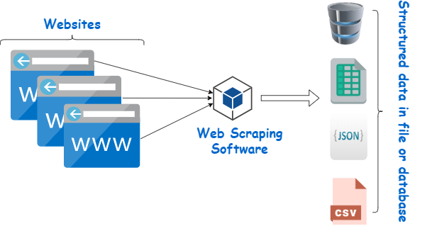
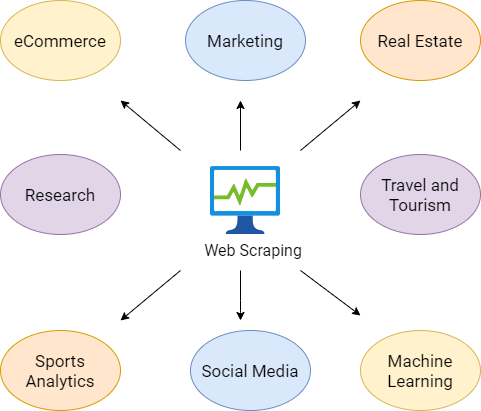
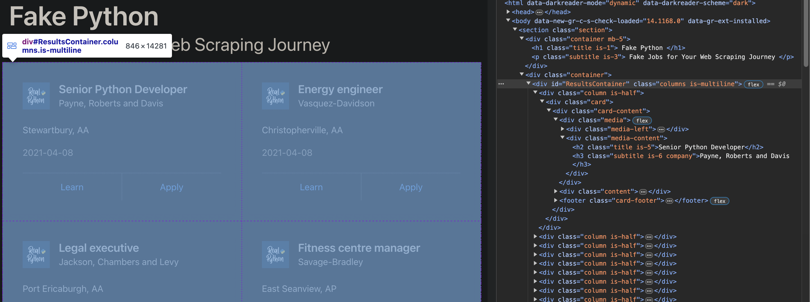

# Introduction to Web Scraping

## What is web scraping?

Web scraping is the automated process of extracting data from websites. It's a technique that is widely used for gathering data, allowing programmers to extract structured data from the web directly when an API either doesn't exist or is too restrictive.

At a high level, the steps for any webscraping project goes something like:
1. Fetch the page
2. Parse the HTML
3. Extract the info needed





## Legal and Ethical Considerations

It's important to consider both legal and ethical implications before writing any code. If you’re scraping a page respectfully for educational purposes, then you’re unlikely to have any problems. Still, it’s a good idea to do some research on your own and make sure that you’re not violating any Terms of Services before you start a large-scale project.

Check out this [article](https://towardsdatascience.com/ethics-in-web-scraping-b96b18136f01) about the ethics of web scraping. To summarize, you should always 

- Be transparent about scraping intentions
- Respect site load by scraping at reasonable rates
- Store only necessary data.
- Credit original sources and respect their content.


## Use Cases and Applications

When you try to get the information you want manually, you might spend a lot of time clicking, scrolling, and searching, especially if you need large amounts of data from websites that are regularly updated with new content. Manual web scraping can take a lot of time and repetition, and doesn't sound like the most fun or productive way to spend your time.

For example, if you're doing a project that relies on product/price information from an ecommerce website, it'd be much easier to write some code to collect the data for you rather than clicking into each product, and copy pasting data manually. A few other suitable applications of web scraping include automatically collecting:

- Offers, discounts, limited-time deals
- Job postings and internships
- Phone numbers/emails for sales and marketing campaigns




## Overview of Tools and Libraries for Web Scraping in Python

Python offers several libraries that help for web scraping, the most popular being `requests` and `BeautifulSoup`. The requests library allows users to easily send HTTP requests to websites, while BeautifulSoup is used for parsing HTML and XML documents. Together, these tools enable developers to automate data collection and process web content efficiently. 

It's important to note that BeautifulSoup is excellent for static content, but not that great when it comes to dynamic webpages that rely heavily on JavaScript for rendering their content. In these cases, `Selenium` is a better solution. Selenium is a web automation tool primarily used for testing web applications, but it's also highly effective for web scraping purposes. Unlike BeautifulSoup, Selenium can interact with web pages just like a human user would, navigating through pages, clicking on buttons, and even filling out forms. This capability allows it to execute JavaScript and scrape data from websites that update their content dynamically.


# BeautifulSoup

Here's the website we'll use in this part of the guide: [realpython.github.io/fake-jobs/](https://realpython.github.io/fake-jobs/)

It's a static page designed for educational purposes, allowing learners to practice their web scraping skills without the ethical and legal complexities that come with scraping real-world websites.

Start off by scrolling and clicking through the website to get yourself familiarized with it. There are lots of fake job postings in a card format, and each of them has two buttons. If you click Apply, then you’ll see a new page that contains more detailed descriptions of the selected job.

Next, inspect the website with your browser's developer tools (right click anywhere, and click "Inspect"). This little window will be your best friend when webscraping as it provides a detailed view of the HTML structure of the webpage. You can identify the specific tags, classes, and ids associated with the data you wish to extract.

Let's get to writing some code! Make sure you have the `bs4` and `requests` packages.


```python
# !pip install bs4 requests
```


```python
import requests

# Send a GET request to the URL, returns the raw HTML
site = requests.get('https://realpython.github.io/fake-jobs/')

print(site.text)
```

    <!DOCTYPE html>
    <html>
      <head>
        <meta charset="utf-8">
        <meta name="viewport" content="width=device-width, initial-scale=1">
        <title>Fake Python</title>
        <link rel="stylesheet" href="https://cdn.jsdelivr.net/npm/bulma@0.9.2/css/bulma.min.css">
      </head>
      <body>
      <section class="section">
        <div class="container mb-5">
          <h1 class="title is-1">
            Fake Python
          </h1>
          <p class="subtitle is-3">
            Fake Jobs for Your Web Scraping Journey
          </p>
        </div>
        <div class="container">
        <div id="ResultsContainer" class="columns is-multiline">
    ... Further output omitted


```python
from bs4 import BeautifulSoup

# Give the HTML to bs4 to parse
soup = BeautifulSoup(site.text, 'html.parser')
```

Let's go through some essential functions:

## Find Elements by ID


In HTML, the `id` attribute is used to assign a unique identifier to an HTML element, no two elements should have the same `id` value in a single page.

If you inspect the webpage, you can find the HTML object that contains all the job postings. Notice the 

``` <div id="ResultsContainer" class="columns is-multiline">```




```python
# find the ResultsContainer id
ids = soup.find(id="ResultsContainer")
```

If you call .prettify() on the ids variable, then you’ll see all the HTML contained within the div element, in a formatted and readable way (as opposed to ids.text).


```python
print(ids.prettify())
```

    <div class="columns is-multiline" id="ResultsContainer">
     <div class="column is-half">
      <div class="card">
       <div class="card-content">
        <div class="media">
         <div class="media-left">
          <figure class="image is-48x48">
           
          </figure>
         </div>
         <div class="media-content">
          <h2 class="title is-5">
           Senior Python Developer
          </h2>
          <h3 class="subtitle is-6 company">
           Payne, Roberts and Davis
          </h3>
         </div>
        </div>
        <div class="content">
    ... Further output omitted


## Find Elements by HTML Class Name

Now that we have this object that holds the individual job listings, we can access the individual cards and all of the information in them.


```python
# finds all the divs within the container, with class "card-content"
job_elements = ids.find_all("div", class_="card-content")
```


```python
# loop through each div, and print its contents

for job_element in job_elements:
    print(job_element.prettify())
    print("------")
```

    <div class="card-content">
     <div class="media">
      <div class="media-left">
       <figure class="image is-48x48">
        
       </figure>
      </div>
      <div class="media-content">
       <h2 class="title is-5">
        Senior Python Developer
       </h2>
       <h3 class="subtitle is-6 company">
        Payne, Roberts and Davis
       </h3>
      </div>
     </div>
     <div class="content">
      <p class="location">
       Stewartbury, AA
      </p>
    ------
    ... Further elements omitted


If you scroll through the output of the last cell, you can notice some patterns. For example, 

- all the job titles are in a ```<h2 class="title is-5">```, 
- all the companies in ```<h3 class="subtitle is-6 company">```, 
- and all the locations in ```<p class="location">```.

Let's extract each of these fields!


```python
for job_element in job_elements:
    title_element = job_element.find("h2", class_="title is-5")
    company_element = job_element.find("h3", class_="subtitle is-6 company")
    location_element = job_element.find("p", class_="location")
    print(title_element)
    print(company_element)
    print(location_element)
    print("----------------------------------------")

```

    <h2 class="title is-5">Senior Python Developer</h2>
    <h3 class="subtitle is-6 company">Payne, Roberts and Davis</h3>
    <p class="location">
            Stewartbury, AA
          </p>
    ----------------------------------------
    <h2 class="title is-5">Energy engineer</h2>
    <h3 class="subtitle is-6 company">Vasquez-Davidson</h3>
    <p class="location">
            Christopherville, AA
          </p>
    ----------------------------------------
    <h2 class="title is-5">Legal executive</h2>
    <h3 class="subtitle is-6 company">Jackson, Chambers and Levy</h3>
    <p class="location">
            Port Ericaburgh, AA
          </p>
    ----------------------------------------
    <h2 class="title is-5">Fitness centre manager</h2>
    <h3 class="subtitle is-6 company">Savage-Bradley</h3>
    <p class="location">
            East Seanview, AP
          </p>
    ----------------------------------------
    ... Further output omitted


Still a little messy, we can clean it up with ```.strip()```:


```python
for job_element in job_elements:
    title_element = job_element.find("h2", class_="title is-5")
    company_element = job_element.find("h3", class_="subtitle is-6 company")
    location_element = job_element.find("p", class_="location")
    print(f"Title: {title_element.text.strip()}")
    print(f"Company: {company_element.text.strip()}")
    print(f"Location: {location_element.text.strip()}")
    print("----------------------------------------")
```

    Title: Senior Python Developer
    Company: Payne, Roberts and Davis
    Location: Stewartbury, AA
    ----------------------------------------
    Title: Energy engineer
    Company: Vasquez-Davidson
    Location: Christopherville, AA
    ----------------------------------------
    Title: Legal executive
    Company: Jackson, Chambers and Levy
    Location: Port Ericaburgh, AA
    ----------------------------------------
    Title: Fitness centre manager
    Company: Savage-Bradley
    Location: East Seanview, AP
    ----------------------------------------
    ... Further output omitted


## Loading into a pandas dataframe

So we can extract and print some elements in a page, but now we want to build a dataset out of it.


```python
import pandas as pd

# lists to store the extracted data
titles = []
companies = []
locations = []

# Extract each element and append to the respective list
for job_element in job_elements:
    title_element = job_element.find("h2", class_="title is-5")
    company_element = job_element.find("h3", class_="subtitle is-6 company")
    location_element = job_element.find("p", class_="location")
    
    # if the element exists, append to list
    if title_element:
        titles.append(title_element.text.strip())
    else:
        titles.append(None)
    
    if company_element:
        companies.append(company_element.text.strip())
    else:
        companies.append(None)
    
    if location_element:
        locations.append(location_element.text.strip())
    else:
        locations.append(None)

# Create a DataFrame using pandas
jobs_df = pd.DataFrame({
    'Title': titles,
    'Company': companies,
    'Location': locations
})
```

Now we have a dataframe that we can export as a csv!


```python
jobs_df.head()

# jobs_df.to_csv("Jobs.csv")
```


<div>
<style scoped>
    .dataframe tbody tr th:only-of-type {
        vertical-align: middle;
    }

    .dataframe tbody tr th {
        vertical-align: top;
    }

    .dataframe thead th {
        text-align: right;
    }
</style>
<table border="1" class="dataframe">
  <thead>
    <tr style="text-align: right;">
      <th></th>
      <th>Title</th>
      <th>Company</th>
      <th>Location</th>
    </tr>
  </thead>
  <tbody>
    <tr>
      <th>0</th>
      <td>Senior Python Developer</td>
      <td>Payne, Roberts and Davis</td>
      <td>Stewartbury, AA</td>
    </tr>
    <tr>
      <th>1</th>
      <td>Energy engineer</td>
      <td>Vasquez-Davidson</td>
      <td>Christopherville, AA</td>
    </tr>
    <tr>
      <th>2</th>
      <td>Legal executive</td>
      <td>Jackson, Chambers and Levy</td>
      <td>Port Ericaburgh, AA</td>
    </tr>
    <tr>
      <th>3</th>
      <td>Fitness centre manager</td>
      <td>Savage-Bradley</td>
      <td>East Seanview, AP</td>
    </tr>
    <tr>
      <th>4</th>
      <td>Product manager</td>
      <td>Ramirez Inc</td>
      <td>North Jamieview, AP</td>
    </tr>
  </tbody>
</table>
</div>


# Selenium

Now that you've seen some of the basics of web scraping using BeautifulSoup, I want to introduce a more dynamic tool—Selenium. While BeautifulSoup is fantastic for straightforward tasks involving static websites, it falls short when you encounter web pages that rely heavily on JavaScript to load content dynamically. This is where Selenium steps in, giving you the power to interact with web pages just like a user would.

Using Python and Selenium for web scraping offers several advantages over other web scraping techniques:

- Dynamic websites: Dynamic web pages are created using JavaScript or other scripting languages. These pages often contain visible elements once the page is fully loaded or when the user interacts with them. Selenium can interact with these elements, making it a powerful tool for scraping data from dynamic web pages.
- User interactions: Selenium can simulate user interactions like clicks, form submissions, and scrolling. This allows you to scrape websites that require user input, such as login forms.
- Debugging: Selenium can be run in debug mode, which allows you to step through the scraping process and see what the scraper is doing at each step. This is useful for troubleshooting when things go wrong.


## Setup
1. pip install selenium
2. Install a WebDriver: WebDriver is a separate executable that Selenium uses to control the browser. For this guide, I will be using ChromeDriver. Here are the links I found to download WebDriver for the most popular browsers:

    - [Chrome](https://sites.google.com/a/chromium.org/chromedriver/downloads)
    - [Firefox](https://github.com/mozilla/geckodriver/releases)
    - [Edge](https://developer.microsoft.com/en-us/microsoft-edge/tools/webdriver/)

    


3. In your Python script or Jupyter Notebook, run this code snippet. This will set up your Python script to open and control a new instance of Google Chrome through Selenium.


    ```
    from selenium import webdriver
    driver = webdriver.Chrome('/path/to/chromedriver')
    ```

After installing, try running this next cell. A separate chrome window should pop up with the [quotes.toscrape.com/js-delayed](https://quotes.toscrape.com/js-delayed/) webpage. Similar to the previous example, this one is a "toy" website built for people to practice webscraping. The webpage contains pages of famous quotes, except this time, it's loaded dynamically using JavaScript.


```python
# !pip install selenium
from selenium.webdriver import Chrome, ChromeOptions
from selenium.webdriver.common.by import By
from selenium.webdriver.support.ui import WebDriverWait
from selenium.webdriver.support import expected_conditions as EC


# note: after setting your path to your chromedriver once, you can just init like so (without specifying path)
driver = Chrome() 

driver.get('https://quotes.toscrape.com/js-delayed/')
```

## What Happens If I Try to Use BeautifulSoup?

Just as the first half of the guide showed us, we can use `requests` to get the HTML content of a website, and then pass this content to BeautifulSoup to parse it. Afterwards, we find all the `<div>` elements with the class `quote` and attempt to print them. Try this on your own, you'll find that nothing prints, but why?


```python
s = requests.get('https://quotes.toscrape.com/js-delayed/')

soup = BeautifulSoup(s.text, 'html.parser')

quotes = soup.find_all('div', class_='quote')

for quote in quotes:
    print(quote)

# no output!
```

Why is nothing printing?

When you make a request with `requests.get`, it retrieves the static HTML that the server sends back on the initial request. It does not execute JavaScript. If a website uses JavaScript to load or modify content after the initial page load (as is common with most modern websites), that dynamically loaded content won't be included in the HTML retrieved by requests.get.

Selenium on the other hand, acts as an actual person navigating to a website. This is what allows it to run JavaScript just like a regular user's browser would, accessing the dynamically loaded content. 

In this case, we want Selenium to wait for things to load and ensure that all dynamically generated content is present before we start scraping. We can accomplish this with `WebDriverWait` and expected conditions (`EC`).


```python
driver = Chrome() 

driver.get('https://quotes.toscrape.com/js-delayed/')

# these lines set up a condition to wait for up to 20 seconds for all elements with the class name "quote" to be visible on the page
wait = WebDriverWait(driver, 20)
quotes = wait.until(EC.visibility_of_all_elements_located((By.CLASS_NAME, "quote")))

for quote in quotes:
    print(quote.text)
    print("-----")
```

    “The world as we have created it is a process of our thinking. It cannot be changed without changing our thinking.”
    by Albert Einstein
    Tags: change deep-thoughts thinking world
    -----
    “It is our choices, Harry, that show what we truly are, far more than our abilities.”
    by J.K. Rowling
    Tags: abilities choices
    -----
    “There are only two ways to live your life. One is as though nothing is a miracle. The other is as though everything is a miracle.”
    by Albert Einstein
    Tags: inspirational life live miracle miracles
    -----
    “The person, be it gentleman or lady, who has not pleasure in a good novel, must be intolerably stupid.”
    by Jane Austen
    Tags: aliteracy books classic humor
    -----
    “Imperfection is beauty, madness is genius and it's better to be absolutely ridiculous than absolutely boring.”
    by Marilyn Monroe
    Tags: be-yourself inspirational
    -----
    “Try not to become a man of success. Rather become a man of value.”
    by Albert Einstein
    Tags: adulthood success value
    -----
    “It is better to be hated for what you are than to be loved for what you are not.”
    by André Gide
    Tags: life love
    -----
    “I have not failed. I've just found 10,000 ways that won't work.”
    by Thomas A. Edison
    Tags: edison failure inspirational paraphrased
    -----
    “A woman is like a tea bag; you never know how strong it is until it's in hot water.”
    by Eleanor Roosevelt
    Tags: misattributed-eleanor-roosevelt
    -----
    “A day without sunshine is like, you know, night.”
    by Steve Martin
    Tags: humor obvious simile
    -----


In the previous codeblock, the line:

```
wait = WebDriverWait(driver, 20)
```

Tells the WebDriver to create a `WebDriverWait` instance named wait, which is used to pause the execution of your script for up to 20 seconds while it waits for a certain condition to be met. This is useful when elements on a webpage takes time to become visible or interactable due to various reasons like slow network conditions or heavy JavaScript operations.

In the next line,

```
quotes = wait.until(EC.visibility_of_all_elements_located((By.CLASS_NAME, "quote")))
```
we use the wait object to pause the execution until all elements with the class name "quote" are visible on the page. Specifically, the `until()` method of the WebDriverWait class waits for the Expected Condition `EC.visibility_of_all_elements_located` to be true before continuing.

Now we can see all of the quotes being printed, and can choose to load them into a pandas dataframe if we want to as well.


## Form Filling with Selenium

Now that we've seen how to collect dynamically loaded content with Selenium, let's explore some of its other capabilities. Notice how there's a Login button on the top right of the page. Let's get Selenium to click on that button, fill out a username and password, and log us in.

The first thing we need to do is figure out how to find the Login button. With a quick inspect element, you can see that the Login button is in an anchor (a) tag with the attribute href="/login",

`<a href="/login">Login</a>`

We can find this using a CSS selector, which in the context of webscraping, are used to identify and interact with specific elements on a webpage based on their tag name, id, class, attributes, and even their hierarchy or position within the HTML document.

So when you see a CSS selector like `a[href="/login"]`, it's saying, "Find me an anchor tag with an href attribute equal to '/login'". Right after finding the button, we can called `.click()`, to navigate to the href and bring us to the Login page.

Notice that the Login button does not take time to be loaded, unlike the actual quotes. So we can throw out the `WebDriverWait`.


```python
driver = Chrome()

driver.get('https://quotes.toscrape.com/js-delayed/')

# locate the login button
login_button = driver.find_element(By.CSS_SELECTOR, 'a[href="/login"]')

# click on it
login_button.click()
```

Next, we need to find the username and password fields, and type in them. Inspecting the page again, we can see that these fields are in input elements like so: 

`<input type="text" class="form-control" id="username" name="username">`

and


`<input type="password" class="form-control" id="password" name="password">`

We can easily find these using `.find_element()` and filtering `By.Name` (or `By.ID`).

After finding the elements, we can "send keys" to populate these fields.


```python
driver = Chrome()

driver.get('https://quotes.toscrape.com/js-delayed/')

login_button = driver.find_element(By.CSS_SELECTOR, 'a[href="/login"]')
login_button.click()


# find the username and password fields
username_field = driver.find_element(By.ID, 'username')
password_field = driver.find_element(By.ID, 'password')

# send login info
username_field.send_keys('your_username')
password_field.send_keys('your_password')


```

Finally, we find and click on the submit button.

Here's the final script:


```python
driver = Chrome()

driver.get('https://quotes.toscrape.com/js-delayed/')

login_button = driver.find_element(By.CSS_SELECTOR, 'a[href="/login"]')
login_button.click()


username_field = driver.find_element(By.ID, 'username')
password_field = driver.find_element(By.ID, 'password')

username_field.send_keys('your_username')
password_field.send_keys('your_password')

submit_button = driver.find_element(By.CSS_SELECTOR, 'input[type="submit"]')
submit_button.click()

```

# Conclusion

Web scraping with BeautifulSoup and Selenium are powerful tools for extracting data from websites. They allow you to automate the process of collecting data which can save you significant time and effort. BeautifulSoup gives you a straightforward HTML parser for static webpages, and with Selenium, you can interact with websites just like a human user and extract data from dynamically loaded websites.

This guide is just the tip of the iceberg, showing you the popular tools and common techniques to get started, but there's a lot much more to explore. As you dive deeper, you'll discover even more advanced methods and new challenges that will enhance your abilities and understanding of web scraping. 

For some additional resources on webscraping, check out these articles:
- [realpython.com/beautiful-soup-web-scraper-python/](https://realpython.com/beautiful-soup-web-scraper-python/)
- [browserstack.com/guide/web-scraping-using-selenium-python](https://www.browserstack.com/guide/web-scraping-using-selenium-python)


